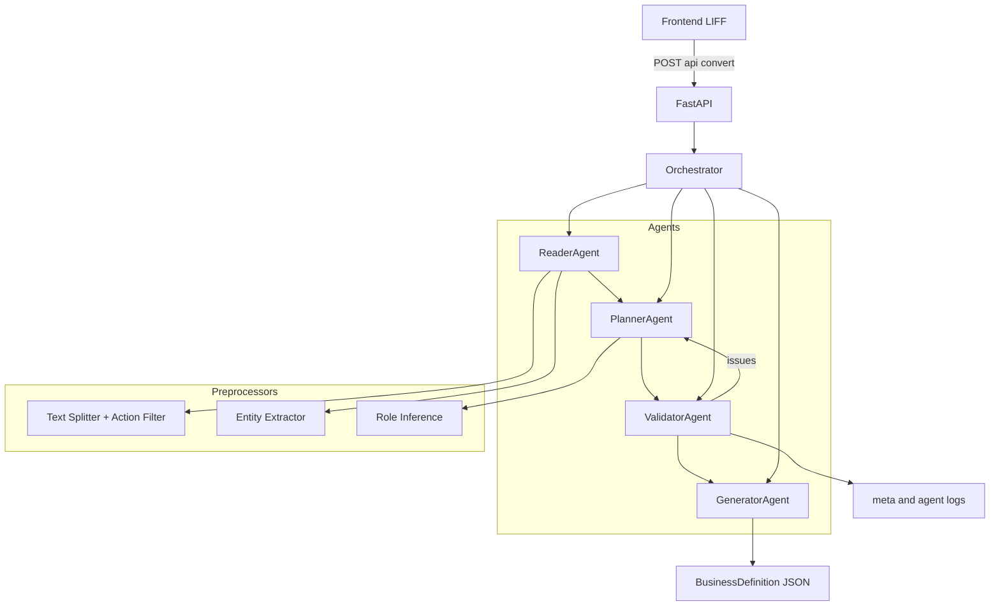

# Agentic BizFlow

## 0. カバー / 冒頭メッセージ

Agentic BizFlow は、**実業務の自然文手順を「実行可能な業務定義(JSON)」へ変換するための
Agentic Architecture 実装例**です。Google Cloud Japan AI Hackathon 提出用に、
短時間で設計意図と成熟度が伝わる形に整理しています。

このREADMEは**プロンプトのデモではなく、検証・再試行を中核に据えた設計思想**を説明します。

## 1. TL;DR（30秒概要）

- 人が読めるだけの業務文書を、**Pydanticで検証可能な業務定義JSON**へ変換する。
- 単発LLMではなく、**Reader/Planner/Validator/Generator**に分割し、検証と再試行で品質を担保する。
- **Validation & Retry Loop が中心設計**。曖昧・欠落を検出し、必要な場合のみ再計画する。
- Google Cloud（Cloud Run + Vertex AI/Gemini想定）での実運用を前提にした構成。

## 2. Problem（なぜ必要か）

業務マニュアル、引き継ぎ資料、Notion、Slackには、**人が読めば分かるがシステムは実行できない**
自然文が大量に存在します。

- 業務知識が属人化し、運用がブラックボックス化する
- 手順の抜け漏れや例外条件が見落とされやすい
- システム化に必要な構造化コストが高い

このプロジェクトは、**自然文を構造化し、検証可能な業務定義へ変換**するための
アーキテクチャを提示します。

## 3. Why Agentic Architecture

単発のLLM呼び出しでは、**「構造化」「抜け漏れ検出」「再修正」**を同時に満たすのが難しいため、
以下の理由で Agentic Architecture を採用しています。

- **役割分担による責務の明確化**（抽出/分解/検証/生成を分離）
- **Validator による失敗判定**で品質基準を明示
- **Retry Loop による改善**で不確実性を吸収
- **Pydantic 検証**で出力の決定性と機械可読性を担保

## 4. システム概要（Input / Output）

### Input

- 日本語の業務文章（マニュアル、引き継ぎ、チャットログ等）

### Output

- BusinessDefinition JSON（tasks / roles / assumptions / open_questions）
- meta（リトライ回数・抽出結果・推定結果など）
- agent_logs（各 Agent の要約ログ）

※ 本システムは**業務フローの実行エンジンではなく**、実行可能な定義を生成する設計です。

## 5. アーキテクチャ（図＋説明）

Reader → Planner → Validator → Generator の順で処理し、
Validator が issues を返した場合のみ再試行します。



設計の詳細は `docs/README_architecture.md` に集約しています。

## 6. 各 Agent の役割

- **ReaderAgent**: 人物/操作/条件/例外/前提を抽出する
- **PlannerAgent**: 抽出結果をタスク単位に分解し構造化する
- **ValidatorAgent**: 抜け漏れ・曖昧さ・矛盾を検出し失敗判定する
- **GeneratorAgent**: 検証済み情報のみから業務定義JSONを生成する
- **Orchestrator**: 実行順序とRetry制御、ログ収集を担当する

## 7. Validation & Retry Loop

品質を担保するための中核設計です。

- **Validator が issues を返した場合のみ再試行**する
- 再試行では Reader/Planner に制約を追加し、**欠落や曖昧さの補正を試みる**
- **最大2回**まで再試行（警告のみの場合は早期に通過する設計）
- Validation 通過後のみ Generator を実行

## 8. 入出力例

### 入力例（自然文）

```text
申請者は申請フォームを提出し、上長が内容を確認する。
不備があれば差し戻し、なければ経理へ回す。
```

### 出力例（抜粋）

```json
{
  "definition": {
    "title": "申請フロー",
    "overview": "申請から経理送付までの手順",
    "tasks": [
      {
        "id": "task_1",
        "name": "申請フォームを提出する",
        "role": "申請者",
        "trigger": "",
        "steps": ["申請フォームを提出する"],
        "exception_handling": ["不備があれば差し戻す"],
        "notifications": [],
        "recipients": []
      }
    ],
    "roles": [{ "name": "申請者", "responsibilities": ["申請フォーム提出"] }],
    "assumptions": [],
    "open_questions": []
  },
  "meta": {
    "retries": 0,
    "splitter_version": "ja_v1",
    "action_filter_version": "biz_v1"
  },
  "agent_logs": [{ "step": "reader", "summary": "..." }]
}
```

## 9. Quick Start

### Backend（local）

```sh
cd backend
pip install -r requirements.txt
python -m uvicorn app.main:app --reload --port 8080
```

### Frontend（optional, local）

```sh
cd frontend
docker build -t agentic-bizflow-frontend .
docker run --rm -p 8081:8080 \
  -e LIFF_ID="<liff-id>" \
  -e BACKEND_BASE_URL="http://localhost:8080" \
  agentic-bizflow-frontend
```

## 10. デプロイ構成（Google Cloud Run）

### 前提

- Cloud Run に backend / frontend を別サービスとしてデプロイ
- Vertex AI（Gemini）利用時は `GCP_PROJECT_ID` が必須

### Backend（Cloud Run）

```sh
gcloud run deploy <backend-service> \
  --source=./backend \
  --region=<region> \
  --allow-unauthenticated \
  --set-env-vars "GCP_PROJECT_ID=<project-id>,GCP_LOCATION=<region>,GEMINI_MODEL=<model>"
```

### Frontend（Cloud Run）

```sh
gcloud run deploy <frontend-service> \
  --source=./frontend \
  --region=<region> \
  --allow-unauthenticated \
  --set-env-vars "LIFF_ID=<liff-id>,BACKEND_BASE_URL=<backend-url>"
```

## 11. 対象外・制約事項

- **BPMN実行エンジンではない**（業務定義の生成までが範囲）
- 分割はルールベースであり、完全な意味理解は保証しない
- Role推定はヒューリスティックで、業務別ルールの拡張が必要
- IDトークンの署名検証は未実装（デモ/検証優先）
- LLM出力の揺らぎは Validation/Retry で吸収する設計

## 12. 今後の展望

- 形態素解析やドメイン辞書による抽出精度向上
- 業務ドメイン別の検証ルール追加
- 評価指標（正確性/網羅性）と継続改善ループ
- UI/運用フローへの統合（Human-in-the-loop）

## 13. なぜこれが重要か（まとめ）

実業務の自動化で本当に難しいのは、**入力の曖昧さと品質保証**です。
Agentic BizFlow は、**検証と再試行を中心に据えた設計**によって、
自然文から信頼できる業務定義を生成し、将来の自動化や運用統合への土台を提供します。
