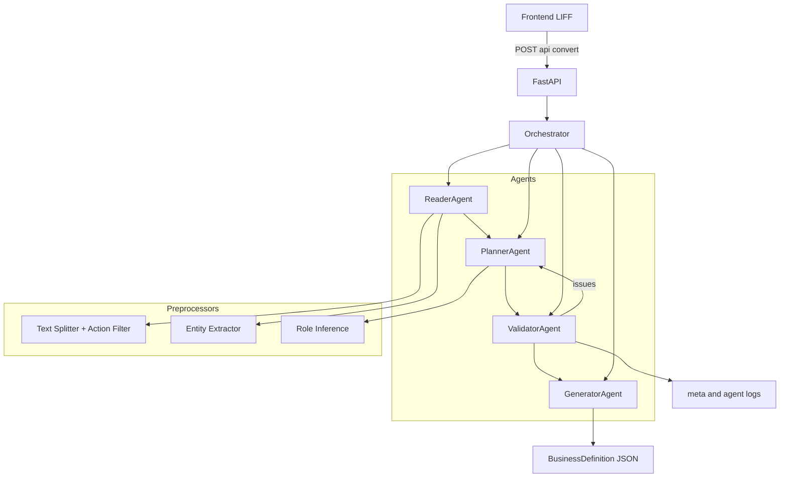

# Agentic BizFlow

## 1. タイトル & 概要

自然文の業務手順を、実行可能な業務定義（JSON）に変換する Agentic Architecture 実装例です。

## 2. 解決したい課題

企業の業務手順は自然文で記載されることが多く、解釈が担当者依存になりやすいため、曖昧さ・属人化・自動化困難が同時に発生します。  
この状態は、企業システムでの再利用性や監査可能性を下げ、運用品質のばらつきを生みます。

## 3. ソリューション概要

Agentic BizFlow は単一プロンプトで一括生成する方式ではなく、Reader → Planner → Generator の段階処理で意味を構造化します。  
さらに Validator による検証と差し戻しを組み込み、自然文から実行可能な業務定義（JSON）へ変換します。

## 4. アーキテクチャ概要

バックエンドは Cloud Run 上で動作し、各エージェントが実行時に Vertex AI（Gemini）を呼び出して、業務定義 JSON と実行メタ情報を返します。

設計補足は `docs/README_architecture.md` に整理しています。

## 5. Agentic Flow の説明

- Reader: 業務文を読解し、登場人物・操作・条件などの意味構造を抽出します。
- Planner: 抽出結果をもとに、役割、手順、承認に関わるタスク構造を推論します。
- Generator: 検証済みの情報のみを使って実行可能な業務定義（JSON）を生成します。
- Validator: `issues` を返した場合は Planner に差し戻し、再計画後に再検証します。

上記エージェントは実行時に Vertex AI（Gemini）を呼び出して処理します。

## 6. LLM / Vertex AI 利用

- Provider: Vertex AI
- Model: Gemini 2.0 Flash
- 実行環境: Cloud Run
- `meta.llm.reader.used` / `meta.llm.planner.used` / `meta.llm.generator.used` が `true` となる実行パスで動作します。
- モックやスタブではなく、Vertex AI への実呼び出しです。

## 7. デモ例

入力例: 「申請者が申請書を提出し、上長が確認する。不備があれば差し戻し、問題なければ経理へ回付する。」  
出力では、役割（申請者・上長・経理）、手順、条件分岐、通知先を持つ業務定義構造が生成されます。

## 8. 信頼性・設計上の工夫

- LLM 呼び出しに失敗した場合は、Reader/Planner は抽出済み情報で継続し、Generator は既定値へフォールバックします。
- Validator が `issues` を検出した場合のみ再試行し、上限付きの制御で安定動作させます。
- 最終出力は Pydantic スキーマ検証を通すため、業務定義 JSON の構造破綻を防止できます。

## 9. ハッカソンとの関連

本プロジェクトは Google Cloud Japan AI Hackathon Vol.4 向けに作成しました。  
Cloud Run と Vertex AI（Gemini）を用いて、企業業務への適用を前提に設計しています。

## 10. 今後の拡張

- 稟議・承認フローの高度化
- ERP / 会計システム連携
- 社内業務自動化への展開
