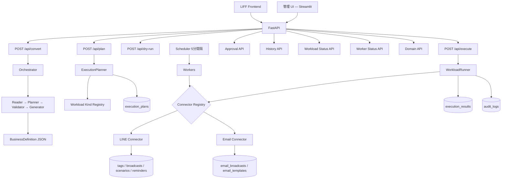

# Agentic BizFlow

## 1. タイトル & 概要

自然文の業務手順を、実行可能な業務定義（JSON）に変換し、計画・承認・実行・監査まで一気通貫で回す Agentic Architecture 実装です。

## 2. 解決したい課題

企業の業務手順は自然文で記載されることが多く、解釈が担当者依存になりやすいため、曖昧さ・属人化・自動化困難が同時に発生します。
特に LINE 配信のような反復的な運用では、設定ミス・漏れ・手戻りが常態化しやすく、監査可能性も低い状態になります。

## 3. ソリューション概要

Agentic BizFlow は自然文で「誰に・いつ・何をするか」を指示すると、以下のパイプラインで安全に実行されます。

```
自然文 → 業務定義（JSON）→ 実行計画 → 承認 → 実行 → 履歴確認
```

- **Agent 層**: Reader → Planner → Validator → Generator の段階処理で業務定義を構造化
- **Executor 層**: 業務定義を実行可能な計画に変換し、dry-run でプレビュー後に実行
- **承認フロー**: 配信系の操作は承認を経てから実行される
- **Scheduler**: バックグラウンドで配信・リマインドを自動消化
- **管理 UI**: Streamlit で計画・承認・実行・監査を一画面で操作

## 4. アーキテクチャ概要


```mermaid
flowchart TB
    ADMIN[管理 UI — Streamlit] --> API[FastAPI]
    LIFF[LIFF Frontend] --> API

    API --> CONVERT[POST /api/convert]
    API --> PLAN[POST /api/plan]
    API --> DRYRUN[POST /api/dry-run]
    API --> EXEC[POST /api/execute]
    API --> APPROVAL[Approval API]
    API --> HISTORY[History API]
    API --> WORKLOAD[Workload Status API]
    API --> WORKER_ST[Worker Status API]
    API --> DOMAIN[Domain API]

    CONVERT --> ORCH[Orchestrator]
    ORCH --> AGENTS[Reader → Planner → Validator → Generator]
    AGENTS --> BD[BusinessDefinition JSON]

    PLAN --> EP[ExecutionPlanner]
    EP --> WKR[Workload Kind Registry]
    EP --> DB_PLAN[(execution_plans)]

    EXEC --> WR[WorkloadRunner]
    WR --> CR{Connector Registry}
    CR --> LINE_CONN[LINE Connector]
    CR --> EMAIL_CONN[Email Connector]
    WR --> DB_RESULT[(execution_results)]
    WR --> DB_AUDIT[(audit_logs)]

    LINE_CONN --> DB_DOMAIN[(tags / broadcasts / scenarios / reminders)]
    EMAIL_CONN --> DB_EMAIL[(email_broadcasts / email_templates)]

    SCHED[Scheduler 5分間隔] --> WORKERS[Workers]
    WORKERS --> CR
```

設計補足は `docs/README_architecture.md` に整理しています。

## 5. Agentic Flow の説明

- **Reader**: 業務文を読解し、登場人物・操作・条件などの意味構造を抽出します。
- **Planner**: 抽出結果をもとに、役割、手順、承認に関わるタスク構造を推論します。
- **Generator**: 検証済みの情報のみを使って実行可能な業務定義（JSON）を生成します。
- **Validator**: `issues` を返した場合は Planner に差し戻し、再計画後に再検証します。

上記エージェントは実行時に Vertex AI（Gemini）を呼び出して処理します。

## 6. LLM / Vertex AI 利用

- Provider: Vertex AI
- Model: Gemini 2.0 Flash
- 実行環境: Cloud Run
- `meta.llm.reader.used` / `meta.llm.planner.used` / `meta.llm.generator.used` が `true` となる実行パスで動作します。
- モックやスタブではなく、Vertex AI への実呼び出しです。

## 7. デモ

### デモシナリオ

入力: 「セミナー参加者にVIPタグをつけて、全員にセール告知を一斉配信して」

```
1. POST /api/convert  → BusinessDefinition（タスク構造・ロール）を生成
2. POST /api/plan     → ExecutionPlan（tag.assign + broadcast.schedule）を生成
3. GET /api/approvals → broadcast.schedule の承認待ちを確認
4. POST /api/approvals/{id}/approve → 承認
5. POST /api/dry-run  → 副作用なしでプレビュー
6. POST /api/execute  → 本実行（DB にドメインレコード書き込み）
7. GET /api/executions → 実行履歴を確認（step ごとの成否）
8. GET /api/workloads/summary → tags / broadcasts のカウント確認
```

### ローカル起動

```bash
# バックエンド
cd backend
pip install -r requirements.txt
python -m alembic upgrade head
python -m uvicorn app.main:app --port 8080

# 管理 UI（別ターミナル）
pip install streamlit requests
streamlit run admin/app.py
```

| UI | URL |
|---|---|
| Swagger UI | http://localhost:8080/docs |
| 管理 UI（Streamlit） | http://localhost:8501 |
| ヘルスチェック | http://localhost:8080/health |

デモの詳細手順は [`docs/demo-guide.md`](docs/demo-guide.md) を参照。

## 8. 信頼性・設計上の工夫

- **dry-run**: 副作用なしで実行計画をプレビュー可能
- **承認フロー**: broadcast 系は承認を経てから実行。DB に永続化
- **冪等性**: `processed_idempotency_keys` テーブルで二重実行を防止
- **監査ログ**: `execution_audit_logs` テーブルで全操作の証跡を記録
- **配信ウィンドウ**: 9:00-23:00 JST の配信制御
- **再試行**: 指数バックオフによる失敗再試行（max_retries で上限制御）
- **Pydantic スキーマ検証**: 業務定義 JSON の構造破綻を防止
- **Agent 層の不変**: Phase 2.5 以降の全機能追加で Agent 層は一切変更なし

## 9. ハッカソンとの関連

本プロジェクトは Google Cloud Japan AI Hackathon Vol.4 向けに作成しました。
Cloud Run と Vertex AI（Gemini）を用いて、企業業務への適用を前提に設計しています。

## 10. API エンドポイント一覧

| エンドポイント | メソッド | 処理 |
|---|---|---|
| `/api/convert` | POST | 自然文 → BusinessDefinition |
| `/api/plan` | POST | BusinessDefinition → ExecutionPlan（DB 保存） |
| `/api/dry-run` | POST | 副作用なしのプレビュー |
| `/api/execute` | POST | 本実行（結果を DB 保存） |
| `/api/plans` | GET | 保存済み plan 一覧 |
| `/api/plans/{plan_id}` | GET | plan 詳細 |
| `/api/executions` | GET | 実行履歴一覧 |
| `/api/executions/{id}` | GET | 実行詳細（step_results 含む） |
| `/api/approvals` | GET | 承認リクエスト一覧 |
| `/api/approvals/{id}` | GET | 承認リクエスト詳細 |
| `/api/approvals/{id}/approve` | POST | 承認 |
| `/api/approvals/{id}/reject` | POST | 却下 |
| `/api/domains` | GET | ドメイン一覧 |
| `/api/domains/{domain}` | GET | ドメイン詳細 |
| `/api/workload-kinds` | GET | 全 workload kind 一覧 |
| `/api/workloads/summary` | GET | Workload 統合サマリー |
| `/api/workloads/scenarios` | GET | シナリオ状態 |
| `/api/workloads/broadcasts` | GET | 配信ステータス別カウント |
| `/api/workloads/reminders` | GET | リマインダー状態 |
| `/api/workers/status` | GET | Worker 最終実行状態 |
| `/health` | GET | ヘルスチェック |

## 11. DB テーブル一覧（20 テーブル）

| 分類 | テーブル |
|---|---|
| **実行管理** | execution_plans, execution_results, step_results |
| **LINE ドメイン** | tags, tag_assignments, scenarios, scenario_steps, scenario_enrollments, broadcasts, reminders, reminder_steps, reminder_enrollments, reminder_deliveries |
| **実行基盤** | approval_requests, processed_idempotency_keys, execution_audit_logs, worker_task_logs |
| **ドメイン管理** | domain_configs |
| **Email ドメイン** | email_broadcasts, email_templates |

詳細は [`docs/table-spec.md`](docs/table-spec.md)、ER 図は [`docs/er-diagram.md`](docs/er-diagram.md) を参照。

## 12. フェーズ別の実装履歴

| Phase | 内容 | 設計書 |
|---|---|---|
| Phase 1 | Agent 層（Reader → Planner → Validator → Generator） | — |
| Phase 2.5 | Executor 層 + Connector 層（plan / dry-run / execute） | [phase2_5_design.md](docs/phase2.5/phase2_5_design.md) |
| Phase 3 | DB 永続化（SQLAlchemy + Alembic、13 テーブル） | [phase3_design.md](docs/phase3/phase3_design.md) |
| Phase 4 | Scheduler / Worker / 承認永続化 / 冪等性 / 監査ログ | [phase4_design.md](docs/phase4/phase4_design.md) |
| Phase 5 | Multi-Domain（Workload Kind Registry / Email ドメイン） | [phase5_design.md](docs/phase5/phase5_design.md) |
| Phase 6 | 管理 UI（Streamlit）/ Workload 状態 API / デモ基盤 | [phase6_design.md](docs/phase6/phase6_design.md) |

## 13. 今後の拡張

- Cloud Scheduler + Cloud Run Jobs への移行
- POS / CRM / ERP ドメインの connector 追加（`domains/_template/` からコピー）
- automations / scoring / notification_rules
- マルチテナント認証
- 社内業務自動化への展開

## License

See `LICENSE`.
