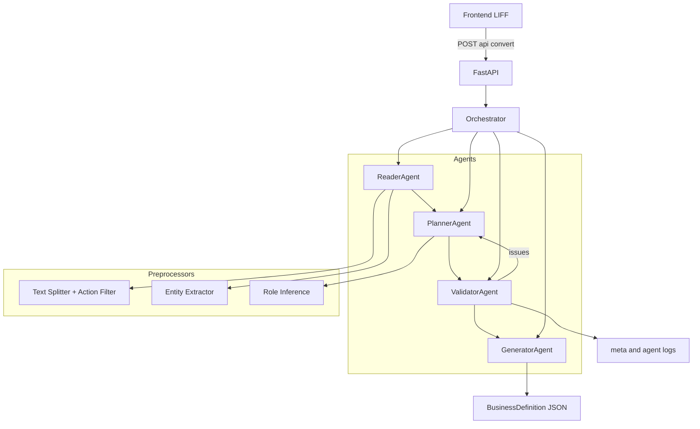
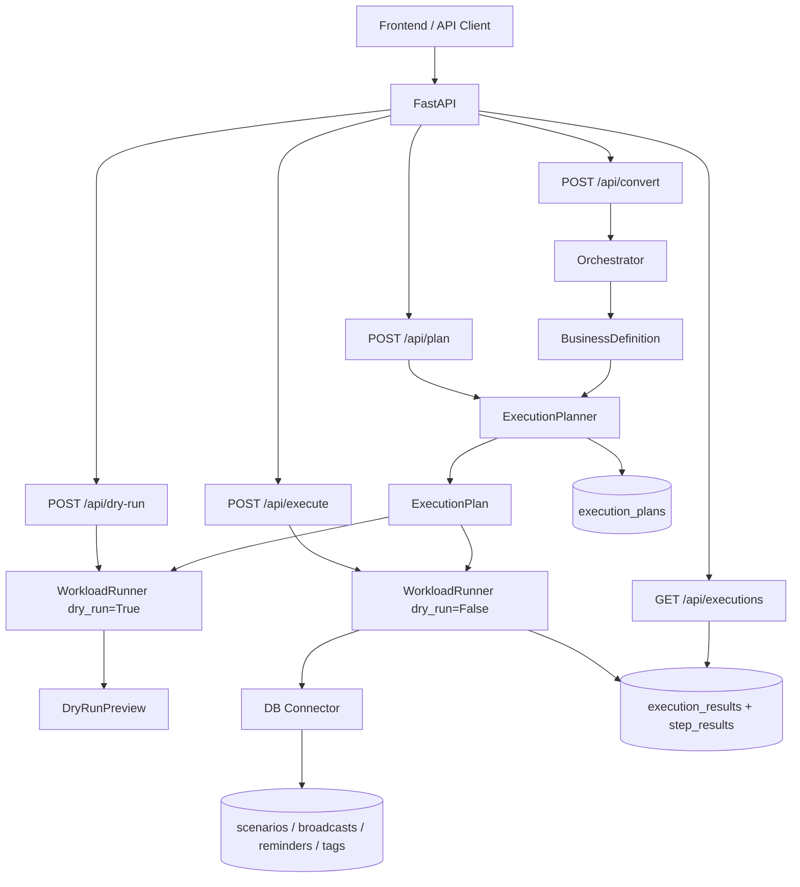
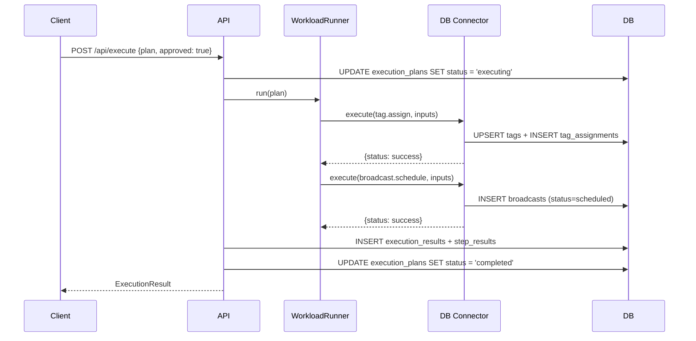

# Agentic BizFlow

> このドキュメントは Agentic BizFlow のアーキテクチャ設計詳細です。  
> README.md に掲載している Mermaid 図の正（Single Source of Truth）です。

## Project Overview（プロジェクト概要）

Agentic BizFlow は、自然文で書かれた業務手順を、実行可能な業務定義（JSON）に変換する
Agentic AI の実装例です。提出/審査に必要な要素を最小構成でまとめています。

## What it does（できること）

- 日本語業務文からアクション/条件/エンティティを抽出
- 複合文を分割し、非業務的な雑談を除外
- Validator で不備を検出し、必要に応じて再計画
- Pydantic スキーマで厳格に出力を検証
- LLM有効時は Vertex AI（Gemini）で actions/roles や title/overview を補助生成
- LIFF向け1画面UIで結果を可視化

## Why it’s agentic / key idea（Agenticである理由）

- Reader / Planner / Validator / Generator の明確な役割分担
- Orchestrator による順序制御とリトライ
- validation を通過しない限り出力しない
- ルールベース前処理で task 分割の再現性を向上

## Architecture（アーキテクチャ）



### 責務とフローの要点

- ReaderAgent: 入力文から actions / entities / 条件情報などを抽出する
- PlannerAgent: actions を基に tasks を分割し、roles / trigger などの骨格を作る
- ValidatorAgent: 不備・曖昧さ・非業務タスクを検出し、issues を返す
- GeneratorAgent: 検証済み情報のみで最終JSONを生成する
- Orchestrator: 実行順序・Retry 制御・ログ収集を担う

Retry の意味:

- Validator が issues を返した場合のみ Planner に差し戻して再計画する
- 再試行回数には上限がある（無限ループ防止）

## Data Model (Output JSON)

- `definition`: 生成された業務定義（tasks / roles / assumptions / open_questions）
- `meta`: デバッグ用メタ情報（actions, entities, role_inference, retries など）
- `agent_logs`: 各 Agent の要約ログ

構造イメージ（抜粋）:

```json
{
  "definition": {
    "title": "...",
    "overview": "...",
    "tasks": [
      {
        "id": "task_1",
        "name": "申請する",
        "role": "Applicant",
        "trigger": "",
        "steps": ["申請する"],
        "exception_handling": [],
        "notifications": [],
        "recipients": []
      }
    ],
    "roles": [{ "name": "Applicant", "responsibilities": ["..."] }],
    "assumptions": [],
    "open_questions": []
  },
  "meta": {
    "actions": ["..."],
    "actions_raw": ["..."],
    "actions_filtered_out": ["..."],
    "entities": { "people": [] },
    "role_inference": [],
    "splitter_version": "ja_v1",
    "action_filter_version": "biz_v1",
    "retries": 0
  },
  "agent_logs": [{ "step": "reader", "summary": "..." }]
}
```

## Demo（デモ）

1. フロントを開く
2. サンプル文章のまま「変換」を押す
3. `definition` / `meta` / `agent_logs` を確認

スクショ/GIFを追加する場合は `docs/` に置き、ここにリンクしてください。

## How to run locally（ローカル実行）

Backend:

```sh
cd backend
pip install -r requirements.txt
python -m uvicorn app.main:app --reload --port 8080
```

Frontend (Docker):

```sh
cd frontend
docker build -t agentic-bizflow-frontend .
docker run --rm -p 8081:8080 \
  -e LIFF_ID="<liff-id>" \
  -e BACKEND_BASE_URL="http://localhost:8080" \
  agentic-bizflow-frontend
```

## Deploy（Cloud Run）

Backend:

- 環境変数: `GCP_PROJECT_ID`, `GCP_LOCATION`, `GEMINI_MODEL`（任意）,
  `LLM_ENABLED`（任意）, `LLM_PROVIDER`（任意）, `LLM_FEATURES`（任意）,
  `CORS_ALLOW_ORIGINS`（任意）
- Vertex AI 利用時はサービスアカウントに権限付与が必要

Frontend:

- 環境変数: `LIFF_ID`, `BACKEND_BASE_URL`, `PORT`（任意）
- `config.js` は起動時に生成され `no-store` で配信

例（プレースホルダのみ）:

```sh
gcloud run deploy <backend-service> \
  --source=./backend \
  --region=<region> \
  --allow-unauthenticated \
  --set-env-vars "GCP_PROJECT_ID=<project-id>,GCP_LOCATION=<region>"
```

```sh
gcloud run deploy <frontend-service> \
  --source=./frontend \
  --region=<region> \
  --allow-unauthenticated \
  --set-env-vars "LIFF_ID=<liff-id>,BACKEND_BASE_URL=<backend-url>"
```

## Repository structure（構成）

```text
agentic-bizflow/
├─ backend/          # FastAPI + agentic core
├─ frontend/         # LIFF single-page UI
├─ docs/             # 設計資料/セットアップ
└─ AGENTS.md         # 最上位ルール
```

## Phase 2.5: Workload Execution 拡張

Phase 2.5 では、GeneratorAgent の出力（BusinessDefinition）を実行可能な形に変換する Executor 層を追加しました。

### 3 層分離

| 層 | 責務 |
|---|---|
| Agent 層（既存・変更なし） | 自然文 → BusinessDefinition |
| Executor 層（新規） | BusinessDefinition → ExecutionPlan → ExecutionResult |
| Connector 層（新規） | 外部システムとの接続（mock / DB / 将来の本番実装） |

詳細設計は [`docs/phase2.5/phase2_5_design.md`](phase2.5/phase2_5_design.md) を参照。

## Phase 3: Stateful Execution Platform

Phase 3 では、SQLAlchemy + Alembic による DB 永続化層を追加し、実行計画・実行結果・workload の状態を DB で管理する構成に拡張しました。

### Phase 3 アーキテクチャ



### workload 実行シーケンス（例: tag.assign + broadcast.schedule）



### API エンドポイント一覧

全エンドポイントの最新一覧は README.md §10 を参照。主要なものを以下に抜粋。

| エンドポイント | メソッド | 処理 | Phase |
|---|---|---|---|
| `/api/convert` | POST | 自然文 → BusinessDefinition | 1 |
| `/api/plan` | POST | BusinessDefinition → ExecutionPlan（DB 保存） | 2.5 |
| `/api/dry-run` | POST | 副作用なしのプレビュー | 2.5 |
| `/api/execute` | POST | 本実行（結果を DB 保存） | 2.5 |
| `/api/plans`, `/api/executions` | GET | 実行計画・履歴照会 | 3 |
| `/api/approvals` | GET/POST | 承認ワークフロー | 4 |
| `/api/domains`, `/api/workload-kinds` | GET | ドメイン・kind 管理 | 5 |
| `/api/workloads/summary`, `/api/workers/status` | GET | Workload / Worker 状態 | 6 |
| `/api/marketing/kinds`, `/api/marketing/contacts` | GET/POST | 共通 kind・Contact 管理 | 7 |
| `/health` | GET | ヘルスチェック | 1 |

### DB テーブル構成

**実行管理テーブル（agentic-bizflow 固有）:**

| テーブル | 責務 |
|---|---|
| `execution_plans` | ExecutionPlan の永続化。status: created → executing → completed/failed |
| `execution_results` | ExecutionResult の永続化 |
| `step_results` | 各ステップの実行結果 |

**workload ドメインテーブル（line-harness-oss 参照モデル）:**

| テーブル | 責務 |
|---|---|
| `tags` / `tag_assignments` | タグ管理。tag.assign で UPSERT |
| `scenarios` / `scenario_steps` | ステップ配信シナリオ。scenario.create で作成 |
| `scenario_enrollments` | 対象者のシナリオ登録。scenario.start で active 登録 |
| `broadcasts` | 一斉配信。broadcast.schedule で status=scheduled 登録 |
| `reminders` / `reminder_steps` | リマインダー。reminder.create で作成 |
| `reminder_enrollments` / `reminder_deliveries` | リマインダー登録・配信記録 |

### ディレクトリ構成（Phase 3 追加分）

```text
backend/
  alembic.ini                  # Alembic 設定
  app/
    db/                        # DB 基盤（新規）
      base.py                  # DeclarativeBase
      session.py               # engine / SessionLocal / get_db
      models.py                # 全 ORM モデル（22 テーブル）
      repositories/            # ドメインごとの CRUD
        execution_repo.py      # plan / result の CRUD
        tag_repo.py            # タグ CRUD
        broadcast_repo.py      # 配信 CRUD
        scenario_repo.py       # シナリオ CRUD
        reminder_repo.py       # リマインダー CRUD
      migrations/              # Alembic マイグレーション
        versions/
          001_execution_tables.py
          002_workload_tables.py
    connectors/
      db_line_connector.py     # DB 書き込み connector（新規）
    api/
      routes_history.py        # 実行履歴照会 API（新規）
```

詳細設計は [`docs/phase3/phase3_design.md`](phase3/phase3_design.md) を参照。

## Limitations & Next steps（制約と今後）

- 分割はルールベース。形態素解析への拡張余地あり
- IDトークンの署名検証は未実装（デモ優先）
- Role推定はヒューリスティック。業務別ルール拡張が必要
- エンティティ抽出（org/date/amount）を今後拡張可能
- Cloud Scheduler + Cloud Run Jobs への移行
- POS / CRM / ERP ドメインの connector 追加
- マルチテナント認証

## License

See `LICENSE`.
