# Agentic BizFlow — ER 図

> 本ドキュメントは全 22 テーブルの ER 図（Mermaid 形式）です。

---

## 全体 ER 図

```mermaid
erDiagram
    execution_plans ||--o{ execution_results : "1:N"
    execution_plans ||--o| approval_requests : "1:0..1"
    execution_plans ||--o{ scenarios : "生成元"
    execution_plans ||--o{ broadcasts : "生成元"
    execution_plans ||--o{ reminders : "生成元"
    execution_plans ||--o{ email_broadcasts : "生成元"

    execution_results ||--o{ step_results : "1:N"

    tags ||--o{ tag_assignments : "1:N"
    tags ||--o{ scenarios : "trigger_tag"
    tags ||--o{ broadcasts : "target_tag"

    scenarios ||--o{ scenario_steps : "1:N"
    scenarios ||--o{ scenario_enrollments : "1:N"

    reminders ||--o{ reminder_steps : "1:N"
    reminders ||--o{ reminder_enrollments : "1:N"

    reminder_enrollments ||--o{ reminder_deliveries : "1:N"
    reminder_steps ||--o{ reminder_deliveries : "1:N"

    contacts ||--o{ contact_channels : "1:N"

    execution_plans {
        TEXT id PK
        TEXT source_definition_id
        TEXT source_definition_json
        TEXT plan_json
        BOOLEAN requires_approval
        TEXT risk_level
        TEXT summary
        TEXT status
        DATETIME created_at
        DATETIME updated_at
    }

    execution_results {
        TEXT id PK
        TEXT plan_id FK
        TEXT status
        DATETIME started_at
        DATETIME finished_at
        TEXT errors_json
        TEXT warnings_json
    }

    step_results {
        TEXT id PK
        TEXT execution_id FK
        TEXT step_id
        INTEGER sequence
        TEXT kind
        TEXT connector
        TEXT status
        TEXT error_code
        TEXT message
        DATETIME created_at
    }

    approval_requests {
        TEXT id PK
        TEXT plan_id FK "UNIQUE"
        TEXT status
        DATETIME requested_at
        DATETIME decided_at
        TEXT decided_by
        TEXT reason
    }

    processed_idempotency_keys {
        TEXT idempotency_key PK
        TEXT step_id
        TEXT plan_id
        DATETIME processed_at
    }

    execution_audit_logs {
        TEXT id PK
        TEXT execution_id "INDEX"
        TEXT plan_id "INDEX"
        TEXT action "INDEX"
        TEXT detail_json
        DATETIME created_at "INDEX"
    }

    worker_task_logs {
        TEXT id PK
        TEXT task_name
        DATETIME started_at
        DATETIME finished_at
        INTEGER processed_count
        INTEGER error_count
        TEXT status
    }

    tags {
        TEXT id PK
        TEXT name "UNIQUE"
        DATETIME created_at
    }

    tag_assignments {
        TEXT target_id PK
        TEXT tag_id FK "PK"
        DATETIME assigned_at
    }

    scenarios {
        TEXT id PK
        TEXT name
        TEXT description
        TEXT trigger_type
        TEXT trigger_tag_id FK
        BOOLEAN is_active
        TEXT execution_plan_id FK
        DATETIME created_at
        DATETIME updated_at
    }

    scenario_steps {
        TEXT id PK
        TEXT scenario_id FK
        INTEGER step_order "UQ(scenario_id)"
        INTEGER delay_minutes
        TEXT message_type
        TEXT message_content
        DATETIME created_at
    }

    scenario_enrollments {
        TEXT id PK
        TEXT scenario_id FK
        TEXT target_id
        INTEGER current_step_order
        TEXT status "INDEX"
        DATETIME next_delivery_at "INDEX"
        INTEGER retry_count
        INTEGER max_retries
        DATETIME started_at
        DATETIME updated_at
    }

    broadcasts {
        TEXT id PK
        TEXT title
        TEXT message_type
        TEXT message_content
        TEXT target_type
        TEXT target_tag_id FK
        TEXT status "INDEX"
        DATETIME scheduled_at "INDEX"
        DATETIME sent_at
        INTEGER total_count
        INTEGER success_count
        TEXT execution_plan_id FK
        DATETIME created_at
    }

    reminders {
        TEXT id PK
        TEXT name
        TEXT description
        BOOLEAN is_active
        TEXT execution_plan_id FK
        DATETIME created_at
        DATETIME updated_at
    }

    reminder_steps {
        TEXT id PK
        TEXT reminder_id FK "INDEX"
        INTEGER offset_minutes
        TEXT message_type
        TEXT message_content
        DATETIME created_at
    }

    reminder_enrollments {
        TEXT id PK
        TEXT reminder_id FK
        TEXT target_id
        DATETIME target_date "INDEX"
        TEXT status "INDEX"
        DATETIME created_at
        DATETIME updated_at
    }

    reminder_deliveries {
        TEXT id PK
        TEXT enrollment_id FK "UQ(enrollment_id,step_id)"
        TEXT reminder_step_id FK
        DATETIME delivered_at
    }

    domain_configs {
        TEXT id PK
        TEXT domain "UNIQUE"
        TEXT display_name
        BOOLEAN is_enabled
        TEXT config_json
        DATETIME created_at
        DATETIME updated_at
    }

    email_broadcasts {
        TEXT id PK
        TEXT subject
        TEXT body_html
        TEXT body_text
        TEXT from_address
        TEXT target_type
        TEXT status "INDEX"
        DATETIME scheduled_at "INDEX"
        DATETIME sent_at
        INTEGER total_count
        INTEGER success_count
        TEXT execution_plan_id FK
        DATETIME created_at
    }

    email_templates {
        TEXT id PK
        TEXT name
        TEXT subject
        TEXT body_html
        TEXT body_text
        DATETIME created_at
        DATETIME updated_at
    }

    contacts {
        TEXT id PK
        TEXT display_name
        TEXT metadata_json
        DATETIME created_at
        DATETIME updated_at
    }

    contact_channels {
        TEXT id PK
        TEXT contact_id FK
        TEXT channel_type "UQ(type,ext_id)"
        TEXT external_id
        DATETIME created_at
    }
```

---

## テーブル分類

| 分類 | テーブル | Phase |
|---|---|---|
| **実行管理** | execution_plans, execution_results, step_results | Phase 3 |
| **LINE ドメイン** | tags, tag_assignments, scenarios, scenario_steps, scenario_enrollments, broadcasts, reminders, reminder_steps, reminder_enrollments, reminder_deliveries | Phase 3 |
| **実行基盤** | approval_requests, processed_idempotency_keys, execution_audit_logs, worker_task_logs | Phase 4 |
| **ドメイン管理** | domain_configs | Phase 5 |
| **Email ドメイン** | email_broadcasts, email_templates | Phase 5 |
| **連絡先管理** | contacts, contact_channels | Phase 7 |
