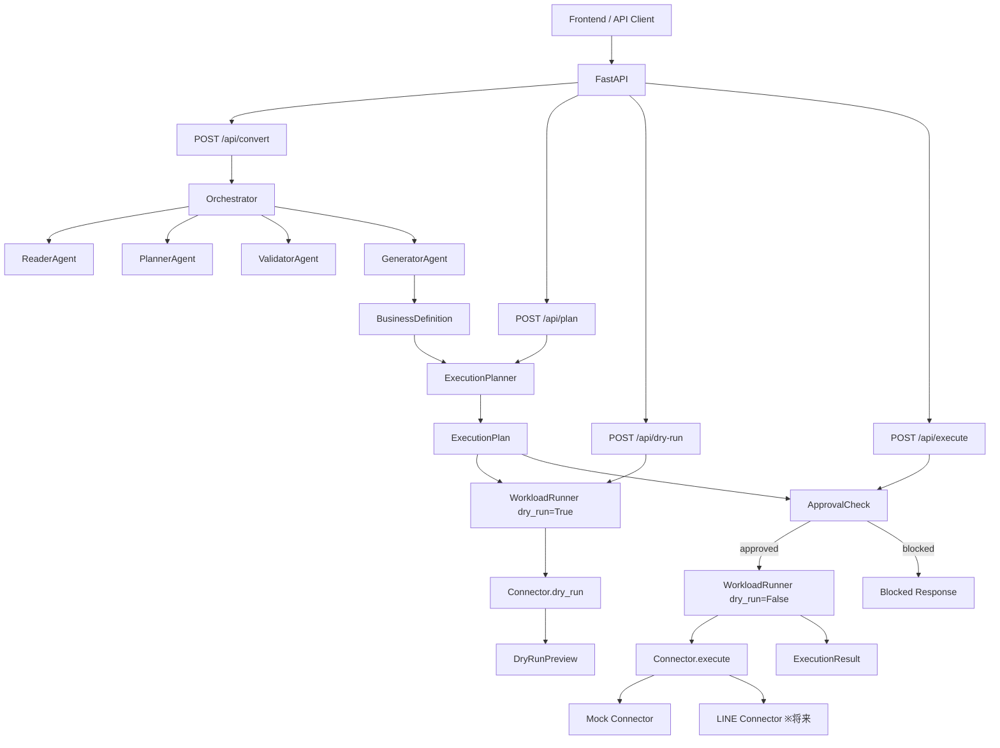
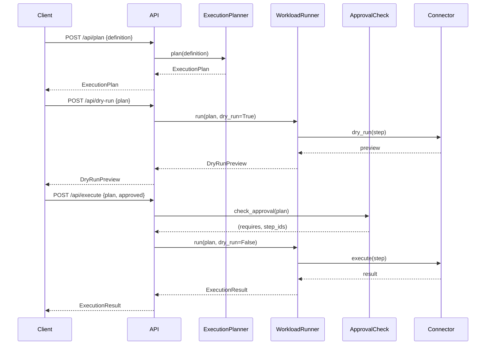

# Phase 2.5: Workload Execution — 設計書

> **参照元:** [`docs/phase2.5/phase2_5_roadmap.md`](phase2_5_roadmap.md)
> **最上位ルール:** `AGENTS.md`

---

## 1. 目的と範囲

### 1.1 目的

GeneratorAgent が出力する BusinessDefinition JSON の「その先」を実装する。
業務定義を安全に実行可能な形（ExecutionPlan）に変換し、dry-run・承認・本実行のフローを提供する。

### 1.2 範囲

**対象:**

- BusinessDefinition → ExecutionPlan への変換（ExecutionPlanner）
- dry-run による副作用なしプレビュー
- 承認要否の判定（ApprovalCheck）
- mock connector を用いた workload 実行（WorkloadRunner）
- 上記に対応する FastAPI エンドポイント（3 本）

**対象外:**

- 既存 Agent 層（`backend/app/agent/`）の変更
- 本番 LINE connector 実装
- 承認の永続化・ワークフローエンジン
- 非同期ジョブキュー
- 実行履歴の DB 保存

---

## 2. 責務境界

### 2.1 3 層分離

```
Agent 層（既存）   = 業務定義生成（頭脳）  ← 変更禁止
Executor 層（新規）= 実行計画と実行（手足）
Connector 層（新規）= 外部システム接続（末端）
```

### 2.2 各コンポーネントの責務

| コンポーネント | 責務 | やらないこと |
|---|---|---|
| Agent 層（既存） | 自然文の理解・構造化 → BusinessDefinition | 外部 API 呼び出し |
| ExecutionPlanner | BusinessDefinition → ExecutionPlan | LLM 呼び出し、外部 API 呼び出し |
| WorkloadRunner | ExecutionPlan → ExecutionResult | 業務定義の解釈 |
| Connector Adapter | 外部システムとの接続 | 業務ロジック |
| ApprovalCheck | 承認要否の判定 | 承認の永続化 |

### 2.3 BusinessDefinition と ExecutionPlan の責務境界

| 項目 | BusinessDefinition | ExecutionPlan |
|---|---|---|
| 所有者 | Agent 層（GeneratorAgent） | Executor 層（ExecutionPlanner） |
| 内容 | 業務の論理構造（タスク・ロール・手順） | 実行可能なステップ列（workload kind・connector・inputs） |
| LLM 依存 | あり（生成時） | なし（ルールベース変換） |
| 外部 API 依存 | なし | なし（実行は WorkloadRunner が担当） |
| スキーマ | `app/agent/schemas.py` | `app/schemas/execution_plan.py` |

---

## 3. Workload Catalog

### 3.1 workload kind 一覧

| workload kind | 説明 | 対応 API（LINE Harness） | 承認要否 |
|---|---|---|---|
| `tag.assign` | ユーザーへのタグ付与 | `POST /api/friends/:id/tags` | 不要 |
| `broadcast.schedule` | 一斉配信の予約 | `POST /api/broadcasts` | **常に必須** |
| `scenario.create` | ステップ配信シナリオの作成 | `POST /api/scenarios` | 不要 |
| `scenario.start` | 指定ユーザーへのシナリオ開始 | `POST /api/scenarios/:id/steps` | 条件付き（対象 100 名超で必須） |
| `reminder.create` | カウントダウン型リマインダー作成 | シナリオ + Cron Trigger 組合せ | 不要 |

### 3.2 変換ルール（BusinessDefinition → workload kind）

ExecutionPlanner は、BusinessDefinition の tasks 内の steps とキーワードから workload kind を判定する。

| 自然文キーワード例 | 判定される workload kind |
|---|---|
| タグ、付与、ラベル | `tag.assign` |
| 配信、一斉、全員、告知 | `broadcast.schedule` |
| シナリオ、ステップ配信、フォロー | `scenario.create` |
| 開始、対象者、配信開始 | `scenario.start` |
| リマインド、リマインダー、通知予約 | `reminder.create` |

### 3.3 承認判定ロジック

| workload kind | 承認要否 |
|---|---|
| `broadcast.schedule` | **常に必須** |
| `scenario.start`（対象 100 名超） | 必須 |
| `scenario.start`（対象 100 名以下） | 不要 |
| `scenario.create` | 不要 |
| `reminder.create` | 不要 |
| `tag.assign` | 不要 |

### 3.4 risk_level 判定

| 条件 | risk_level |
|---|---|
| `broadcast.schedule` を含む | `medium` 以上 |
| `scenario.start` で対象が多い | `medium` |
| 全ステップが `create` / `assign` のみ | `low` |
| 複数の connector にまたがる | `high` |

---

## 4. Approval / Dry-run / Connector Adapter の責務定義

### 4.1 ApprovalCheck

- `check_approval(plan) -> tuple[bool, list[str]]` を提供する
- plan 内の各 step の `requires_approval` を集約し、plan 全体の承認要否を返す
- 承認が必要な step の step_id リストも返す
- **承認の永続化やワークフローエンジンは対象外**

### 4.2 Dry-run

- WorkloadRunner が `dry_run=True` で実行された場合、connector の `dry_run()` メソッドを呼ぶ
- 副作用を一切起こさず、DryRunPreview（preview テキスト・warnings・推定対象数）を返す
- **dry-run は承認なしでも常に実行可能**

### 4.3 Connector Adapter

- `BaseConnector` 抽象基底クラスが `execute()` / `dry_run()` / `capabilities()` を定義する
- 具象 connector は `BaseConnector` を継承して実装する
- WorkloadRunner は connector registry（dict）から connector 名で解決し、具象実装を直接 import しない
- Phase 2.5 では mock connector のみ実装する

---

## 5. アーキテクチャ図

### 5.1 全体フロー



### 5.2 実行フロー（シーケンス）



---

## 6. ディレクトリ構成（追加分）

```
backend/
  app/
    agent/               ← 既存（変更禁止）
    schemas/             ← 新規
      __init__.py
      execution_plan.py
      execution_result.py
      connector_capability.py
    execution/           ← 新規
      __init__.py
      execution_planner.py
      workload_runner.py
      approval.py
    connectors/          ← 新規
      __init__.py
      base_connector.py
      mock_line_connector.py
      mock_internal_job_connector.py
    api/
      convert.py         ← 既存（変更なし）
      routes_plan.py     ← 新規
      routes_dry_run.py  ← 新規
      routes_execute.py  ← 新規
  tests/
    evidence/
    test_execution_planner.py
    test_workload_runner.py
    test_approval.py
    test_connectors.py
    test_api_plan.py
    test_existing_convert.py
```

---

## 7. Pydantic スキーマ概要

### 7.1 ExecutionPlan 関連

- **ExecutionPlan**: plan_id, source_definition_id, dry_run, requires_approval, risk_level, steps, summary, warnings, estimated_side_effects
- **ExecutionStep**: step_id, sequence, kind（5 種類の Literal）, connector, action, inputs, idempotency_key, requires_approval, rollback_action, status
- **ApprovalPolicy**: mode（none / always / conditional）, conditions, reason

### 7.2 ExecutionResult 関連

- **ExecutionResult**: execution_id, plan_id, status（success / partial_success / failed / blocked）, started_at, finished_at, step_results, errors, warnings
- **StepResult**: step_id, status, error_code, message
- **DryRunPreview**: plan_id, status, warnings, preview, estimated_target_count

### 7.3 ConnectorCapability

- **ConnectorCapability**: connector, supported_actions, supports_dry_run, supports_rollback, supports_schedule
