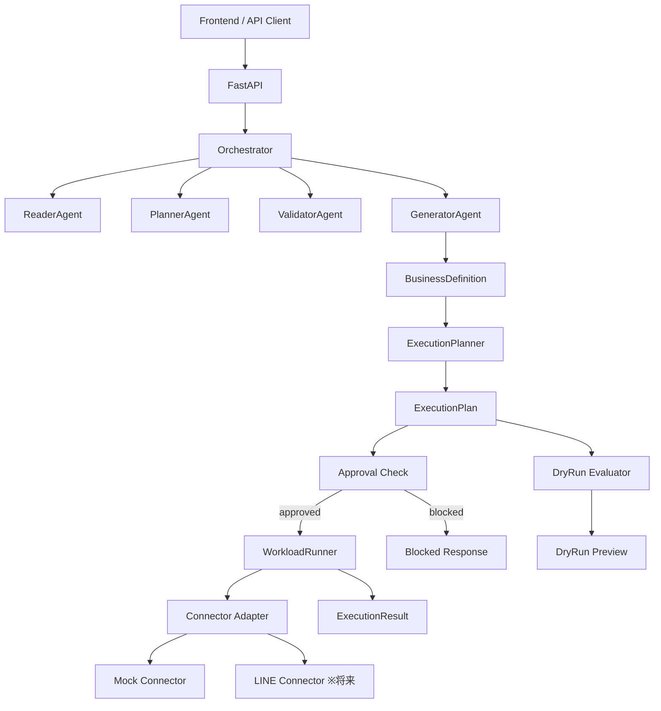

# Phase 2.5: Workload Execution 拡張 — ロードマップ

## 1. 背景と動機

### 1.1 LINE Harness OSS の評価

LINE Harness OSS（github.com/Shudesu/line-harness-oss）は、LINE 公式アカウント運用を「管理画面中心」から「API / 自然言語指示中心」へ転換しようとする OSS である。

**強み:**
- 明確な API-first 設計思想（admin UI is just one client）
- Cloudflare Workers + D1 + Next.js という軽量構成
- ステップ配信、一斉配信、タグ、シナリオ、リマインダーなど主要業務を API 化
- README に具体的な API エンドポイント一覧が公開されており、connector 設計の参考にできる

**注意点:**
- 公開リポジトリ規模はまだ小さい（2 commits、contributor 1 名）
- 承認フロー、dry-run、監査証跡、冪等性など企業運用統制は表からは見えない
- 「BAN 検知」「ステルスモード」等はプラットフォーム規約との距離感を慎重に見るべき

**結論:** プロダクトの脅威というより UX の示唆が大きい。「設定を覚えさせる SaaS」から「目的を言わせる SaaS」への転換を示している。

### 1.2 agentic-bizflow の現状と課題

agentic-bizflow は、自然文の業務手順を Reader → Planner → Validator → Generator の段階処理で BusinessDefinition JSON に変換する Agentic Architecture 実装である。

**現状の強み:**
- 47 commits、Python 85.3%、FastAPI / Pydantic / Vertex AI（Gemini 2.0 Flash）/ Cloud Run
- Agent 間の責務分離が AGENTS.md で明文化されている
- Validator による差し戻し・再計画のループが組み込まれている
- Pydantic スキーマ検証による出力の構造保証

**課題:**
- GeneratorAgent の出力（BusinessDefinition JSON）で処理が終了している
- 「定義を作る」はできるが「実行する」責務がない
- 外部システムとの connector 接続が未実装

### 1.3 Phase 2.5 の目的

GeneratorAgent の後ろに実行計画生成・dry-run・承認付き実行の層を新設し、業務定義を安全に実行できる構成へ拡張する。

### 1.4 line-harness-oss との関係

- agentic-bizflow は本体 repo としてそのまま育てる
- line-harness-oss は fork して「connector の接続先候補の検証」と「API 形状の固定」に使う
- 本体に丸ごと依存するのではなく、adapter インターフェースを通じて疎結合にする

---

## 2. 設計方針

### 2.1 3 層分離

```
agentic-bizflow = 業務定義生成（頭脳）
executor 層     = 実行計画と実行（手足）
connectors      = 外部システム接続（末端）
```

この 3 層を混在させないことが最重要原則である。

### 2.2 責務境界

| 責務 | 担当 | やらないこと |
|---|---|---|
| 自然文の理解・構造化 | Agent 層（既存） | 外部 API 呼び出し |
| BusinessDefinition → ExecutionPlan | ExecutionPlanner | LLM 呼び出し、外部 API 呼び出し |
| ExecutionPlan → ExecutionResult | WorkloadRunner | 業務定義の解釈 |
| 外部システム接続 | Connector Adapter | 業務ロジック |
| 承認要否の判定 | ApprovalCheck | 承認の永続化 |

### 2.3 アーキテクチャ図



### 2.4 API フロー

```
POST /api/convert   → BusinessDefinition（既存・変更なし）
POST /api/plan      → ExecutionPlan（新規）
POST /api/dry-run   → DryRunPreview（新規）
POST /api/execute   → ExecutionResult（新規）
```

---

## 3. Workload Catalog

LINE Harness OSS の公開 API エンドポイントに合わせた 5 種類を初回 workload として定義する。

| workload kind | 説明 | 対応する LINE Harness API | 承認要否 |
|---|---|---|---|
| `scenario.create` | ステップ配信シナリオの作成 | `POST /api/scenarios` | 不要 |
| `scenario.start` | 指定ユーザーへのシナリオ開始 | `POST /api/scenarios/:id/steps` | 条件付き（対象 100 名超で必須） |
| `reminder.create` | カウントダウン型リマインダー作成 | シナリオ + Cron Trigger の組合せ | 不要 |
| `broadcast.schedule` | 一斉配信の予約 | `POST /api/broadcasts` | **常に必須** |
| `tag.assign` | ユーザーへのタグ付与 | `POST /api/friends/:id/tags` | 不要 |

### 3.1 変換ルール（自然文 → workload kind）

| 自然文の例 | 判定される workload |
|---|---|
| 「申込者に VIP タグつけて」 | `tag.assign` |
| 「友だち全員に明日 10 時にセール告知して」 | `broadcast.schedule` |
| 「フォーム作ってフォローシナリオ開始して」 | `scenario.create` → `scenario.start` |
| 「セミナー参加者に 3 日前と前日にリマインド送って」 | `reminder.create`（複数ステップ） |
| 「新規友だちに 3 日間のステップ配信を設定して」 | `scenario.create` |

### 3.2 承認判定ロジック

| workload kind | 承認要否 |
|---|---|
| `broadcast.schedule` | **常に必須** |
| `scenario.start`（対象 100 名超） | 必須 |
| `scenario.start`（対象 100 名以下） | 不要 |
| `scenario.create` | 不要 |
| `reminder.create` | 不要 |
| `tag.assign` | 不要 |

### 3.3 risk_level 判定

- `broadcast.schedule` を含む → `medium` 以上
- `scenario.start` で対象が多い → `medium`
- 全ステップが `create` / `assign` のみ → `low`
- 複数の connector にまたがる → `high`

---

## 4. ディレクトリ構成（追加分）

```
backend/
  app/
    agent/               ← 既存（変更禁止）
    schemas/
      execution_plan.py       ← 新規
      execution_result.py     ← 新規
      connector_capability.py ← 新規
    execution/               ← 新規
      __init__.py
      execution_planner.py
      workload_runner.py
      approval.py
    connectors/              ← 新規
      __init__.py
      base_connector.py
      mock_line_connector.py
      mock_internal_job_connector.py
    api/
      routes_plan.py         ← 新規
      routes_dry_run.py      ← 新規
      routes_execute.py      ← 新規
  tests/
    evidence/                ← エビデンス保存先
    test_execution_planner.py
    test_workload_runner.py
    test_approval.py
    test_connectors.py
    test_api_plan.py
    test_existing_convert.py ← 回帰テスト
docs/
  phase2_5_roadmap.md        ← 本ファイル
```

---

## 5. Pydantic スキーマ設計

### 5.1 ExecutionPlan / ExecutionStep / ApprovalPolicy

→ `backend/app/schemas/execution_plan.py` に配置

主要フィールド:

- `ExecutionPlan`: plan_id, source_definition_id, dry_run, requires_approval, risk_level, steps, summary, warnings, estimated_side_effects
- `ExecutionStep`: step_id, sequence, kind（5 種類の Literal）, connector, action, inputs, idempotency_key, requires_approval, rollback_action, status
- `ApprovalPolicy`: mode（none / always / conditional）, conditions, reason

### 5.2 ExecutionResult / StepResult / DryRunPreview

→ `backend/app/schemas/execution_result.py` に配置

主要フィールド:

- `ExecutionResult`: execution_id, plan_id, status（success / partial_success / failed / blocked）, started_at, finished_at, step_results, errors, warnings
- `StepResult`: step_id, status, error_code, message
- `DryRunPreview`: plan_id, status, warnings, preview, estimated_target_count

### 5.3 ConnectorCapability

→ `backend/app/schemas/connector_capability.py` に配置

主要フィールド: connector, supported_actions, supports_dry_run, supports_rollback, supports_schedule

---

## 6. API レスポンス例

### 6.1 `POST /api/plan`

```json
{
  "plan_id": "plan_a1b2c3d4",
  "source_definition_id": "def_x1y2z3",
  "dry_run": false,
  "requires_approval": true,
  "risk_level": "medium",
  "summary": "VIPタグ付与後に、明日10時に一斉配信を予約します",
  "steps": [
    {
      "step_id": "step_001",
      "sequence": 1,
      "kind": "tag.assign",
      "connector": "line",
      "action": "tag.assign",
      "inputs": {"tag_name": "VIP", "target": "applicants"},
      "idempotency_key": "550e8400-e29b-41d4-a716-446655440000",
      "requires_approval": false,
      "status": "planned"
    },
    {
      "step_id": "step_002",
      "sequence": 2,
      "kind": "broadcast.schedule",
      "connector": "line",
      "action": "broadcast.schedule",
      "inputs": {"scheduled_at": "2026-03-25T10:00:00+09:00", "target_tags": ["VIP"]},
      "idempotency_key": "550e8400-e29b-41d4-a716-446655440001",
      "requires_approval": true,
      "status": "planned"
    }
  ],
  "warnings": ["broadcast.schedule は承認後にのみ実行されます"],
  "estimated_side_effects": ["対象ユーザーへの LINE メッセージ送信"]
}
```

### 6.2 `POST /api/dry-run`

```json
{
  "plan_id": "plan_a1b2c3d4",
  "status": "dry_run_completed",
  "warnings": ["broadcast.schedule は承認後にのみ実行可能です"],
  "preview": [
    "VIPタグを対象ユーザー（申込者）に付与します",
    "明日10:00に一斉配信を予約します（対象: VIPタグ保持者）"
  ],
  "estimated_target_count": 132
}
```

### 6.3 `POST /api/execute`（承認済み）

```json
{
  "execution_id": "exec_d4e5f6",
  "plan_id": "plan_a1b2c3d4",
  "status": "success",
  "started_at": "2026-03-24T15:30:00Z",
  "finished_at": "2026-03-24T15:30:02Z",
  "step_results": [
    {"step_id": "step_001", "status": "success", "message": "VIPタグを付与しました"},
    {"step_id": "step_002", "status": "success", "message": "配信を予約しました"}
  ],
  "errors": [],
  "warnings": []
}
```

### 6.4 `POST /api/execute`（未承認）

```json
{
  "execution_id": "exec_g7h8i9",
  "plan_id": "plan_a1b2c3d4",
  "status": "partial_success",
  "started_at": "2026-03-24T15:30:00Z",
  "finished_at": "2026-03-24T15:30:01Z",
  "step_results": [
    {"step_id": "step_001", "status": "success", "message": "VIPタグを付与しました"},
    {"step_id": "step_002", "status": "blocked", "error_code": "APPROVAL_REQUIRED"}
  ],
  "errors": [],
  "warnings": ["step_002 は承認が必要です"]
}
```

---

## 7. Phase 3 候補（本フェーズでは対象外）

- 非同期ジョブキュー対応（Cloud Tasks / Pub/Sub）
- 本番 LINE connector 実装（line-harness-oss fork との接続）
- 承認ワークフロー永続化
- 実行履歴の DB 保存
- rollback / compensation の強化
- UI 上の ExecutionPlan 編集
- 実行ポリシーの tenant 別設定
- Odoo / Square / Gmail など他 connector の追加

---

## 8. Phase 2.5 完了条件（DoD）

以下をすべて満たしたら Phase 2.5 完了とする。

- [ ] BusinessDefinition から ExecutionPlan を生成できる
- [ ] dry-run が API から利用できる
- [ ] mock connector を用いた execute が可能
- [ ] approval 必須ケースをブロックできる
- [ ] ExecutionResult が構造化されている
- [ ] 既存 `/api/convert` が壊れていない（回帰テスト通過）
- [ ] README / docs に Phase 2.5 の説明が追加されている
- [ ] Python 実装は AGENTS.md の docstring / 日本語コメント要件を満たす
- [ ] 全テストが通過し、evidence が保存されている
