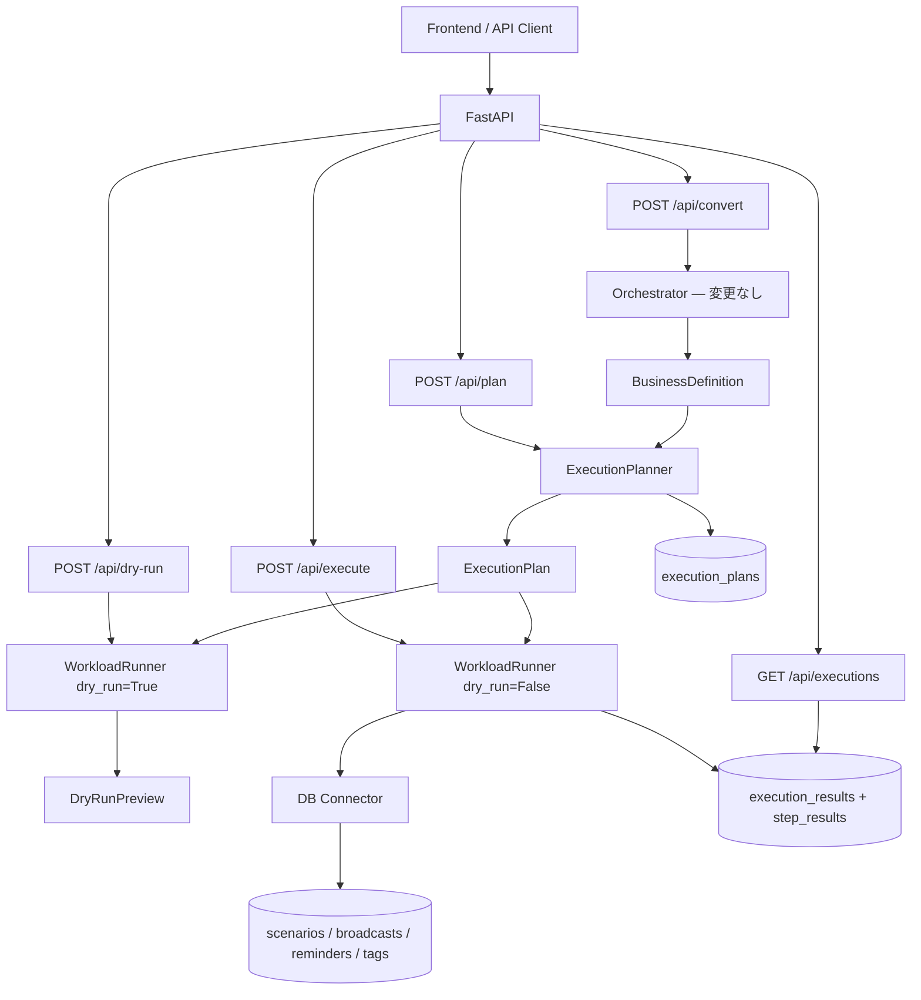
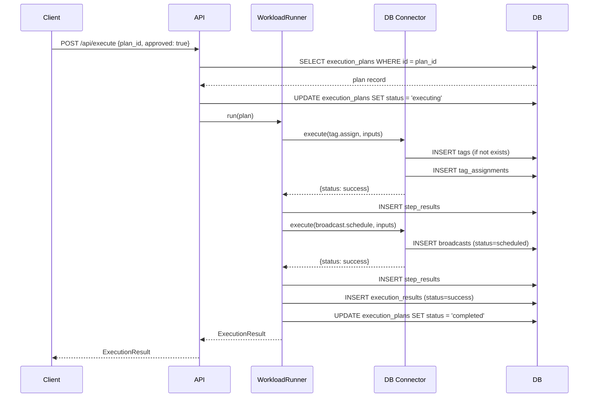

# Phase 3: Stateful Execution Platform — 設計書

> **前提:** Phase 2.5（ExecutionPlanner / WorkloadRunner / mock connector）が完了していること
> **参照元:** `docs/roadmap-phase2_5-to-phase5.md` §3、`docs/ref/line-harness-oss/`
> **最上位ルール:** `AGENTS.md`

---

## 1. 目的と範囲

### 1.1 目的

Phase 2.5 の ExecutionPlan はメモリ上の一時オブジェクトであり、実行が終われば消える。
Phase 3 では、**業務オブジェクトを DB に永続化し、実行状態を追跡できる構成**へ拡張する。

これにより agentic-bizflow は「計画を作って返す変換器」から「状態を持つ実行基盤」に変わる。

### 1.2 この Phase で解決する課題

| 課題 | Phase 2.5 の状態 | Phase 3 で到達する状態 |
|---|---|---|
| 実行計画の保存 | メモリ上のみ、揮発する | DB に保存し、後から参照できる |
| 実行結果の保存 | API レスポンスで返すだけ | DB に履歴として蓄積される |
| workload の状態管理 | mock が即座に成功を返す | DB 上で状態遷移する（draft → scheduled → sent 等） |
| 実行の追跡 | execution_id がログにだけある | API で実行履歴を照会できる |

### 1.3 スコープ

**対象:**

- 実行計画・実行結果の DB 永続化
- 5 workload kind に対応するドメインテーブルの追加
- workload 実行時の DB 状態遷移
- 実行履歴の照会 API
- Alembic マイグレーション

**対象外:**

- 既存 Agent 層（`backend/app/agent/`）の変更
- 非同期ジョブキュー / Cron / Worker（→ Phase 4）
- 本番 LINE connector（→ Phase 4）
- 承認の永続化・ワークフローエンジン（→ Phase 4）
- automations / scoring / notification_rules（→ Phase 5 以降）

---

## 2. 設計方針

### 2.1 「宣言的に登録し、将来の定期実行で消化する」

line-harness-oss の核心的な構造は、業務オブジェクトを DB に登録し、Cron が条件到来分を消化する設計にある。

```
scenario.start  → friend_scenarios に enroll → Cron が next_delivery_at で配信
broadcast.schedule → broadcasts に status=scheduled → Cron が scheduled_at で送信
reminder.create → reminders + steps を登録 → Cron が target_date + offset で配信
```

Phase 3 では「登録」までを担当し、「Cron による消化」は Phase 4 に委ねる。
つまり、DB に正しい状態で書き込むところまでが Phase 3 のゴール。

### 2.2 Phase 2.5 からの変更点

| コンポーネント | Phase 2.5 | Phase 3 |
|---|---|---|
| ExecutionPlan | メモリ上のみ | `execution_plans` テーブルに保存 |
| ExecutionResult | レスポンスで返すだけ | `execution_results` + `step_results` テーブルに保存 |
| mock connector | 即座に成功 dict を返す | DB にドメインレコードを書き込む |
| WorkloadRunner | connector 呼び出し → 結果返却 | connector 呼び出し → DB 書き込み → 結果保存 |
| API | plan / dry-run / execute | + 実行履歴照会（GET） |

### 2.3 既存コードへの影響

- `backend/app/agent/` — **変更なし**
- `backend/app/schemas/` — ExecutionPlan / ExecutionResult は既存を維持、ORM モデルを別途追加
- `backend/app/execution/` — WorkloadRunner に DB 書き込みを追加
- `backend/app/connectors/` — mock connector を「DB に書く connector」に進化させる
- `backend/app/api/` — 実行履歴照会エンドポイントを追加

---

## 3. ドメインモデル

line-harness-oss の ER / テーブル仕様（`docs/ref/line-harness-oss/`）を参照モデルとする。
ただし、agentic-bizflow の文脈に合わせて以下を調整する。

- line-harness は LINE 専用だが、agentic-bizflow は将来マルチドメインを見据えるため、LINE 固有のカラム（`line_user_id` 等）は connector 側の責務に寄せる
- line-harness は Cloudflare D1（SQLite）だが、agentic-bizflow は PostgreSQL or SQLite を想定する
- ID は UUID v4 文字列、タイムスタンプは UTC の datetime 型

### 3.1 実行管理テーブル（agentic-bizflow 固有）

#### execution_plans

ExecutionPlan の永続化。Phase 2.5 で Pydantic モデルだったものを DB に保存する。

| カラム | 型 | 制約 | 説明 |
|---|---|---|---|
| id | TEXT | PK | plan_id（UUID） |
| source_definition_id | TEXT | NOT NULL | 元の BusinessDefinition の識別子 |
| source_definition_json | TEXT | NOT NULL | BusinessDefinition の JSON スナップショット |
| plan_json | TEXT | NOT NULL | ExecutionPlan 全体の JSON |
| requires_approval | BOOLEAN | NOT NULL DEFAULT FALSE | 承認要否 |
| risk_level | TEXT | NOT NULL DEFAULT 'low' | low / medium / high |
| summary | TEXT | | 実行計画の要約 |
| status | TEXT | NOT NULL DEFAULT 'created' | created / approved / executing / completed / failed |
| created_at | DATETIME | NOT NULL | 作成日時 |
| updated_at | DATETIME | NOT NULL | 更新日時 |

#### execution_results

ExecutionResult の永続化。

| カラム | 型 | 制約 | 説明 |
|---|---|---|---|
| id | TEXT | PK | execution_id（UUID） |
| plan_id | TEXT | FK → execution_plans | 実行した plan |
| status | TEXT | NOT NULL | success / partial_success / failed / blocked |
| started_at | DATETIME | NOT NULL | 実行開始日時 |
| finished_at | DATETIME | | 実行完了日時 |
| errors_json | TEXT | NOT NULL DEFAULT '[]' | エラー一覧（JSON） |
| warnings_json | TEXT | NOT NULL DEFAULT '[]' | 警告一覧（JSON） |

#### step_results

StepResult の永続化。

| カラム | 型 | 制約 | 説明 |
|---|---|---|---|
| id | TEXT | PK | UUID |
| execution_id | TEXT | FK → execution_results | 所属する execution |
| step_id | TEXT | NOT NULL | ExecutionStep の step_id |
| sequence | INTEGER | NOT NULL | ステップ順序 |
| kind | TEXT | NOT NULL | workload kind |
| connector | TEXT | NOT NULL | connector 名 |
| status | TEXT | NOT NULL | success / failed / blocked / skipped |
| error_code | TEXT | | エラーコード |
| message | TEXT | | 結果メッセージ |
| created_at | DATETIME | NOT NULL | 記録日時 |

### 3.2 workload ドメインテーブル

以下は、workload 実行時に connector が実際に書き込むテーブル。
line-harness-oss の同名テーブルを参照モデルとしつつ、agentic-bizflow 向けに簡素化する。

#### scenarios

| カラム | 型 | 制約 | 説明 | line-harness 参照 |
|---|---|---|---|---|
| id | TEXT | PK | UUID | scenarios.id |
| name | TEXT | NOT NULL | シナリオ名 | scenarios.name |
| description | TEXT | | 説明 | scenarios.description |
| trigger_type | TEXT | NOT NULL DEFAULT 'manual' | manual / tag_added | scenarios.trigger_type |
| trigger_tag_id | TEXT | FK → tags | tag_added トリガー時のタグ | scenarios.trigger_tag_id |
| is_active | BOOLEAN | NOT NULL DEFAULT TRUE | 有効/無効 | scenarios.is_active |
| execution_plan_id | TEXT | FK → execution_plans | 生成元の plan | ※agentic-bizflow 固有 |
| created_at | DATETIME | NOT NULL | | |
| updated_at | DATETIME | NOT NULL | | |

#### scenario_steps

| カラム | 型 | 制約 | 説明 | line-harness 参照 |
|---|---|---|---|---|
| id | TEXT | PK | UUID | scenario_steps.id |
| scenario_id | TEXT | FK → scenarios | 所属シナリオ | scenario_steps.scenario_id |
| step_order | INTEGER | NOT NULL | ステップ順序 | scenario_steps.step_order |
| delay_minutes | INTEGER | NOT NULL DEFAULT 0 | 前ステップからの遅延（分） | scenario_steps.delay_minutes |
| message_type | TEXT | NOT NULL DEFAULT 'text' | text / image / flex | scenario_steps.message_type |
| message_content | TEXT | NOT NULL | メッセージ本文 | scenario_steps.message_content |
| created_at | DATETIME | NOT NULL | | |

**UNIQUE:** `(scenario_id, step_order)`

#### scenario_enrollments

line-harness の `friend_scenarios` に相当。「友だち」ではなく「対象者」として汎化。

| カラム | 型 | 制約 | 説明 | line-harness 参照 |
|---|---|---|---|---|
| id | TEXT | PK | UUID | friend_scenarios.id |
| scenario_id | TEXT | FK → scenarios | シナリオ | friend_scenarios.scenario_id |
| target_id | TEXT | NOT NULL | 対象者の外部 ID | friend_scenarios.friend_id |
| current_step_order | INTEGER | NOT NULL DEFAULT 0 | 現在のステップ位置 | friend_scenarios.current_step_order |
| status | TEXT | NOT NULL DEFAULT 'active' | active / paused / completed | friend_scenarios.status |
| next_delivery_at | DATETIME | | 次回配信予定日時 | friend_scenarios.next_delivery_at |
| started_at | DATETIME | NOT NULL | 開始日時 | friend_scenarios.started_at |
| updated_at | DATETIME | NOT NULL | | |

**インデックス:** `next_delivery_at`, `status`

#### broadcasts

| カラム | 型 | 制約 | 説明 | line-harness 参照 |
|---|---|---|---|---|
| id | TEXT | PK | UUID | broadcasts.id |
| title | TEXT | NOT NULL | 配信タイトル | broadcasts.title |
| message_type | TEXT | NOT NULL DEFAULT 'text' | | broadcasts.message_type |
| message_content | TEXT | NOT NULL | | broadcasts.message_content |
| target_type | TEXT | NOT NULL DEFAULT 'all' | all / tag / segment | broadcasts.target_type |
| target_tag_id | TEXT | FK → tags | タグ絞り込み時 | broadcasts.target_tag_id |
| status | TEXT | NOT NULL DEFAULT 'draft' | draft / scheduled / sending / sent | broadcasts.status |
| scheduled_at | DATETIME | | 予約配信日時 | broadcasts.scheduled_at |
| sent_at | DATETIME | | 送信完了日時 | broadcasts.sent_at |
| total_count | INTEGER | NOT NULL DEFAULT 0 | 対象者数 | broadcasts.total_count |
| success_count | INTEGER | NOT NULL DEFAULT 0 | 送信成功数 | broadcasts.success_count |
| execution_plan_id | TEXT | FK → execution_plans | 生成元の plan | ※agentic-bizflow 固有 |
| created_at | DATETIME | NOT NULL | | |

**インデックス:** `status`, `scheduled_at`

#### reminders

| カラム | 型 | 制約 | 説明 | line-harness 参照 |
|---|---|---|---|---|
| id | TEXT | PK | UUID | reminders.id |
| name | TEXT | NOT NULL | リマインダ名 | reminders.name |
| description | TEXT | | 説明 | reminders.description |
| is_active | BOOLEAN | NOT NULL DEFAULT TRUE | | reminders.is_active |
| execution_plan_id | TEXT | FK → execution_plans | 生成元の plan | ※agentic-bizflow 固有 |
| created_at | DATETIME | NOT NULL | | |
| updated_at | DATETIME | NOT NULL | | |

#### reminder_steps

| カラム | 型 | 制約 | 説明 | line-harness 参照 |
|---|---|---|---|---|
| id | TEXT | PK | UUID | reminder_steps.id |
| reminder_id | TEXT | FK → reminders | 所属リマインダ | reminder_steps.reminder_id |
| offset_minutes | INTEGER | NOT NULL | 基準日からのオフセット（負=前、正=後） | reminder_steps.offset_minutes |
| message_type | TEXT | NOT NULL DEFAULT 'text' | | reminder_steps.message_type |
| message_content | TEXT | NOT NULL | | reminder_steps.message_content |
| created_at | DATETIME | NOT NULL | | |

**インデックス:** `reminder_id`

#### reminder_enrollments

line-harness の `friend_reminders` + `friend_reminder_deliveries` に相当。

| カラム | 型 | 制約 | 説明 | line-harness 参照 |
|---|---|---|---|---|
| id | TEXT | PK | UUID | friend_reminders.id |
| reminder_id | TEXT | FK → reminders | リマインダ | friend_reminders.reminder_id |
| target_id | TEXT | NOT NULL | 対象者の外部 ID | friend_reminders.friend_id |
| target_date | DATETIME | NOT NULL | 基準日（例: セミナー日） | friend_reminders.target_date |
| status | TEXT | NOT NULL DEFAULT 'active' | active / completed / cancelled | friend_reminders.status |
| created_at | DATETIME | NOT NULL | | |
| updated_at | DATETIME | NOT NULL | | |

**インデックス:** `status`, `target_date`

#### reminder_deliveries

配信済み記録。冪等性の担保に使う。

| カラム | 型 | 制約 | 説明 | line-harness 参照 |
|---|---|---|---|---|
| id | TEXT | PK | UUID | friend_reminder_deliveries.id |
| enrollment_id | TEXT | FK → reminder_enrollments | 登録 ID | friend_reminder_deliveries.friend_reminder_id |
| reminder_step_id | TEXT | FK → reminder_steps | ステップ ID | friend_reminder_deliveries.reminder_step_id |
| delivered_at | DATETIME | NOT NULL | 配信日時 | friend_reminder_deliveries.delivered_at |

**UNIQUE:** `(enrollment_id, reminder_step_id)`

#### tags

| カラム | 型 | 制約 | 説明 | line-harness 参照 |
|---|---|---|---|---|
| id | TEXT | PK | UUID | tags.id |
| name | TEXT | UNIQUE NOT NULL | タグ名 | tags.name |
| created_at | DATETIME | NOT NULL | | |

#### tag_assignments

line-harness の `friend_tags` に相当。「友だち」ではなく「対象者」として汎化。

| カラム | 型 | 制約 | 説明 | line-harness 参照 |
|---|---|---|---|---|
| target_id | TEXT | PK | 対象者の外部 ID | friend_tags.friend_id |
| tag_id | TEXT | PK, FK → tags | タグ ID | friend_tags.tag_id |
| assigned_at | DATETIME | NOT NULL | 付与日時 | friend_tags.assigned_at |

### 3.3 line-harness との命名差分

| line-harness | agentic-bizflow | 変更理由 |
|---|---|---|
| `friend_scenarios` | `scenario_enrollments` | LINE の「友だち」に限定しない |
| `friend_reminders` | `reminder_enrollments` | 同上 |
| `friend_reminder_deliveries` | `reminder_deliveries` | 簡潔化 |
| `friend_tags` | `tag_assignments` | 同上 |
| `friend_id` | `target_id` | マルチドメイン対応の布石 |

---

## 4. 状態遷移

### 4.1 execution_plans.status

```
created → approved → executing → completed
                               → failed
```

- `created`: plan 生成直後
- `approved`: 承認済み（approval 不要の plan は created → approved を即時通過）
- `executing`: WorkloadRunner 実行中
- `completed`: 全 step 成功
- `failed`: いずれかの step が失敗

### 4.2 broadcasts.status

```
draft → scheduled → sending → sent
```

line-harness と同一。Phase 3 では `draft → scheduled` までを workload 実行で行い、`scheduled → sending → sent` は Phase 4（Cron）の責務。

### 4.3 scenario_enrollments.status

```
active → paused → active（再開）
active → completed
```

Phase 3 では enroll（active 状態で登録）までを行い、step 進行は Phase 4 の責務。

### 4.4 reminder_enrollments.status

```
active → completed
active → cancelled
```

同上。

---

## 5. アーキテクチャ図

### 5.1 Phase 3 全体フロー



### 5.2 workload 実行シーケンス（例: tag.assign + broadcast.schedule）



---

## 6. ディレクトリ構成（追加・変更分）

```
backend/
  app/
    agent/                  ← 変更なし
    schemas/                ← 既存維持
    execution/              ← 既存修正
      execution_planner.py  ← plan 保存ロジック追加
      workload_runner.py    ← DB 書き込みロジック追加
      approval.py           ← 変更なし
    connectors/             ← 既存修正
      base_connector.py     ← 変更なし
      db_line_connector.py  ← 新規（mock を置き換え、DB に書く connector）
    db/                     ← 新規
      __init__.py
      session.py            ← DB セッション管理
      models.py             ← SQLAlchemy ORM モデル
      migrations/           ← Alembic マイグレーション
        env.py
        versions/
    api/
      routes_plan.py        ← plan 保存に対応
      routes_execute.py     ← 結果保存に対応
      routes_history.py     ← 新規（実行履歴照会）
  tests/
    evidence/
    test_db_models.py       ← 新規
    test_db_connector.py    ← 新規
    test_execution_history.py ← 新規
    test_existing_convert.py  ← 回帰テスト維持
    test_existing_phase25.py  ← Phase 2.5 回帰テスト
```

---

## 7. API 追加・変更

### 7.1 既存 API の変更

| エンドポイント | 変更内容 |
|---|---|
| `POST /api/plan` | ExecutionPlan を `execution_plans` テーブルに保存するようになる |
| `POST /api/execute` | ExecutionResult を `execution_results` + `step_results` テーブルに保存するようになる |
| `POST /api/dry-run` | 変更なし（DB 書き込みしない） |
| `POST /api/convert` | **変更なし** |

### 7.2 新規 API

| エンドポイント | 説明 |
|---|---|
| `GET /api/executions` | 実行履歴一覧 |
| `GET /api/executions/{execution_id}` | 実行詳細（step_results 含む） |
| `GET /api/plans` | 保存済み plan 一覧 |
| `GET /api/plans/{plan_id}` | plan 詳細 |

### 7.3 レスポンス例

#### `GET /api/executions`

```json
{
  "executions": [
    {
      "execution_id": "exec_d4e5f6",
      "plan_id": "plan_a1b2c3d4",
      "status": "success",
      "started_at": "2026-03-26T15:30:00Z",
      "finished_at": "2026-03-26T15:30:02Z",
      "step_count": 2,
      "summary": "VIPタグ付与後に一斉配信を予約"
    }
  ],
  "total": 1
}
```

#### `GET /api/executions/{execution_id}`

```json
{
  "execution_id": "exec_d4e5f6",
  "plan_id": "plan_a1b2c3d4",
  "status": "success",
  "started_at": "2026-03-26T15:30:00Z",
  "finished_at": "2026-03-26T15:30:02Z",
  "step_results": [
    {
      "step_id": "step_001",
      "kind": "tag.assign",
      "status": "success",
      "message": "VIPタグを付与しました",
      "created_records": {"tags": 1, "tag_assignments": 15}
    },
    {
      "step_id": "step_002",
      "kind": "broadcast.schedule",
      "status": "success",
      "message": "配信を予約しました",
      "created_records": {"broadcasts": 1}
    }
  ],
  "errors": [],
  "warnings": []
}
```

---

## 8. Phase 3 完了条件（DoD）

- [ ] Alembic マイグレーションで全テーブルが作成できる
- [ ] ExecutionPlan が DB に保存・取得できる
- [ ] ExecutionResult + StepResult が DB に保存・取得できる
- [ ] workload 実行で scenarios / broadcasts / reminders / tags テーブルにレコードが作成される
- [ ] 実行履歴を API で照会できる
- [ ] broadcasts は status=scheduled で登録される（sending/sent への遷移は Phase 4）
- [ ] scenario_enrollments は active で登録される（step 進行は Phase 4）
- [ ] 既存 `/api/convert` が壊れていない
- [ ] Phase 2.5 の既存テストが壊れていない
- [ ] 全テストが通過し evidence が保存されている
- [ ] AGENTS.md の docstring 要件を満たしている

---

## 9. Phase 4 への申し送り（本 Phase では対象外）

Phase 3 で「登録」した状態を Phase 4 で「消化」する。具体的には:

- `scenario_enrollments.next_delivery_at ≤ now` を Cron で拾い、step 配信を実行する
- `broadcasts.status = scheduled, scheduled_at ≤ now` を Cron で拾い、送信処理を実行する
- `reminder_enrollments` + `reminder_steps` の offset_minutes を Cron で評価し、未配信分を送信する
- 承認状態の永続化（approval_state テーブル）
- retry policy（step 単位の再試行）
- execution_audit_log（詳細な監査ログ）
