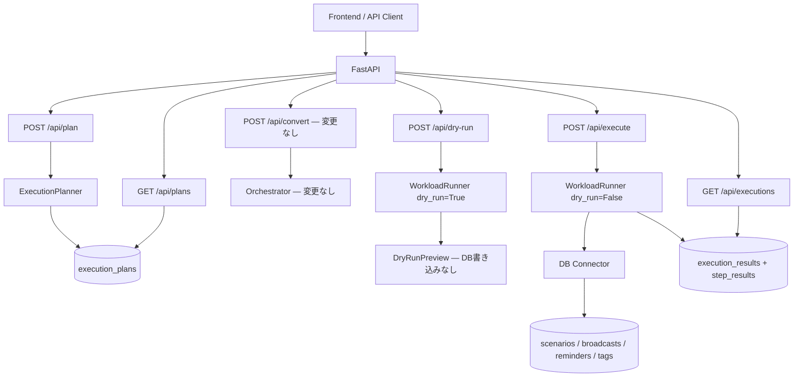

# Phase 3: Stateful Execution Platform — 設計書

> **前提:** Phase 2.5（ExecutionPlanner / WorkloadRunner / mock connector）が完了していること
> **全体ロードマップ:** `docs/roadmap-phase2_5-to-phase5.md`
> **参照モデル:** `docs/ref/line-harness-oss/`
> **最上位ルール:** `AGENTS.md`

---

## 1. 目的と範囲

### 1.1 目的

Phase 2.5 の ExecutionPlan はメモリ上の一時オブジェクトであり、実行が終われば消える。
Phase 3 では、**業務オブジェクトを DB に永続化し、実行状態を追跡できる構成**へ拡張する。

これにより agentic-bizflow は「計画を作って返す変換器」から「状態を持つ実行基盤」に変わる。

### 1.2 Phase 2.5 → Phase 3 で何が変わるか

| 項目 | Phase 2.5 の状態 | Phase 3 で到達する状態 |
|---|---|---|
| 実行計画の保存 | メモリ上のみ、揮発する | DB に保存し、後から参照できる |
| 実行結果の保存 | API レスポンスで返すだけ | DB に履歴として蓄積される |
| workload の状態管理 | mock が即座に成功を返す | DB 上で状態遷移する（draft → scheduled 等） |
| 実行の追跡 | execution_id がログにだけある | API で実行履歴を照会できる |

### 1.3 スコープ

**対象:**

- SQLAlchemy + Alembic による DB 基盤構築
- 実行計画・実行結果の DB 永続化
- 5 workload kind に対応するドメインテーブルの追加
- workload 実行時の DB 状態遷移（mock connector → DB connector への進化）
- 実行履歴の照会 API
- テスト DB 戦略（in-memory SQLite）

**対象外:**

- 既存 Agent 層（`backend/app/agent/`）の変更
- 非同期ジョブキュー / Cron / Worker（→ Phase 4）
- 本番 LINE connector（→ Phase 4）
- 承認の永続化・ワークフローエンジン（→ Phase 4）
- automations / scoring / notification_rules（→ Phase 5 以降）

---

## 2. 設計方針

### 2.1 「宣言的に登録し、将来の定期実行で消化する」

line-harness-oss の核心的な構造は、業務オブジェクトを DB に登録し、Cron が条件到来分を消化する設計にある。

```
scenario.start     → scenario_enrollments に enroll  → Cron が next_delivery_at で配信（Phase 4）
broadcast.schedule → broadcasts に status=scheduled  → Cron が scheduled_at で送信（Phase 4）
reminder.create    → reminders + steps を登録        → Cron が target_date + offset で配信（Phase 4）
```

Phase 3 では **「登録」まで** を担当し、**「Cron による消化」は Phase 4** に委ねる。
DB に正しい状態で書き込むところまでが Phase 3 のゴール。

### 2.2 Phase 2.5 コードへの影響方針

| コンポーネント | 変更内容 |
|---|---|
| `backend/app/agent/` | **変更なし** |
| `backend/app/schemas/` | 既存 Pydantic モデルを維持。ORM モデルを `db/models.py` に別途追加 |
| `backend/app/execution/execution_planner.py` | plan 生成後に DB 保存ロジックを追加 |
| `backend/app/execution/workload_runner.py` | DB 書き込み + 結果保存ロジックを追加 |
| `backend/app/connectors/mock_line_connector.py` | `db_line_connector.py` に進化（BaseConnector は変更なし） |
| `backend/app/api/routes_plan.py` | DB セッション注入を追加 |
| `backend/app/api/routes_execute.py` | DB セッション注入 + 結果保存を追加 |

### 2.3 Pydantic スキーマと ORM モデルの関係

Phase 2.5 の Pydantic スキーマ（`schemas/execution_plan.py` 等）は API の入出力用として維持する。
Phase 3 で追加する SQLAlchemy ORM モデル（`db/models.py`）は DB 永続化用。
両者は repository 層で相互変換する。混在させない。

---

## 3. テスト DB 戦略

### 3.1 構成

```python
# conftest.py
from sqlalchemy import create_engine, event
from sqlalchemy.orm import sessionmaker
from sqlalchemy.pool import StaticPool

engine = create_engine(
    "sqlite:///:memory:",
    connect_args={"check_same_thread": False},
    poolclass=StaticPool,
)

@event.listens_for(engine, "connect")
def set_sqlite_pragma(dbapi_connection, connection_record):
    cursor = dbapi_connection.cursor()
    cursor.execute("PRAGMA foreign_keys=ON")
    cursor.close()

TestingSessionLocal = sessionmaker(bind=engine)
```

### 3.2 ルール

- テスト DB は **in-memory SQLite** (`sqlite:///:memory:`) + `StaticPool`
- **`PRAGMA foreign_keys=ON`** を event listener で設定（SQLite は FK がデフォルト OFF）
- `conftest.py` で FastAPI の `get_db` 依存を override し、全テストで DB 利用可能にする
- 各テスト後に **rollback** で初期化（テスト間の独立性を保証）
- 本番/開発環境は `DATABASE_URL` 環境変数で PostgreSQL or ファイル SQLite に切替

### 3.3 conftest.py の配置

```
backend/tests/conftest.py  ← DB セッション override + テーブル作成/破棄
```

---

## 4. ドメインモデル

line-harness-oss の ER / テーブル仕様（`docs/ref/line-harness-oss/`）を参照モデルとする。

### 4.1 実行管理テーブル（agentic-bizflow 固有）

#### execution_plans

| カラム | 型 | 制約 | 説明 |
|---|---|---|---|
| id | TEXT | PK | plan_id（UUID） |
| source_definition_id | TEXT | NOT NULL | 元の BusinessDefinition の識別子 |
| source_definition_json | TEXT | NOT NULL | BusinessDefinition の JSON スナップショット |
| plan_json | TEXT | NOT NULL | ExecutionPlan 全体の JSON |
| requires_approval | BOOLEAN | NOT NULL DEFAULT FALSE | 承認要否 |
| risk_level | TEXT | NOT NULL DEFAULT 'low' | low / medium / high |
| summary | TEXT | | 実行計画の要約 |
| status | TEXT | NOT NULL DEFAULT 'created' | created / approved / executing / completed / failed |
| created_at | DATETIME | NOT NULL | |
| updated_at | DATETIME | NOT NULL | |

#### execution_results

| カラム | 型 | 制約 | 説明 |
|---|---|---|---|
| id | TEXT | PK | execution_id（UUID） |
| plan_id | TEXT | FK → execution_plans | 実行した plan |
| status | TEXT | NOT NULL | success / partial_success / failed / blocked |
| started_at | DATETIME | NOT NULL | |
| finished_at | DATETIME | | |
| errors_json | TEXT | NOT NULL DEFAULT '[]' | エラー一覧（JSON） |
| warnings_json | TEXT | NOT NULL DEFAULT '[]' | 警告一覧（JSON） |

#### step_results

| カラム | 型 | 制約 | 説明 |
|---|---|---|---|
| id | TEXT | PK | UUID |
| execution_id | TEXT | FK → execution_results | |
| step_id | TEXT | NOT NULL | ExecutionStep の step_id |
| sequence | INTEGER | NOT NULL | ステップ順序 |
| kind | TEXT | NOT NULL | workload kind |
| connector | TEXT | NOT NULL | connector 名 |
| status | TEXT | NOT NULL | success / failed / blocked / skipped |
| error_code | TEXT | | |
| message | TEXT | | |
| created_at | DATETIME | NOT NULL | |

### 4.2 workload ドメインテーブル

line-harness-oss を参照モデルとしつつ、LINE 固有の名称を汎化する。

#### scenarios

| カラム | 型 | 制約 | 説明 | line-harness 参照 |
|---|---|---|---|---|
| id | TEXT | PK | UUID | scenarios.id |
| name | TEXT | NOT NULL | シナリオ名 | scenarios.name |
| description | TEXT | | | scenarios.description |
| trigger_type | TEXT | NOT NULL DEFAULT 'manual' | manual / tag_added | scenarios.trigger_type |
| trigger_tag_id | TEXT | FK → tags | | scenarios.trigger_tag_id |
| is_active | BOOLEAN | NOT NULL DEFAULT TRUE | | scenarios.is_active |
| execution_plan_id | TEXT | FK → execution_plans | 生成元 plan | ※固有 |
| created_at | DATETIME | NOT NULL | | |
| updated_at | DATETIME | NOT NULL | | |

#### scenario_steps

| カラム | 型 | 制約 | 説明 |
|---|---|---|---|
| id | TEXT | PK | UUID |
| scenario_id | TEXT | FK → scenarios | |
| step_order | INTEGER | NOT NULL | |
| delay_minutes | INTEGER | NOT NULL DEFAULT 0 | 前ステップからの遅延（分） |
| message_type | TEXT | NOT NULL DEFAULT 'text' | text / image / flex |
| message_content | TEXT | NOT NULL | |
| created_at | DATETIME | NOT NULL | |

**UNIQUE:** `(scenario_id, step_order)`

#### scenario_enrollments

line-harness の `friend_scenarios` に相当。`friend_id` → `target_id` に汎化。

| カラム | 型 | 制約 | 説明 |
|---|---|---|---|
| id | TEXT | PK | UUID |
| scenario_id | TEXT | FK → scenarios | |
| target_id | TEXT | NOT NULL | 対象者の外部 ID |
| current_step_order | INTEGER | NOT NULL DEFAULT 0 | |
| status | TEXT | NOT NULL DEFAULT 'active' | active / paused / completed |
| next_delivery_at | DATETIME | | 次回配信予定（Phase 4 で使用） |
| started_at | DATETIME | NOT NULL | |
| updated_at | DATETIME | NOT NULL | |

**インデックス:** `next_delivery_at`, `status`

#### broadcasts

| カラム | 型 | 制約 | 説明 |
|---|---|---|---|
| id | TEXT | PK | UUID |
| title | TEXT | NOT NULL | |
| message_type | TEXT | NOT NULL DEFAULT 'text' | |
| message_content | TEXT | NOT NULL | |
| target_type | TEXT | NOT NULL DEFAULT 'all' | all / tag / segment |
| target_tag_id | TEXT | FK → tags | |
| status | TEXT | NOT NULL DEFAULT 'draft' | draft / scheduled / sending / sent |
| scheduled_at | DATETIME | | |
| sent_at | DATETIME | | |
| total_count | INTEGER | NOT NULL DEFAULT 0 | |
| success_count | INTEGER | NOT NULL DEFAULT 0 | |
| execution_plan_id | TEXT | FK → execution_plans | 生成元 plan |
| created_at | DATETIME | NOT NULL | |

**インデックス:** `status`, `scheduled_at`

#### reminders

| カラム | 型 | 制約 | 説明 |
|---|---|---|---|
| id | TEXT | PK | UUID |
| name | TEXT | NOT NULL | |
| description | TEXT | | |
| is_active | BOOLEAN | NOT NULL DEFAULT TRUE | |
| execution_plan_id | TEXT | FK → execution_plans | |
| created_at | DATETIME | NOT NULL | |
| updated_at | DATETIME | NOT NULL | |

#### reminder_steps

| カラム | 型 | 制約 | 説明 |
|---|---|---|---|
| id | TEXT | PK | UUID |
| reminder_id | TEXT | FK → reminders | |
| offset_minutes | INTEGER | NOT NULL | 基準日からのオフセット（負=前、正=後） |
| message_type | TEXT | NOT NULL DEFAULT 'text' | |
| message_content | TEXT | NOT NULL | |
| created_at | DATETIME | NOT NULL | |

**インデックス:** `reminder_id`

#### reminder_enrollments

line-harness の `friend_reminders` に相当。

| カラム | 型 | 制約 | 説明 |
|---|---|---|---|
| id | TEXT | PK | UUID |
| reminder_id | TEXT | FK → reminders | |
| target_id | TEXT | NOT NULL | 対象者の外部 ID |
| target_date | DATETIME | NOT NULL | 基準日（例: セミナー日） |
| status | TEXT | NOT NULL DEFAULT 'active' | active / completed / cancelled |
| created_at | DATETIME | NOT NULL | |
| updated_at | DATETIME | NOT NULL | |

**インデックス:** `status`, `target_date`

#### reminder_deliveries

冪等性担保用。line-harness の `friend_reminder_deliveries` に相当。

| カラム | 型 | 制約 | 説明 |
|---|---|---|---|
| id | TEXT | PK | UUID |
| enrollment_id | TEXT | FK → reminder_enrollments | |
| reminder_step_id | TEXT | FK → reminder_steps | |
| delivered_at | DATETIME | NOT NULL | |

**UNIQUE:** `(enrollment_id, reminder_step_id)`

#### tags

| カラム | 型 | 制約 | 説明 |
|---|---|---|---|
| id | TEXT | PK | UUID |
| name | TEXT | UNIQUE NOT NULL | |
| created_at | DATETIME | NOT NULL | |

#### tag_assignments

line-harness の `friend_tags` に相当。

| カラム | 型 | 制約 | 説明 |
|---|---|---|---|
| target_id | TEXT | PK | 対象者の外部 ID |
| tag_id | TEXT | PK, FK → tags | |
| assigned_at | DATETIME | NOT NULL | |

### 4.3 命名差分（line-harness → agentic-bizflow）

| line-harness | agentic-bizflow | 理由 |
|---|---|---|
| `friend_scenarios` | `scenario_enrollments` | LINE 限定しない |
| `friend_reminders` | `reminder_enrollments` | 同上 |
| `friend_reminder_deliveries` | `reminder_deliveries` | 簡潔化 |
| `friend_tags` | `tag_assignments` | 同上 |
| `friend_id` | `target_id` | マルチドメインの布石 |

---

## 5. 状態遷移

### 5.1 execution_plans.status

```
created → approved → executing → completed
                               → failed
```

approval 不要の plan は `created → approved` を即時通過。

### 5.2 broadcasts.status

```
draft → scheduled → sending → sent
```

Phase 3 では `draft → scheduled` まで。`scheduled → sending → sent` は Phase 4。

### 5.3 scenario_enrollments.status

```
active → completed
active → paused → active
```

Phase 3 では enroll（active で登録）まで。step 進行は Phase 4。

---

## 6. アーキテクチャ図



---

## 7. ディレクトリ構成（追加・変更分）

```
backend/
  app/
    agent/                  ← 変更なし
    schemas/                ← 既存 Pydantic 維持
    execution/
      execution_planner.py  ← DB 保存追加
      workload_runner.py    ← DB 書き込み + 結果保存追加
      approval.py           ← 変更なし
    connectors/
      base_connector.py     ← 変更なし
      mock_line_connector.py ← 維持（テスト用に残す）
      db_line_connector.py  ← 新規（DB に書く connector）
    db/                     ← 新規
      __init__.py
      base.py               ← SQLAlchemy Base
      session.py            ← セッション管理
      models.py             ← ORM モデル全テーブル
      repositories/
        __init__.py
        execution_repo.py
        scenario_repo.py
        broadcast_repo.py
        reminder_repo.py
        tag_repo.py
      migrations/
        env.py
        versions/
          001_execution_tables.py
          002_workload_tables.py
    api/
      routes_plan.py        ← DB セッション注入
      routes_execute.py     ← 結果保存対応
      routes_history.py     ← 新規
  tests/
    conftest.py             ← テスト DB 設定（in-memory SQLite + StaticPool）
    evidence/
    test_db_models.py       ← 新規
    test_db_connector.py    ← 新規
    test_execution_persistence.py ← 新規
    test_history_api.py     ← 新規
    test_existing_convert.py     ← 回帰（維持）
    test_existing_phase25.py     ← Phase 2.5 回帰（新規）
  alembic.ini               ← 新規
```

---

## 8. API 追加・変更

### 8.1 既存 API の変更

| エンドポイント | 変更内容 |
|---|---|
| `POST /api/plan` | ExecutionPlan を `execution_plans` に保存 |
| `POST /api/execute` | ExecutionResult を `execution_results` + `step_results` に保存 |
| `POST /api/dry-run` | **変更なし**（DB に書き込まない） |
| `POST /api/convert` | **変更なし** |

### 8.2 新規 API

| エンドポイント | メソッド | 説明 |
|---|---|---|
| `/api/plans` | GET | 保存済み plan 一覧 |
| `/api/plans/{plan_id}` | GET | plan 詳細 |
| `/api/executions` | GET | 実行履歴一覧 |
| `/api/executions/{execution_id}` | GET | 実行詳細（step_results 含む） |

### 8.3 レスポンス例

#### GET /api/executions

```json
{
  "executions": [
    {
      "execution_id": "exec_d4e5f6",
      "plan_id": "plan_a1b2c3d4",
      "status": "success",
      "started_at": "2026-03-26T15:30:00Z",
      "finished_at": "2026-03-26T15:30:02Z",
      "step_count": 2,
      "summary": "VIPタグ付与後に一斉配信を予約"
    }
  ],
  "total": 1
}
```

#### GET /api/executions/{execution_id}

```json
{
  "execution_id": "exec_d4e5f6",
  "plan_id": "plan_a1b2c3d4",
  "status": "success",
  "started_at": "2026-03-26T15:30:00Z",
  "finished_at": "2026-03-26T15:30:02Z",
  "step_results": [
    {
      "step_id": "step_001",
      "kind": "tag.assign",
      "status": "success",
      "message": "VIPタグを付与しました"
    },
    {
      "step_id": "step_002",
      "kind": "broadcast.schedule",
      "status": "success",
      "message": "配信を予約しました（status=scheduled）"
    }
  ]
}
```

---

## 9. 検証手順

Phase 3 完了時に以下を順番に実行し、全件成功を確認する。

```bash
# 1. マイグレーション正方向
cd backend && alembic upgrade head

# 2. マイグレーション逆方向
cd backend && alembic downgrade base

# 3. 再度正方向（往復確認）
cd backend && alembic upgrade head

# 4. 既存テスト全件 PASS
cd backend && pytest tests/test_existing_convert.py tests/test_existing_phase25.py -v

# 5. 新規テスト全件 PASS
cd backend && pytest tests/test_db_models.py tests/test_db_connector.py tests/test_execution_persistence.py tests/test_history_api.py -v

# 6. E2E フロー確認
# POST /api/plan → GET /api/plans → POST /api/execute → GET /api/executions

# 7. エビデンス保存
cd backend && pytest tests/ -v > tests/evidence/phase3_test_result.txt
```

---

## 10. Phase 3 完了条件（DoD）

- [ ] Alembic マイグレーションで全テーブルが作成・削除できる
- [ ] ExecutionPlan が DB に保存・取得できる
- [ ] ExecutionResult + StepResult が DB に保存・取得できる
- [ ] workload 実行で scenarios / broadcasts / reminders / tags テーブルにレコードが作成される
- [ ] broadcasts は status=scheduled で登録される（sending/sent は Phase 4）
- [ ] scenario_enrollments は status=active で登録される（step 進行は Phase 4）
- [ ] 実行履歴を API で照会できる
- [ ] dry-run では DB にレコードが作成されない
- [ ] 既存 `/api/convert` が壊れていない
- [ ] Phase 2.5 の既存テストが壊れていない
- [ ] テスト DB（in-memory SQLite + StaticPool）で全テストが動作する
- [ ] 全テストが通過し evidence が保存されている
- [ ] AGENTS.md の docstring 要件を満たしている

---

## 11. Phase 4 への申し送り

Phase 3 で「登録」した状態を Phase 4 で「消化」する。

- `scenario_enrollments.next_delivery_at ≤ now` を Cron/Worker で拾い step 配信
- `broadcasts.status=scheduled, scheduled_at ≤ now` を Cron/Worker で拾い送信処理
- `reminder_enrollments` + `reminder_steps` の offset 評価で未配信分を送信
- 承認状態の永続化
- retry policy（step 単位の再試行）
- 監査ログの詳細化
