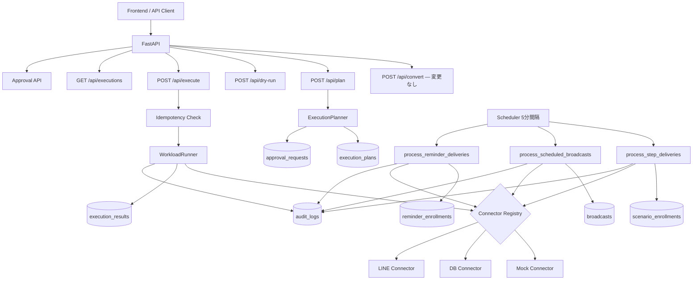

# Phase 4: Async Execution Engine — 設計書

> **前提:** Phase 3（DB 永続化・ドメインテーブル・実行履歴照会）が完了していること
> **全体ロードマップ:** `docs/roadmap-phase2_5-to-phase5.md` §4
> **参照モデル:** `docs/ref/line-harness-oss/`（architecture.md §Cron スケジューラ, sequence-diagrams.md §2,3,5）
> **最上位ルール:** `AGENTS.md`

---

## 1. 目的と範囲

### 1.1 目的

Phase 3 で DB に「登録」された業務オブジェクト（scheduled な broadcasts、active な scenario_enrollments、active な reminder_enrollments）を、**バックグラウンドで安全に消化する仕組み**を構築する。

加えて、承認状態の永続化、冪等性の保証、失敗時の再試行、監査ログの記録を整備し、「軽く指示できる」と「安全に回る」を両立する。

### 1.2 Phase 3 → Phase 4 で何が変わるか

| 項目 | Phase 3 の状態 | Phase 4 で到達する状態 |
|---|---|---|
| broadcasts | status=scheduled で止まる | Scheduler が scheduled_at 到来分を sending → sent に進める |
| scenario_enrollments | status=active で止まる | Worker が next_delivery_at 到来分の step を配信し、次 step に進める |
| reminder_enrollments | status=active で止まる | Worker が target_date + offset 到来分を配信し、完了を記録する |
| 承認 | API パラメータ approved=true のみ | approval_requests テーブルに永続化し、承認/却下を記録 |
| 冪等性 | idempotency_key はスキーマにあるが検証なし | 処理済みキーを DB で管理し二重実行を防止 |
| 失敗 | step 失敗で後続 skip、以上 | retry_count / max_retries で再試行、dead letter 記録 |
| 監査 | logging のみ | execution_audit_logs テーブルに全操作を記録 |

### 1.3 スコープ

**対象:**

- Scheduler / Worker 基盤（Cloud Scheduler + Cloud Run Jobs、または FastAPI BackgroundTasks）
- 3 つの定期処理: processStepDeliveries / processScheduledBroadcasts / processReminderDeliveries
- 承認状態の永続化（approval_requests テーブル）
- 冪等性の保証（processed_idempotency_keys テーブル）
- 失敗再試行（retry policy）
- 配信ウィンドウ制御（9:00–23:00 JST）
- 監査ログ（execution_audit_logs テーブル）
- Connector を mock から本番 LINE connector へ切替可能にする構成

**対象外:**

- 既存 Agent 層の変更
- automations / scoring / notification_rules（→ Phase 5）
- マルチドメイン connector（→ Phase 5）
- ステルスエンジン（配信ジッター、zero-width 文字等は connector 内部の責務として隔離し、Phase 4 では最小限の配信ウィンドウ制御のみ）

---

## 2. 設計方針

### 2.1 line-harness-oss の Cron パターンを参照する

line-harness-oss は 5 分間隔の Cron Trigger で以下を処理している:

```
processStepDeliveries()      — next_delivery_at ≤ now の scenario_enrollments を配信
processScheduledBroadcasts() — status=scheduled, scheduled_at ≤ now の broadcasts を送信
processReminderDeliveries()  — target_date + offset_minutes ≤ now の未配信 reminder を送信
checkAccountHealth()         — LINE API ヘルスチェック
```

agentic-bizflow では同等の処理を **Cloud Run 上の定期実行** で実現する。
Cloudflare Workers Cron Triggers には依存せず、以下のいずれかで構成する:

| 方式 | 構成 | 適用条件 |
|---|---|---|
| **A. Cloud Scheduler + Cloud Run Jobs** | Cloud Scheduler が 5 分間隔で Cloud Run Job を起動 | 本番推奨 |
| **B. FastAPI BackgroundTasks + APScheduler** | アプリ内で定期実行 | 開発・PoC 用 |

Phase 4 では **方式 B で実装し、方式 A への移行パスを残す** 設計とする。
具体的には、定期処理のロジックを `backend/app/workers/` に独立モジュールとして配置し、呼び出し元（APScheduler or Cloud Run Job エントリポイント）を差し替え可能にする。

### 2.2 処理の独立性

3 つの定期処理は互いに独立とする。1 つが失敗しても他に影響しない。

```
Scheduler（5分間隔）
  ├── process_step_deliveries()    ← 独立
  ├── process_scheduled_broadcasts() ← 独立
  └── process_reminder_deliveries()  ← 独立
```

### 2.3 配信最適化の責務分離

line-harness-oss のステルスエンジン（配信ジッター、バッチ間遅延、zero-width 文字、レートリミット）は技術的に興味深いが、プラットフォーム規約との距離感を考慮し、agentic-bizflow では以下の方針を取る:

- **配信ウィンドウ（9:00–23:00 JST）** → Worker 層で制御（Phase 4 で実装）
- **バッチ間遅延・ジッター・メッセージ変異** → connector 内部の責務として隔離（Phase 4 では実装しない）
- **レートリミット** → connector 内部の責務

Worker は「何をいつ誰に」を決め、connector は「どう送るか」を担当する。

---

## 3. 追加テーブル

### 3.1 approval_requests（承認リクエスト）

Phase 2.5 では API パラメータ `approved=true` のみだった承認を DB に永続化する。

| カラム | 型 | 制約 | 説明 |
|---|---|---|---|
| id | TEXT | PK | UUID |
| plan_id | TEXT | FK → execution_plans, UNIQUE | 対象 plan |
| status | TEXT | NOT NULL DEFAULT 'pending' | pending / approved / rejected |
| requested_at | DATETIME | NOT NULL | リクエスト日時 |
| decided_at | DATETIME | | 承認/却下日時 |
| decided_by | TEXT | | 承認者（将来の認証統合用） |
| reason | TEXT | | 承認/却下理由 |

**状態遷移:**
```
pending → approved → （execute 可能）
pending → rejected → （execute 不可）
```

### 3.2 processed_idempotency_keys（冪等性管理）

二重実行を防止する。WorkloadRunner が step 実行前にチェックし、処理済みならスキップする。

| カラム | 型 | 制約 | 説明 |
|---|---|---|---|
| idempotency_key | TEXT | PK | ExecutionStep の idempotency_key |
| step_id | TEXT | NOT NULL | |
| plan_id | TEXT | NOT NULL | |
| processed_at | DATETIME | NOT NULL | 処理日時 |

### 3.3 execution_audit_logs（監査ログ）

全操作の証跡を残す。

| カラム | 型 | 制約 | 説明 |
|---|---|---|---|
| id | TEXT | PK | UUID |
| execution_id | TEXT | | 関連する execution（nullable） |
| plan_id | TEXT | | 関連する plan（nullable） |
| action | TEXT | NOT NULL | plan_created / execution_started / step_executed / step_failed / step_retried / approval_requested / approval_decided |
| detail_json | TEXT | NOT NULL DEFAULT '{}' | 操作の詳細（JSON） |
| created_at | DATETIME | NOT NULL | |

**インデックス:** `execution_id`, `plan_id`, `action`, `created_at`

### 3.4 worker_task_logs（定期処理ログ）

Scheduler の各実行サイクルを記録する。

| カラム | 型 | 制約 | 説明 |
|---|---|---|---|
| id | TEXT | PK | UUID |
| task_name | TEXT | NOT NULL | process_step_deliveries / process_scheduled_broadcasts / process_reminder_deliveries |
| started_at | DATETIME | NOT NULL | |
| finished_at | DATETIME | | |
| processed_count | INTEGER | NOT NULL DEFAULT 0 | 処理件数 |
| error_count | INTEGER | NOT NULL DEFAULT 0 | エラー件数 |
| status | TEXT | NOT NULL DEFAULT 'running' | running / completed / failed |

---

## 4. 定期処理の詳細設計

### 4.1 process_step_deliveries()

line-harness のシーケンス（sequence-diagrams.md §2）を参照。

```
1. scenario_enrollments WHERE status='active' AND next_delivery_at ≤ now を取得
2. 配信ウィンドウチェック（9:00–23:00 JST）— 時間外ならスキップ
3. 各 enrollment について:
   a. scenario_steps から current_step_order の次ステップを取得
   b. idempotency_key をチェック（処理済みならスキップ）
   c. connector.execute() でメッセージ送信
   d. 成功 → current_step_order を進める + next_delivery_at を再計算
   e. 最後のステップなら status='completed' に遷移
   f. 失敗 → retry_count をインクリメント、max_retries 超過なら status='failed'
   g. 監査ログを記録
```

**next_delivery_at の再計算:**
- 次ステップの `delay_minutes` を現在時刻に加算
- 配信ウィンドウ外なら翌朝 9:00 に繰り延べ（line-harness と同一）

### 4.2 process_scheduled_broadcasts()

line-harness のシーケンス（sequence-diagrams.md §3）を参照。

```
1. broadcasts WHERE status='scheduled' AND scheduled_at ≤ now を取得
2. 各 broadcast について:
   a. status を 'sending' に更新
   b. idempotency_key をチェック
   c. connector.execute() で配信
   d. 成功 → status='sent', sent_at=now, success_count を記録
   e. 失敗 → status='failed', error 情報を記録
   f. 監査ログを記録
```

### 4.3 process_reminder_deliveries()

line-harness のシーケンス（sequence-diagrams.md §5）を参照。

```
1. reminder_enrollments WHERE status='active' を取得
2. 各 enrollment について:
   a. reminder_steps を取得
   b. 各 step: target_date + offset_minutes ≤ now かつ reminder_deliveries に未記録のものを抽出
   c. idempotency_key をチェック
   d. connector.execute() でメッセージ送信
   e. 成功 → reminder_deliveries に INSERT（UNIQUE 制約で冪等性担保）
   f. 全ステップ配信済みなら enrollment.status='completed'
   g. 監査ログを記録
```

---

## 5. 冪等性の設計

### 5.1 二重実行防止のフロー

```python
def execute_step_with_idempotency(step, db):
    """ステップを冪等に実行する。

    処理済みの idempotency_key が存在すればスキップし、
    存在しなければ実行後にキーを記録する。
    """
    existing = db.query(ProcessedIdempotencyKey).filter_by(
        idempotency_key=step.idempotency_key
    ).first()

    if existing:
        return StepResult(step_id=step.step_id, status="skipped", message="Already processed")

    result = connector.execute(step.action, step.inputs)

    db.add(ProcessedIdempotencyKey(
        idempotency_key=step.idempotency_key,
        step_id=step.step_id,
        plan_id=step.plan_id,
        processed_at=datetime.utcnow(),
    ))
    db.commit()

    return result
```

### 5.2 reminder_deliveries の UNIQUE 制約

Phase 3 で設計済みの `(enrollment_id, reminder_step_id)` UNIQUE 制約が、リマインダ配信の冪等性を DB レベルで保証する。Worker は INSERT を試み、制約違反ならスキップする。

---

## 6. 再試行（Retry Policy）

### 6.1 scenario_enrollments への retry_count 追加

| カラム | 型 | 制約 | 説明 |
|---|---|---|---|
| retry_count | INTEGER | NOT NULL DEFAULT 0 | 現在ステップの失敗回数 |
| max_retries | INTEGER | NOT NULL DEFAULT 3 | 最大再試行回数 |

**マイグレーション:** Phase 3 の `scenario_enrollments` テーブルに 2 カラムを ALTER ADD。

### 6.2 再試行フロー

```
step 実行失敗
  → retry_count += 1
  → retry_count ≤ max_retries の場合:
      next_delivery_at = now + backoff_minutes(retry_count)
      （次の Scheduler サイクルで再試行される）
  → retry_count > max_retries の場合:
      status = 'failed'
      監査ログに dead letter として記録
```

**バックオフ計算:**
```
backoff_minutes(retry_count) = min(5 * (2 ** retry_count), 60)
// 1回目: 10分、2回目: 20分、3回目: 40分、上限60分
```

---

## 7. 承認ワークフロー

### 7.1 フロー

```
POST /api/plan → ExecutionPlan 生成
  → requires_approval=true の場合:
      → approval_requests に pending で INSERT
      → API レスポンスに approval_request_id を含める

POST /api/approvals/{id}/approve → status='approved'
POST /api/approvals/{id}/reject  → status='rejected'

POST /api/execute → approval_requests.status を確認
  → approved なら実行
  → pending or rejected なら blocked を返す
```

### 7.2 API

| エンドポイント | メソッド | 説明 |
|---|---|---|
| `GET /api/approvals` | GET | 承認リクエスト一覧（status でフィルタ可能） |
| `GET /api/approvals/{id}` | GET | 承認リクエスト詳細 |
| `POST /api/approvals/{id}/approve` | POST | 承認 |
| `POST /api/approvals/{id}/reject` | POST | 却下 |

---

## 8. 配信ウィンドウ制御

line-harness-oss は 9:00–23:00 JST のみ配信し、時間外は翌朝 9:00 に繰り延べる。

### 8.1 実装

```python
def enforce_delivery_window(target_time: datetime) -> datetime:
    """配信ウィンドウ（9:00–23:00 JST）を適用する。

    時間外の場合は翌日 9:00 JST に繰り延べる。
    """
    jst = target_time.astimezone(ZoneInfo("Asia/Tokyo"))
    if 9 <= jst.hour < 23:
        return target_time
    if jst.hour < 9:
        return jst.replace(hour=9, minute=0, second=0, microsecond=0)
    # 23:00 以降 → 翌日 9:00
    next_day = jst + timedelta(days=1)
    return next_day.replace(hour=9, minute=0, second=0, microsecond=0)
```

### 8.2 適用箇所

- `process_step_deliveries()`: 処理開始時に時間外ならスキップ、next_delivery_at 再計算時に適用
- `process_scheduled_broadcasts()`: 処理自体はウィンドウ無関係（scheduled_at はユーザーが指定）
- `process_reminder_deliveries()`: 処理開始時に時間外ならスキップ

---

## 9. LINE Connector（本番接続の準備）

### 9.1 構成

Phase 4 では **LINE connector の枠組みを実装し、環境変数で mock / 本番を切り替え可能にする**。

```python
# connector registry
def get_connector_registry(settings) -> dict[str, BaseConnector]:
    if settings.LINE_CONNECTOR_MODE == "mock":
        return {"line": MockLineConnector()}
    elif settings.LINE_CONNECTOR_MODE == "db":
        return {"line": DbLineConnector(db)}
    elif settings.LINE_CONNECTOR_MODE == "live":
        return {"line": LiveLineConnector(line_client)}
    ...
```

### 9.2 LiveLineConnector

| メソッド | 処理 |
|---|---|
| `execute(action, inputs)` | LINE Messaging API を呼び出し + DB にも書き込む |
| `dry_run(action, inputs)` | LINE API は呼ばず、DB にも書き込まず、プレビューを返す |
| `capabilities()` | 対応 action リストを返す |

**環境変数:**
- `LINE_CHANNEL_ACCESS_TOKEN`
- `LINE_CHANNEL_SECRET`
- `LINE_CONNECTOR_MODE` = `mock` / `db` / `live`

### 9.3 本 Phase での制限

- `live` モードの実装は行うが、**デフォルトは `db` モードのまま**
- テストでは引き続き mock connector を使用
- `live` モードの動作確認は手動で LINE Developers のテストアカウントで行う

---

## 10. アーキテクチャ図



---

## 11. ディレクトリ構成（追加・変更分）

```
backend/
  app/
    agent/                     ← 変更なし
    schemas/                   ← 既存維持 + 承認関連スキーマ追加
      approval.py              ← 新規
    execution/
      workload_runner.py       ← 冪等性チェック追加
      approval.py              ← 承認永続化に対応
    connectors/
      base_connector.py        ← 変更なし
      mock_line_connector.py   ← 維持
      db_line_connector.py     ← Phase 3 から維持
      live_line_connector.py   ← 新規（LINE Messaging API 接続）
      registry.py              ← 新規（connector 切替ロジック）
    workers/                   ← 新規
      __init__.py
      scheduler.py             ← APScheduler 設定 + エントリポイント
      step_delivery.py         ← process_step_deliveries()
      broadcast_delivery.py    ← process_scheduled_broadcasts()
      reminder_delivery.py     ← process_reminder_deliveries()
      delivery_window.py       ← 配信ウィンドウ制御
    db/
      models.py                ← 4 テーブル追加
      repositories/
        approval_repo.py       ← 新規
        idempotency_repo.py    ← 新規
        audit_repo.py          ← 新規
      migrations/versions/
        003_phase4_tables.py   ← 新規
        004_retry_columns.py   ← scenario_enrollments への ALTER ADD
    api/
      routes_approval.py       ← 新規
      routes_audit.py          ← 新規（監査ログ照会）
  tests/
    test_step_delivery.py      ← 新規
    test_broadcast_delivery.py ← 新規
    test_reminder_delivery.py  ← 新規
    test_idempotency.py        ← 新規
    test_approval_workflow.py  ← 新規
    test_delivery_window.py    ← 新規
    test_live_line_connector.py ← 新規（mock された LINE API で検証）
    test_existing_convert.py   ← 回帰
    test_existing_phase25.py   ← 回帰
    test_existing_phase3.py    ← 回帰（新規）
```

---

## 12. 検証手順

```bash
# 1. マイグレーション
cd backend && alembic upgrade head

# 2. 既存テスト全件 PASS
cd backend && pytest tests/test_existing_convert.py tests/test_existing_phase25.py tests/test_existing_phase3.py -v

# 3. 新規テスト全件 PASS
cd backend && pytest tests/test_step_delivery.py tests/test_broadcast_delivery.py tests/test_reminder_delivery.py tests/test_idempotency.py tests/test_approval_workflow.py tests/test_delivery_window.py -v

# 4. E2E: plan → approve → execute → scheduler cycle → check results
# 5. エビデンス保存
cd backend && pytest tests/ -v > tests/evidence/phase4_test_result.txt
```

---

## 13. Phase 4 完了条件（DoD）

- [ ] Scheduler が 5 分間隔で 3 つの定期処理を実行できる
- [ ] scheduled broadcasts が sending → sent に遷移する
- [ ] scenario_enrollments の step が進行し、最後のステップで completed になる
- [ ] reminder_enrollments の未配信ステップが配信され、全完了で completed になる
- [ ] 配信ウィンドウ（9:00–23:00 JST）外の配信がスキップ/繰り延べされる
- [ ] idempotency_key による二重実行防止が動作する
- [ ] 承認リクエストが DB に永続化され、approve/reject API が動作する
- [ ] 失敗時に retry_count がインクリメントされ、上限超過で failed になる
- [ ] 監査ログが全操作で記録される
- [ ] LINE connector が mock / db / live を環境変数で切替可能
- [ ] 既存テスト（Phase 1 / 2.5 / 3）が壊れていない
- [ ] 全テストが通過し evidence が保存されている
- [ ] AGENTS.md の docstring 要件を満たしている

---

## 14. Phase 5 への申し送り

- connector adapter の抽象化が十分か確認する（新しい connector を足すときに WorkloadRunner を変更しなくてよいか）
- workload kind を LINE 固有でなく汎用的に拡張可能か確認する
- 承認・スケジューリング・監査のモデルが connector に依存していないか確認する
- これらが成立していれば、Phase 5 は connector を足すだけで実現できる
