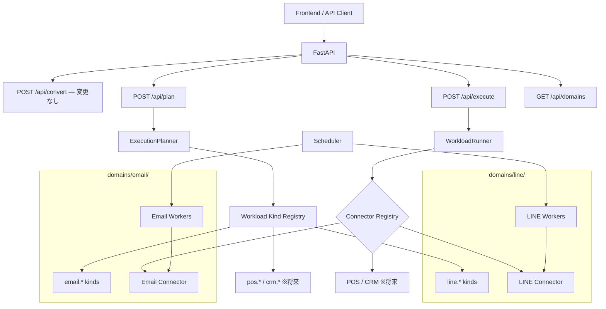

# Phase 5: Multi-Domain Execution Platform — 設計書

> **前提:** Phase 4（Scheduler / Worker / 冪等性 / 承認永続化 / 監査ログ / LINE connector）が完了していること
> **全体ロードマップ:** `docs/roadmap-phase2_5-to-phase5.md` §5
> **最上位ルール:** `AGENTS.md`

---

## 1. 目的と範囲

### 1.1 目的

Phase 4 までの agentic-bizflow は LINE 配信に特化していた。
Phase 5 では、**LINE 以外の業務ドメイン（POS / CRM / ERP / メール配信 / クーポン / 予約等）にも同じオーケストレーション層で対応できる共通基盤**へ拡張する。

利用者から見ると、「LINE で配信して」も「メールで告知して」も「Odoo でタグつけて」も、同じノリで自然文から指示できる状態が Phase 5 のゴール。

### 1.2 Phase 5 に進む前の確認事項（ロードマップ §9 より）

Phase 4 完了時点で以下が成立しているかを確認する。成立していなければ Phase 4 の補修を先に行う。

- [ ] connector adapter の抽象化が十分か（新しい connector を足すときに WorkloadRunner を変更しなくてよいか）
- [ ] ExecutionPlan の workload kind が LINE 固有でなく、汎用的に拡張可能か
- [ ] 承認・スケジューリング・監査のモデルが connector に依存していないか

### 1.3 Phase 4 → Phase 5 で何が変わるか

| 項目 | Phase 4 の状態 | Phase 5 で到達する状態 |
|---|---|---|
| workload kind | 5 種類固定（LINE 専用） | 動的に拡張可能（ドメイン別に追加） |
| connector | LINE connector のみ（mock / db / live） | 複数ドメインの connector を並列登録 |
| ExecutionPlanner | LINE キーワードでの判定のみ | ドメイン横断の workload 判定 |
| Scheduler / Worker | LINE 配信の 3 処理固定 | ドメインごとの Worker を動的登録 |
| 設定 | 環境変数で LINE のみ管理 | tenant / domain 設定で複数ドメイン管理 |
| ExecutionPlan | 単一ドメインの step 列 | 複数ドメインにまたがる step 列 |

### 1.4 スコープ

**対象:**

- Workload Kind Registry（動的拡張）
- Connector Plugin アーキテクチャ
- Domain Module 構造（ドメインごとの workload + connector + worker をパッケージ化）
- Cross-domain ExecutionPlan（1 つの plan に LINE step と Email step が混在できる）
- Domain 設定テーブル（接続先・認証情報・有効/無効の管理）
- 最初の追加ドメインとして Email connector を実装

**対象外:**

- 既存 Agent 層の変更
- 全ドメインの connector 実装（Phase 5 では Email のみ。POS / CRM / Odoo は枠組みを作り、実装は後続）
- マルチテナント認証（認証基盤は別途検討）
- UI の本格的なドメイン切替画面

---

## 2. 設計方針

### 2.1 「connector を足すだけ」を実現する

Phase 5 の成功基準は、**新しいドメインを追加するときに触るのは以下だけ**であること:

1. 新しい connector クラス（BaseConnector を継承）
2. 新しい workload kind の登録（Registry に追加）
3. 新しい domain module ディレクトリ（connector + worker + config）
4. domain_configs テーブルへの設定レコード追加

**触らなくてよいもの:**
- Agent 層
- ExecutionPlanner の本体ロジック
- WorkloadRunner
- Scheduler フレームワーク
- 承認 / 冪等性 / 監査ログの仕組み

### 2.2 ドメインモジュール構造

各ドメインを自己完結したモジュールとして構成する。

```
backend/app/domains/
  line/
    __init__.py
    connector.py          ← LiveLineConnector（Phase 4 から移動）
    db_connector.py       ← DbLineConnector（Phase 3 から移動）
    workload_kinds.py     ← LINE 固有の workload kind 定義
    worker.py             ← LINE 固有の定期処理（step/broadcast/reminder）
    config.py             ← LINE 固有の設定スキーマ
  email/
    __init__.py
    connector.py          ← EmailConnector（新規）
    workload_kinds.py     ← Email 固有の workload kind 定義
    worker.py             ← Email 固有の定期処理
    config.py             ← Email 固有の設定スキーマ
  _template/
    __init__.py           ← 新ドメイン追加時のテンプレート
    connector.py
    workload_kinds.py
    worker.py
    config.py
```

### 2.3 LINE 固有コードの移動方針

Phase 4 までに `backend/app/connectors/` と `backend/app/workers/` に置かれた LINE 固有のコードを `backend/app/domains/line/` に移動する。

| 移動元 | 移動先 |
|---|---|
| `connectors/live_line_connector.py` | `domains/line/connector.py` |
| `connectors/db_line_connector.py` | `domains/line/db_connector.py` |
| `workers/step_delivery.py` | `domains/line/worker.py` に統合 |
| `workers/broadcast_delivery.py` | `domains/line/worker.py` に統合 |
| `workers/reminder_delivery.py` | `domains/line/worker.py` に統合 |

移動後、`connectors/` と `workers/` にはフレームワーク（BaseConnector / Registry / Scheduler）のみが残る。

---

## 3. Workload Kind Registry

### 3.1 Phase 4 までの制約

Phase 2.5 で定義した workload kind は Literal 型で 5 種類に固定されていた:

```python
kind: Literal["scenario.create", "scenario.start", "reminder.create", "broadcast.schedule", "tag.assign"]
```

これを動的に拡張可能にする。

### 3.2 Registry 設計

```python
class WorkloadKindRegistry:
    """workload kind の動的レジストリ。

    各ドメインモジュールが起動時に自身の workload kind を登録する。
    ExecutionPlanner と WorkloadRunner はこの Registry を参照する。
    """

    def register(self, kind: str, domain: str, connector: str,
                 requires_approval: ApprovalRule, description: str) -> None: ...

    def get(self, kind: str) -> WorkloadKindDefinition: ...

    def list_by_domain(self, domain: str) -> list[WorkloadKindDefinition]: ...

    def list_all(self) -> list[WorkloadKindDefinition]: ...

    def is_valid(self, kind: str) -> bool: ...
```

### 3.3 WorkloadKindDefinition

```python
class WorkloadKindDefinition(BaseModel):
    kind: str                    # "line.broadcast.schedule", "email.broadcast.schedule"
    domain: str                  # "line", "email", "pos"
    connector: str               # connector registry のキー
    requires_approval: ApprovalRule  # none / always / conditional
    description: str             # 人間向け説明
    keywords: list[str]          # ExecutionPlanner のキーワードマッチ用
```

### 3.4 命名規則

Phase 5 以降の workload kind は `{domain}.{action}` 形式とする。

| 旧（Phase 2.5–4） | 新（Phase 5） | 理由 |
|---|---|---|
| `tag.assign` | `line.tag.assign` | ドメインを明示 |
| `broadcast.schedule` | `line.broadcast.schedule` | 同上 |
| `scenario.create` | `line.scenario.create` | 同上 |
| `scenario.start` | `line.scenario.start` | 同上 |
| `reminder.create` | `line.reminder.create` | 同上 |
| — | `email.broadcast.schedule` | Email 追加 |
| — | `email.template.create` | Email 追加 |

**後方互換:** 旧形式（`tag.assign` 等）は `line.tag.assign` のエイリアスとして Registry に登録し、既存の ExecutionPlan が壊れないようにする。

---

## 4. Connector Plugin アーキテクチャ

### 4.1 Phase 4 からの進化

Phase 4 の Connector Registry:
```python
{"line": LiveLineConnector(line_client)}
```

Phase 5 の Connector Registry:
```python
{
    "line": LiveLineConnector(line_client),
    "email": EmailConnector(smtp_config),
    "pos": PosConnector(pos_api_client),  # 将来
}
```

### 4.2 BaseConnector の拡張

Phase 4 の BaseConnector は変更しない。新しい connector は同じインターフェースを実装する。

```python
class BaseConnector(ABC):
    @abstractmethod
    def execute(self, action: str, inputs: dict) -> dict: ...

    @abstractmethod
    def dry_run(self, action: str, inputs: dict) -> dict: ...

    @abstractmethod
    def capabilities(self) -> ConnectorCapability: ...
```

### 4.3 Connector の自動検出

各ドメインモジュールの `__init__.py` が `register()` 関数を提供し、アプリ起動時に Connector Registry と Workload Kind Registry に登録する。

```python
# domains/email/__init__.py
def register(connector_registry, workload_registry, config):
    """Email ドメインモジュールを登録する。"""
    connector = EmailConnector(config.smtp)
    connector_registry.register("email", connector)

    workload_registry.register(
        kind="email.broadcast.schedule",
        domain="email",
        connector="email",
        requires_approval=ApprovalRule.ALWAYS,
        description="メール一斉配信の予約",
        keywords=["メール", "mail", "一斉メール"],
    )
    # ...
```

---

## 5. Cross-Domain ExecutionPlan

### 5.1 1 つの plan に複数ドメインの step が混在できる

```json
{
  "plan_id": "plan_x1y2z3",
  "steps": [
    {
      "step_id": "step_001",
      "kind": "line.tag.assign",
      "connector": "line",
      "inputs": {"tag_name": "VIP", "target": "applicants"}
    },
    {
      "step_id": "step_002",
      "kind": "line.broadcast.schedule",
      "connector": "line",
      "inputs": {"scheduled_at": "2026-04-01T10:00:00+09:00"}
    },
    {
      "step_id": "step_003",
      "kind": "email.broadcast.schedule",
      "connector": "email",
      "inputs": {"scheduled_at": "2026-04-01T10:00:00+09:00", "subject": "セール告知"}
    }
  ]
}
```

### 5.2 WorkloadRunner の変更

WorkloadRunner は step ごとに `connector` フィールドを見て Registry から解決する。この仕組みは Phase 4 で既に実装済みのため、変更は不要（Registry に connector が追加されるだけ）。

### 5.3 ExecutionPlanner のドメイン判定

BusinessDefinition のキーワードから、どのドメインの workload kind を使うかを判定する。

```
「LINE で友だち全員にセール告知して、メールでも同じ内容を配信して」
  → line.broadcast.schedule + email.broadcast.schedule
```

判定ロジック:
1. Workload Kind Registry から全 kind の keywords を取得
2. BusinessDefinition の tasks / steps 内のテキストとマッチング
3. 明示的なドメイン指定（「LINE で」「メールで」）があればそのドメインの kind を使う
4. ドメイン指定がなければデフォルトドメイン（設定で定義）を使う

---

## 6. Domain 設定

### 6.1 domain_configs テーブル

各ドメインの接続情報・有効/無効を管理する。

| カラム | 型 | 制約 | 説明 |
|---|---|---|---|
| id | TEXT | PK | UUID |
| domain | TEXT | UNIQUE NOT NULL | line / email / pos / crm |
| display_name | TEXT | NOT NULL | 表示名 |
| is_enabled | BOOLEAN | NOT NULL DEFAULT FALSE | 有効/無効 |
| config_json | TEXT | NOT NULL DEFAULT '{}' | ドメイン固有の設定（JSON） |
| created_at | DATETIME | NOT NULL | |
| updated_at | DATETIME | NOT NULL | |

### 6.2 config_json の例

**LINE:**
```json
{
  "channel_access_token": "...",
  "channel_secret": "...",
  "connector_mode": "live",
  "delivery_window": {"start_hour": 9, "end_hour": 23, "timezone": "Asia/Tokyo"}
}
```

**Email:**
```json
{
  "smtp_host": "smtp.example.com",
  "smtp_port": 587,
  "smtp_user": "...",
  "smtp_password_env": "EMAIL_SMTP_PASSWORD",
  "from_address": "noreply@example.com",
  "from_name": "Agentic BizFlow"
}
```

### 6.3 秘密値の扱い

config_json に秘密値を直接格納しない。`_env` サフィックスのキーで環境変数名を参照する。

```python
config["smtp_password"] = os.environ[config["smtp_password_env"]]
```

---

## 7. Email ドメイン（Phase 5 で実装する最初の追加ドメイン）

### 7.1 なぜ Email か

- LINE 以外で最も汎用的な配信チャネル
- SMTP は標準プロトコルで、外部 SaaS 依存なく検証できる
- 「LINE と Email の両方で配信」は cross-domain の最小検証ケース
- connector 実装の複雑さが適度（API 認証不要、SMTP で完結）

### 7.2 Email workload kind

| kind | 説明 | 承認要否 |
|---|---|---|
| `email.broadcast.schedule` | メール一斉配信の予約 | **常に必須** |
| `email.template.create` | メールテンプレートの作成 | 不要 |

### 7.3 Email 用テーブル

#### email_broadcasts

| カラム | 型 | 制約 | 説明 |
|---|---|---|---|
| id | TEXT | PK | UUID |
| subject | TEXT | NOT NULL | 件名 |
| body_html | TEXT | NOT NULL | 本文（HTML） |
| body_text | TEXT | | 本文（プレーンテキスト） |
| from_address | TEXT | NOT NULL | 送信元 |
| target_type | TEXT | NOT NULL DEFAULT 'all' | all / segment |
| status | TEXT | NOT NULL DEFAULT 'draft' | draft / scheduled / sending / sent / failed |
| scheduled_at | DATETIME | | |
| sent_at | DATETIME | | |
| total_count | INTEGER | NOT NULL DEFAULT 0 | |
| success_count | INTEGER | NOT NULL DEFAULT 0 | |
| execution_plan_id | TEXT | FK → execution_plans | |
| created_at | DATETIME | NOT NULL | |

#### email_templates

| カラム | 型 | 制約 | 説明 |
|---|---|---|---|
| id | TEXT | PK | UUID |
| name | TEXT | NOT NULL | テンプレート名 |
| subject | TEXT | NOT NULL | 件名テンプレート |
| body_html | TEXT | NOT NULL | 本文テンプレート（HTML） |
| body_text | TEXT | | プレーンテキスト |
| created_at | DATETIME | NOT NULL | |
| updated_at | DATETIME | NOT NULL | |

### 7.4 EmailConnector

```python
class EmailConnector(BaseConnector):
    """メール配信用 connector。

    SMTP 経由でメールを送信する。
    dry_run 時は SMTP に接続せず、プレビューを返す。
    """

    def execute(self, action: str, inputs: dict) -> dict: ...
    def dry_run(self, action: str, inputs: dict) -> dict: ...
    def capabilities(self) -> ConnectorCapability: ...
```

### 7.5 Email Worker

```python
def process_scheduled_email_broadcasts():
    """scheduled なメール配信を送信する定期処理。

    broadcasts の LINE 版と同じ構造:
    status='scheduled' AND scheduled_at ≤ now → sending → sent
    """
```

---

## 8. アーキテクチャ図



---

## 9. ディレクトリ構成（追加・変更分）

```
backend/
  app/
    agent/                           ← 変更なし
    schemas/
      workload_kind.py               ← 新規（WorkloadKindDefinition）
      domain_config.py               ← 新規
    execution/
      execution_planner.py           ← Registry 参照に変更
      workload_runner.py             ← 変更なし（Registry 経由は Phase 4 で実装済み）
    connectors/
      base_connector.py              ← 変更なし
      registry.py                    ← Workload Kind Registry 統合
      mock_line_connector.py         ← 維持（テスト用）
    domains/                         ← 新規
      __init__.py                    ← ドメイン自動検出
      line/
        __init__.py                  ← register()
        connector.py                 ← Phase 4 から移動
        db_connector.py              ← Phase 3 から移動
        workload_kinds.py            ← LINE workload kind 定義
        worker.py                    ← Phase 4 の 3 Worker を統合
        config.py                    ← LINE 設定スキーマ
      email/
        __init__.py                  ← register()
        connector.py                 ← EmailConnector（新規）
        workload_kinds.py            ← Email workload kind 定義
        worker.py                    ← Email Worker（新規）
        config.py                    ← Email 設定スキーマ
      _template/                     ← 新ドメイン追加用テンプレート
        __init__.py
        connector.py
        workload_kinds.py
        worker.py
        config.py
    workers/
      scheduler.py                   ← ドメインの worker を動的に登録
      delivery_window.py             ← 維持（共通ユーティリティ）
    db/
      models.py                      ← domain_configs + email テーブル追加
      repositories/
        domain_config_repo.py        ← 新規
        email_broadcast_repo.py      ← 新規
      migrations/versions/
        005_phase5_domain_config.py
        006_phase5_email_tables.py
    api/
      routes_domains.py              ← 新規（ドメイン管理 API）
  tests/
    test_workload_kind_registry.py
    test_cross_domain_plan.py
    test_email_connector.py
    test_email_worker.py
    test_domain_config.py
    test_backward_compat.py          ← 旧 workload kind の後方互換
    test_existing_convert.py         ← 回帰
    test_existing_phase25.py         ← 回帰
    test_existing_phase3.py          ← 回帰
    test_existing_phase4.py          ← 回帰（新規）
```

---

## 10. API 追加

| エンドポイント | メソッド | 説明 |
|---|---|---|
| `GET /api/domains` | GET | 有効なドメイン一覧 |
| `GET /api/domains/{domain}` | GET | ドメイン詳細（workload kind 一覧含む） |
| `PUT /api/domains/{domain}/config` | PUT | ドメイン設定の更新 |
| `POST /api/domains/{domain}/enable` | POST | ドメインの有効化 |
| `POST /api/domains/{domain}/disable` | POST | ドメインの無効化 |
| `GET /api/workload-kinds` | GET | 全 workload kind 一覧 |

---

## 11. 後方互換

### 11.1 workload kind の後方互換

旧形式（`tag.assign`）は `line.tag.assign` のエイリアスとして動作する。

```python
# Workload Kind Registry の初期化時
registry.register_alias("tag.assign", "line.tag.assign")
registry.register_alias("broadcast.schedule", "line.broadcast.schedule")
registry.register_alias("scenario.create", "line.scenario.create")
registry.register_alias("scenario.start", "line.scenario.start")
registry.register_alias("reminder.create", "line.reminder.create")
```

### 11.2 既存 ExecutionPlan の後方互換

DB に保存済みの ExecutionPlan（plan_json 内の kind が旧形式）は、取得時にエイリアス解決して返す。

### 11.3 既存 API の後方互換

`POST /api/plan`, `POST /api/execute` 等の既存 API は動作が変わらない。

---

## 12. 検証手順

```bash
# 1. マイグレーション
cd backend && alembic upgrade head

# 2. 全フェーズの回帰テスト
cd backend && pytest tests/test_existing_convert.py tests/test_existing_phase25.py tests/test_existing_phase3.py tests/test_existing_phase4.py -v

# 3. 後方互換テスト
cd backend && pytest tests/test_backward_compat.py -v

# 4. Phase 5 新規テスト
cd backend && pytest tests/test_workload_kind_registry.py tests/test_cross_domain_plan.py tests/test_email_connector.py tests/test_email_worker.py tests/test_domain_config.py -v

# 5. E2E: LINE + Email の cross-domain plan を作成・実行
# 6. エビデンス保存
cd backend && pytest tests/ -v > tests/evidence/phase5_test_result.txt
```

---

## 13. Phase 5 完了条件（DoD）

- [ ] Workload Kind Registry が動作し、ドメインごとの kind を動的登録できる
- [ ] 旧 workload kind（`tag.assign` 等）が後方互換で動作する
- [ ] LINE 固有コードが `domains/line/` に移動されている
- [ ] Email connector が実装され、email.broadcast.schedule が動作する
- [ ] Cross-domain ExecutionPlan（LINE + Email の混在）が作成・実行できる
- [ ] domain_configs テーブルでドメインの有効/無効を切り替えられる
- [ ] ドメイン追加テンプレート（`_template/`）が存在する
- [ ] 既存テスト（Phase 1 / 2.5 / 3 / 4）が壊れていない
- [ ] 全テストが通過し evidence が保存されている
- [ ] AGENTS.md の docstring 要件を満たしている

---

## 14. Phase 5 以降の展望

Phase 5 が完了すれば、新しいドメインの追加は以下の手順で完結する:

1. `domains/_template/` をコピーして新ドメインディレクトリを作成
2. connector.py に BaseConnector の実装を書く
3. workload_kinds.py に workload kind を定義する
4. worker.py に定期処理（あれば）を書く
5. config.py に設定スキーマを定義する
6. `__init__.py` の register() を実装する
7. domain_configs に設定レコードを追加する
8. テストを書く

WorkloadRunner / ExecutionPlanner / Scheduler / 承認 / 冪等性 / 監査ログは一切触らない。
