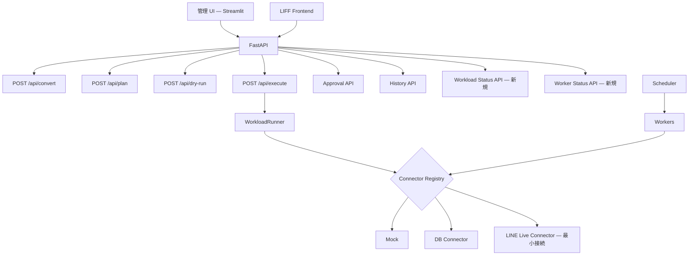

# Phase 6: LINE Demo & Admin UI — 設計書

> **前提:** Phase 2.5〜5 が実装済み（20 テーブル、全 API、Scheduler / Worker / 承認 / 冪等性 / 監査 / Multi-domain）
> **全体ロードマップ:** `docs/roadmap-phase6-to-phase9.md`
> **最上位ルール:** `AGENTS.md`

---

## 1. 目的と範囲

### 1.1 目的

Phase 5 まで基盤は揃った。Phase 6 では **「外部に見せられるデモ」** を完成させる。

具体的には:
- 1 本の LINE 運用ストーリーを端から端まで動かす
- 管理 UI で一覧・操作・状態確認ができる
- LINE live connector で 1 ユースケースだけ本番接続を通す

### 1.2 Phase 6 の位置づけ

Phase 6 は **「技術フェーズ」ではなく「製品デモフェーズ」** である。
新しいテーブルや新しい connector は追加しない。既存の 20 テーブルと既存の connector / worker / API を使い、**見せ方を完成させる** ことに集中する。

### 1.3 スコープ

**対象:**

- デモシナリオの固定（サンプルデータ + 操作手順）
- 管理 UI（Next.js or Streamlit の最小実装）
- LINE live connector の最小接続
- 外部説明資料の整備

**対象外:**

- 既存 Agent 層の変更
- 新テーブルの追加
- マルチテナント / 認証（→ Phase 9）
- 概念の抽象化（→ Phase 7）
- 新ドメインの追加（→ Phase 8）

---

## 2. デモシナリオ

### 2.1 完成ストーリー

外部に見せる 1 本のストーリーを以下に固定する。

```
1. 自然文入力
   「セミナー参加者にVIPタグをつけて、
    明日10時にセール告知を一斉配信して、
    セミナー3日前と前日にリマインドを送って」

2. BusinessDefinition 生成（POST /api/convert）
   → タスク構造・ロール・ステップが可視化される

3. ExecutionPlan 生成（POST /api/plan）
   → 3つの workload kind に分解される:
     step 1: line.tag.assign
     step 2: line.broadcast.schedule（承認必須）
     step 3: line.reminder.create

4. dry-run（POST /api/dry-run）
   → 副作用なしでプレビュー表示

5. 承認フロー
   → broadcast.schedule の承認待ち表示
   → 管理 UI から承認

6. 本実行（POST /api/execute）
   → DB にドメインレコード書き込み
   → tags + tag_assignments
   → broadcasts (status=scheduled)
   → reminders + reminder_steps

7. Scheduler による消化
   → broadcasts: scheduled → sending → sent
   → reminder_enrollments: active → 配信 → completed

8. 実行履歴確認（GET /api/executions）
   → step ごとの成否・監査ログ
```

### 2.2 サンプルデータ

デモ用の seed スクリプトを用意する。

```python
# backend/scripts/seed_demo.py

# 1. 事前に存在すべきデータ（デモの前提）
# - なし（自然文入力からすべて生成される）

# 2. デモ後に確認すべきデータ
# - execution_plans: 1件（status=completed）
# - approval_requests: 1件（status=approved）
# - tags: 1件（VIP）
# - tag_assignments: N件
# - broadcasts: 1件（status=sent）
# - reminders: 1件
# - reminder_steps: 2件（3日前、前日）
# - execution_audit_logs: 各操作の証跡
```

### 2.3 デモ手順書

`docs/demo-guide.md` を Phase 6 向けに拡充する。
現在の demo-guide.md は API レベルの手順が中心だが、Phase 6 では **管理 UI 経由の操作手順** を追加する。

---

## 3. 管理 UI

### 3.1 技術選定

| 候補 | メリット | デメリット | 判定 |
|---|---|---|---|
| **Streamlit** | Python だけで完結、既存 backend と同一言語 | カスタマイズ性に限界、本格 UI には不向き | PoC / 社内デモ向け |
| **Next.js (App Router)** | 本格的な UI、将来の製品化に使える | フロントエンド開発が必要 | 製品化を見据える場合 |
| **既存 LIFF の拡張** | 既存資産を活用 | LINE 内でしか動かない | デモの制約が大きい |

**推奨:** Phase 6 では **Streamlit で最小 UI を作り**、Phase 9 の製品化で Next.js に移行する。
理由: Phase 6 の目的は「見せること」であり、フロントエンド開発に時間をかけるべきではない。

### 3.2 画面構成

| 画面 | 内容 | 対応 API |
|---|---|---|
| **自然文入力** | テキスト入力 → BusinessDefinition 表示 → Plan 生成ボタン | POST /api/convert, POST /api/plan |
| **Plan 一覧** | 保存済み plan の一覧。status / risk_level 表示 | GET /api/plans |
| **Plan 詳細** | step 列 + 承認要否 + dry-run ボタン + 実行ボタン | GET /api/plans/{id}, POST /api/dry-run, POST /api/execute |
| **承認一覧** | pending な承認リクエスト一覧。承認/却下ボタン | GET /api/approvals?status=pending, POST /api/approvals/{id}/approve |
| **実行履歴** | 実行結果一覧 + 詳細（step_results） | GET /api/executions, GET /api/executions/{id} |
| **Workload 状態** | scenarios / broadcasts / reminders の状態一覧 | 新規 API or 直接 DB 参照 |
| **Worker 状態** | worker_task_logs の最新状態 | 新規 API |

### 3.3 workload 状態確認 API（新規）

管理 UI から workload の状態を確認するための API を追加する。

| エンドポイント | メソッド | 説明 |
|---|---|---|
| `GET /api/workloads/scenarios` | GET | scenarios + enrollment 数 + 状態サマリ |
| `GET /api/workloads/broadcasts` | GET | broadcasts の状態別件数 |
| `GET /api/workloads/reminders` | GET | reminders + enrollment 数 + 配信済みステップ数 |
| `GET /api/workloads/summary` | GET | 全 workload の統合サマリ |
| `GET /api/workers/status` | GET | worker_task_logs の最新実行状態 |

### 3.4 UI の設計方針

- **管理 UI は backend の API のみを叩く**（DB 直接参照しない）
- 全画面で loading / empty / error 状態を表示する
- デモ用なので認証は不要（Phase 9 で追加）
- Streamlit の場合、`admin/` ディレクトリに配置

---

## 4. LINE Live Connector の最小接続

### 4.1 目的

`LINE_CONNECTOR_MODE=live` で 1 ユースケースだけ本番接続を通す。
Phase 4 で枠組み（LiveLineConnector）は実装済みなので、実際の LINE API 呼び出しを接続する。

### 4.2 最小接続対象

**tag.assign のみ** を live 接続の対象とする。

理由:
- 副作用が最も小さい（メッセージ送信ではなくメタデータ操作）
- LINE Messaging API の `POST /v2/bot/user/{userId}/richmenu` 等のように、タグ相当の操作で検証できる
- 失敗してもユーザーへの影響がない

### 4.3 接続方法

```python
# domains/line/connector.py の LiveLineConnector

def execute(self, action: str, inputs: dict) -> dict:
    if action == "line.tag.assign":
        # LINE API 呼び出し（最小限）
        # + DB にも書き込む（DB connector の処理を内包）
        ...
    else:
        # tag.assign 以外は DB connector にフォールバック
        return self.db_connector.execute(action, inputs)
```

### 4.4 環境変数

```
LINE_CHANNEL_ACCESS_TOKEN=...
LINE_CHANNEL_SECRET=...
LINE_CONNECTOR_MODE=live  # or db (default) or mock
```

### 4.5 テスト時の注意

- テストでは引き続き mock connector を使用
- live connector のテストは LINE API を mock した上で、リクエスト引数を検証
- 実際の LINE API 呼び出しテストは手動で LINE Developers テストアカウントで行う

---

## 5. 外部説明資料

### 5.1 1 ページ構成案

```
タイトル:
  Agentic BizFlow — LINE 運用を自然文で安全に回す

問題提起:
  LINE 配信の設定は属人化しやすく、ミス・漏れ・手戻りが発生する

ソリューション:
  自然文で「誰に・いつ・何を送るか」を指示すると、
  配信計画が可視化され、承認後に安全に実行される

デモスクリーンショット:
  自然文入力 → Plan → 承認 → 実行 → 履歴

技術的な強み:
  dry-run / 承認 / 冪等性 / 監査ログ / Scheduler

将来の展開:
  同じ基盤で Email / おみせアプリ等の集客チャネルにも展開可能
```

### 5.2 デモ動画

管理 UI を使って §2.1 のデモシナリオを操作する様子を録画する。
1〜2 分程度。

---

## 6. アーキテクチャ図（Phase 6 で追加される層）



---

## 7. ディレクトリ構成（追加分）

```
admin/                             ← 管理 UI（Streamlit）新規
  app.py                           ← エントリポイント
  pages/
    01_convert.py                  ← 自然文入力
    02_plans.py                    ← Plan 一覧 / 詳細
    03_approvals.py                ← 承認一覧
    04_executions.py               ← 実行履歴
    05_workloads.py                ← Workload 状態
    06_workers.py                  ← Worker 状態
  requirements.txt                 ← streamlit, requests

backend/
  app/
    api/
      routes_workload_status.py    ← Workload 状態 API（新規）
      routes_worker_status.py      ← Worker 状態 API（新規）
    domains/line/
      connector.py                 ← live 接続の最小実装を追加
  scripts/
    seed_demo.py                   ← デモ用サンプルデータ（新規）
  tests/
    test_workload_status_api.py    ← 新規
    test_worker_status_api.py      ← 新規
    test_live_line_minimal.py      ← live connector 最小テスト（新規）

docs/
  phase6/
    phase6_design.md               ← 本ファイル
  demo-guide.md                    ← 拡充（管理 UI 手順を追加）
  external/
    one-pager.md                   ← 外部説明用 1 ページ資料（新規）
```

---

## 8. 検証手順

```bash
# 1. 既存テスト全件 PASS
cd backend && pytest tests/ -v

# 2. 管理 UI 起動
cd admin && streamlit run app.py

# 3. デモシナリオ一気通貫
#    自然文入力 → Plan → dry-run → 承認 → Execute → Scheduler 消化 → 履歴確認

# 4. LINE live connector（手動）
#    LINE_CONNECTOR_MODE=live で tag.assign が LINE API に到達することを確認

# 5. エビデンス保存
cd backend && pytest tests/ -v > tests/evidence/phase6_test_result.txt
```

---

## 9. Phase 6 完了条件（DoD）

- [ ] デモシナリオ（§2.1）が管理 UI から一気通貫で動作する
- [ ] 管理 UI で plan / approval / execution / workload / worker を一覧・操作できる
- [ ] LINE_CONNECTOR_MODE=live で tag.assign の LINE API 呼び出しが成功する（テストアカウント）
- [ ] 外部説明用 1 ページ資料がある
- [ ] demo-guide.md が管理 UI 手順を含む形に更新されている
- [ ] 既存テスト（Phase 1〜5）が壊れていない
- [ ] 新規テストが通過し evidence が保存されている
- [ ] AGENTS.md の docstring 要件を満たしている

---

## 10. Phase 7 への申し送り

Phase 6 のデモが外部に見せられる品質になったら:

- 共通語彙への寄せ（tags → audience labels 等）を API / UI / ドキュメントで進める
- workload kind 二層化（共通 kind + domain kind）
- contacts テーブルの導入（target_id のチャネル依存を隔離）
- 類似集客アプリへの展開を説明する資料の作成
