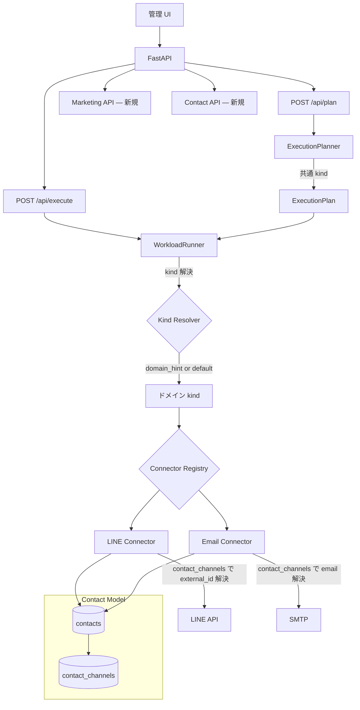

# Phase 7: Marketing Channel Abstraction — 設計書

> **前提:** Phase 6（LINE デモ完成・管理 UI・live connector 最小接続）が完了していること
> **全体ロードマップ:** `docs/roadmap-phase6-to-phase9.md` §4
> **最上位ルール:** `AGENTS.md`

---

## 1. 目的と範囲

### 1.1 目的

Phase 6 までは「LINE 運用製品」として見せていた。
Phase 7 では、**外向きの見た目は LINE を維持しつつ、内部を集客チャネル共通基盤に整理する**。

これにより「類似の集客アプリへ差し替え可能」と説明でき、Phase 8 でのアダプタ整備・Phase 9 での製品化へつながる。

### 1.2 Phase 7 の設計原則

**DB テーブル名は変えない。** 20 テーブルの既存構造はそのまま維持する。
変えるのは以下の 4 層:

| 変更対象 | 内容 |
|---|---|
| **API レスポンス** | LINE 用語を共通語彙に寄せたレスポンスキーを追加（後方互換維持） |
| **Workload Kind** | 共通 kind 層を追加し、ドメイン kind への解決を WorkloadRunner に委ねる |
| **対象者 ID** | contacts + contact_channels テーブルで target_id のチャネル依存を隔離 |
| **ドキュメント / UI** | LINE 固有用語を共通語彙に言い換え |

### 1.3 Phase 6 → Phase 7 で何が変わるか

| 項目 | Phase 6 の状態 | Phase 7 で到達する状態 |
|---|---|---|
| API レスポンスの語彙 | LINE 用語（tags, broadcasts, scenarios, reminders） | 共通語彙（labels, campaigns, journeys, followups）もサポート |
| workload kind | ドメイン kind のみ（line.tag.assign 等） | 共通 kind（audience.label.assign 等）→ ドメイン kind の二層 |
| 対象者の識別 | target_id（チャネル外部 ID 直持ち） | contact_id → contact_channels でチャネル非依存に |
| 外部向け説明 | 「LINE 運用製品」 | 「LINE で動くが、他の集客アプリにも展開できる」 |

### 1.4 スコープ

**対象:**

- 共通語彙の定義と API レスポンスラッパー
- workload kind 二層化（共通 kind + ドメイン kind）
- contacts / contact_channels テーブルの追加
- 既存テーブルの target_id → contact_id への段階移行
- ExecutionPlanner の共通 kind 対応
- WorkloadRunner の共通 → ドメイン kind 解決
- 外部向け展開説明資料

**対象外:**

- 既存 Agent 層の変更
- 既存 DB テーブル名の変更
- capability 定義（→ Phase 8）
- 新ドメイン adapter の実装（→ Phase 8）
- マルチテナント / 認証（→ Phase 9）

---

## 2. 共通語彙

### 2.1 対応表

| 現在の用語（LINE 由来） | 共通語彙 | 説明 | DB テーブル名 |
|---|---|---|---|
| tags | **audience labels** | 対象者の分類 | `tags`（変更なし） |
| tag_assignments | **label assignments** | 対象者へのラベル付与 | `tag_assignments`（変更なし） |
| broadcasts | **campaigns** | 一斉配信 | `broadcasts`（変更なし） |
| scenarios | **journeys** | ステップ配信シナリオ | `scenarios`（変更なし） |
| scenario_steps | **journey steps** | ジャーニー内の配信ステップ | `scenario_steps`（変更なし） |
| scenario_enrollments | **journey enrollments** | 対象者のジャーニー登録 | `scenario_enrollments`（変更なし） |
| reminders | **follow-ups** | タイミング配信 | `reminders`（変更なし） |
| reminder_steps | **follow-up steps** | フォローアップの配信ステップ | `reminder_steps`（変更なし） |
| reminder_enrollments | **follow-up enrollments** | 対象者のフォローアップ登録 | `reminder_enrollments`（変更なし） |
| target_id | **contact_id** | チャネル非依存の対象者 ID | 新規 `contacts` テーブル |

### 2.2 適用方針

- **DB テーブル名・カラム名:** 変更しない
- **API レスポンス:** 既存キー名をそのまま返しつつ、`aliases` フィールドで共通語彙も併記する（後方互換）
- **管理 UI:** 表示ラベルを共通語彙に変更（`scenarios` 画面 → `Journeys` 画面）
- **ドキュメント:** 共通語彙を前面に出し、LINE 固有名称は括弧書きで補足

---

## 3. Workload Kind 二層化

### 3.1 現状（Phase 5 時点）

Phase 5 の Workload Kind Registry にはドメイン kind のみが登録されている:

```
line.tag.assign
line.broadcast.schedule
line.scenario.create
line.scenario.start
line.reminder.create
email.broadcast.schedule
email.template.create
```

ExecutionPlanner がドメイン kind を直接生成し、WorkloadRunner がそのまま connector に渡している。

### 3.2 Phase 7 の二層構造

```
共通 kind（ExecutionPlanner が生成）:
  audience.label.assign       ← 対象者にラベルを付与する
  campaign.schedule           ← 一斉配信を予約する
  journey.create              ← ステップ配信シナリオを作成する
  journey.enroll              ← 対象者をジャーニーに登録する
  followup.create             ← タイミング配信を作成する

ドメイン kind（WorkloadRunner が解決）:
  line.tag.assign             ← LINE タグ操作
  line.broadcast.schedule     ← LINE 一斉配信
  line.scenario.create        ← LINE シナリオ作成
  line.scenario.start         ← LINE シナリオ開始
  line.reminder.create        ← LINE リマインダ作成
  email.broadcast.schedule    ← Email 一斉配信
  email.template.create       ← Email テンプレート作成
```

### 3.3 解決フロー

```
自然文: 「VIPタグをつけて全員にセール告知して」
  ↓
ExecutionPlanner: 共通 kind を生成
  step 1: audience.label.assign
  step 2: campaign.schedule
  ↓
WorkloadRunner: domain_configs の有効ドメインで解決
  step 1: audience.label.assign → line.tag.assign（LINE が有効）
  step 2: campaign.schedule → line.broadcast.schedule（LINE が有効）
  ↓
Connector: ドメイン kind で実行
```

**複数ドメインが有効な場合:**

```
自然文: 「VIPタグをつけて、LINEとメールの両方でセール告知して」
  ↓
ExecutionPlanner:
  step 1: audience.label.assign
  step 2: campaign.schedule（LINE 指定）
  step 3: campaign.schedule（Email 指定）
  ↓
WorkloadRunner:
  step 1 → line.tag.assign
  step 2 → line.broadcast.schedule
  step 3 → email.broadcast.schedule
```

### 3.4 Workload Kind Registry への登録

Phase 5 の Registry に共通 kind を追加登録する。

```python
# 共通 kind の登録
registry.register(
    kind="audience.label.assign",
    domain="common",           # ドメイン非依存
    connector="",              # 解決時に決まる
    requires_approval=ApprovalRule.NONE,
    description="対象者にラベルを付与する",
    keywords=["タグ", "付与", "ラベル", "セグメント"],
)

# 共通 kind → ドメイン kind のマッピング
registry.register_resolution("audience.label.assign", {
    "line": "line.tag.assign",
    "email": None,  # Email はラベル操作非対応
})
```

### 3.5 後方互換

- 既存の ExecutionPlan（plan_json にドメイン kind が入っている）はそのまま動作する
- WorkloadRunner はドメイン kind も共通 kind も受け付ける
- 共通 kind の場合のみ解決処理が走る
- Phase 5 で登録済みのエイリアス（`tag.assign` → `line.tag.assign`）も引き続き動作

---

## 4. Contact モデル

### 4.1 問題

現在の target_id は「対象者の外部 ID」として 3 テーブルで使われている:

| テーブル | カラム | 説明 |
|---|---|---|
| `tag_assignments` | `target_id` (PK) | タグ付与先 |
| `scenario_enrollments` | `target_id` | シナリオ登録先 |
| `reminder_enrollments` | `target_id` | リマインダ登録先 |

この target_id は今は LINE userId を直接入れることを想定しているが、チャネルを跨ぐ場合に「同じ人物が LINE と Email で別の target_id を持つ」問題が発生する。

### 4.2 解決: contacts + contact_channels

```
contacts（チャネル非依存の対象者）
  ↓ 1:N
contact_channels（チャネル別の外部 ID）
```

### 4.3 追加テーブル

#### contacts

| カラム | 型 | 制約 | 説明 |
|---|---|---|---|
| id | TEXT | PK | contact_id（UUID） |
| display_name | TEXT | | 表示名（最初に取得したチャネルの名前） |
| metadata_json | TEXT | NOT NULL DEFAULT '{}' | 任意のメタデータ |
| created_at | DATETIME | NOT NULL | |
| updated_at | DATETIME | NOT NULL | |

#### contact_channels

| カラム | 型 | 制約 | 説明 |
|---|---|---|---|
| id | TEXT | PK | UUID |
| contact_id | TEXT | FK → contacts, NOT NULL | 所属 contact |
| channel_type | TEXT | NOT NULL | line / email / app |
| external_id | TEXT | NOT NULL | チャネル固有の外部 ID（LINE userId, Email address 等） |
| is_primary | BOOLEAN | NOT NULL DEFAULT FALSE | 優先チャネルか |
| created_at | DATETIME | NOT NULL | |

**UNIQUE:** `(channel_type, external_id)` — 同一チャネル内で同じ外部 ID が重複しない

**インデックス:** `contact_id`, `channel_type`

### 4.4 既存テーブルの target_id との関係

**Phase 7 では既存テーブルの target_id カラムを削除しない。** 代わりに:

1. 新規レコード作成時: contact_id を target_id に入れる（contacts テーブル経由）
2. 既存レコード: target_id のまま動作する（後方互換）
3. connector が execute 時に contact_channels から external_id を解決する

```
ExecutionPlan step の inputs に contact_id が含まれる
  ↓
WorkloadRunner → Connector
  ↓
Connector: contact_channels WHERE contact_id = ? AND channel_type = 'line'
  ↓
external_id（LINE userId）を取得して LINE API を呼ぶ
```

### 4.5 target_id → contact_id の移行戦略

| 段階 | 内容 |
|---|---|
| Phase 7 | contacts / contact_channels テーブルを追加。新規 workload 実行時は contact_id 経由で target_id に書き込む。既存データはそのまま。 |
| Phase 8 以降 | 既存 target_id を contacts に紐付けるマイグレーションスクリプトを実行。target_id カラム自体の削除は Phase 9 の製品化で判断。 |

---

## 5. API レスポンスの共通語彙化

### 5.1 方針

既存の API レスポンスのキー名は変更しない（後方互換）。代わりに:

- Workload 状態 API（Phase 6 で追加）のレスポンスに共通語彙キーを追加
- 新規 API は共通語彙をデフォルトにする
- 管理 UI は共通語彙で表示する

### 5.2 例: GET /api/workloads/summary

**Phase 6（現在）:**
```json
{
  "scenarios": {"total": 3, "active_enrollments": 12},
  "broadcasts": {"draft": 1, "scheduled": 2, "sent": 15},
  "reminders": {"total": 2, "active_enrollments": 8},
  "tags": {"total": 5, "total_assignments": 132}
}
```

**Phase 7（共通語彙追加）:**
```json
{
  "scenarios": {"total": 3, "active_enrollments": 12},
  "broadcasts": {"draft": 1, "scheduled": 2, "sent": 15},
  "reminders": {"total": 2, "active_enrollments": 8},
  "tags": {"total": 5, "total_assignments": 132},
  "common": {
    "journeys": {"total": 3, "active_enrollments": 12},
    "campaigns": {"draft": 1, "scheduled": 2, "sent": 15},
    "followups": {"total": 2, "active_enrollments": 8},
    "labels": {"total": 5, "total_assignments": 132}
  }
}
```

### 5.3 新規 API: 共通語彙ベースの workload kind 一覧

| エンドポイント | メソッド | 説明 |
|---|---|---|
| `GET /api/marketing/kinds` | GET | 共通 kind 一覧 + 各 kind の解決可能ドメイン |
| `GET /api/marketing/contacts` | GET | contact 一覧 |
| `GET /api/marketing/contacts/{contact_id}` | GET | contact 詳細 + channel 一覧 |
| `POST /api/marketing/contacts` | POST | contact 作成 + channel 紐付け |

---

## 6. ExecutionPlanner の変更

### 6.1 共通 kind 生成モード

Phase 7 以降の ExecutionPlanner は、デフォルトで **共通 kind** を生成する。

```python
def plan(definition, dry_run=True, kind_mode="common") -> ExecutionPlan:
    """ExecutionPlan を生成する。

    Args:
        kind_mode:
            "common" — 共通 kind を生成（Phase 7 デフォルト）
            "domain" — ドメイン kind を直接生成（Phase 5 互換）
    """
```

### 6.2 ドメイン指定の検出

自然文に「LINE で」「メールで」等のドメイン指定がある場合、step にドメインヒントを付与する。

```json
{
  "step_id": "step_002",
  "kind": "campaign.schedule",
  "domain_hint": "line",
  "inputs": {...}
}
```

domain_hint がない場合、WorkloadRunner がデフォルトドメイン（domain_configs の優先度順）で解決する。

---

## 7. WorkloadRunner の変更

### 7.1 共通 kind → ドメイン kind の解決

```python
def resolve_kind(self, step: ExecutionStep) -> str:
    """共通 kind をドメイン kind に解決する。

    Args:
        step: ExecutionStep（kind が共通 or ドメイン）

    Returns:
        解決されたドメイン kind（例: "line.tag.assign"）

    Note:
        - kind がすでにドメイン kind（"line." や "email." で始まる）ならそのまま返す
        - kind が共通 kind なら、domain_hint または enabled なドメインで解決する
    """
```

### 7.2 解決の優先順位

1. step に `domain_hint` がある → そのドメインで解決
2. `domain_hint` がない → domain_configs で `is_enabled=True` かつ該当 kind をサポートするドメインで解決
3. 複数ドメインが該当 → `priority` 順（domain_configs に priority カラムを追加）
4. 該当ドメインなし → step を `skipped` にしてエラーメッセージを返す

---

## 8. アーキテクチャ図



---

## 9. ディレクトリ構成（追加・変更分）

```
backend/
  app/
    agent/                           ← 変更なし
    schemas/
      marketing.py                   ← 新規（共通語彙のレスポンススキーマ）
      contact.py                     ← 新規（Contact / ContactChannel スキーマ）
    execution/
      execution_planner.py           ← kind_mode 追加
      workload_runner.py             ← kind 解決ロジック追加
      kind_resolver.py               ← 新規（共通 kind → ドメイン kind 解決）
    connectors/
      workload_kind_registry.py      ← 共通 kind 登録 + resolution マッピング追加
    domains/
      common/                        ← 新規（共通 kind 定義）
        __init__.py
        workload_kinds.py            ← 5 つの共通 kind を定義
      line/
        __init__.py                  ← register() に resolution マッピングを追加
      email/
        __init__.py                  ← register() に resolution マッピングを追加
    db/
      models.py                      ← contacts + contact_channels 追加
      repositories/
        contact_repo.py              ← 新規
      migrations/versions/
        007_contacts.py              ← 新規
        008_domain_config_priority.py ← domain_configs に priority カラム追加
    api/
      routes_marketing.py            ← 新規（共通語彙ベースの API）
      routes_contacts.py             ← 新規（Contact CRUD API）
      routes_workload_status.py      ← 共通語彙キーを追加
  tests/
    test_kind_resolver.py            ← 新規
    test_common_kinds.py             ← 新規
    test_contacts.py                 ← 新規
    test_marketing_api.py            ← 新規
    test_backward_compat_phase7.py   ← 後方互換テスト
    test_existing_*.py               ← Phase 1〜6 回帰テスト維持

docs/
  phase7/
    phase7_design.md                 ← 本ファイル
  external/
    expansion-overview.md            ← 新規（展開可能性の説明資料）
```

---

## 10. 検証手順

```bash
# 1. マイグレーション
cd backend && alembic upgrade head

# 2. 全フェーズ回帰テスト
cd backend && pytest tests/test_existing_*.py -v

# 3. 後方互換テスト（既存ドメイン kind での plan/execute が壊れない）
cd backend && pytest tests/test_backward_compat_phase7.py -v

# 4. Phase 7 新規テスト
cd backend && pytest tests/test_kind_resolver.py tests/test_common_kinds.py tests/test_contacts.py tests/test_marketing_api.py -v

# 5. E2E: 共通 kind で plan → resolve → execute
# 6. E2E: 既存ドメイン kind で plan → execute（後方互換）
# 7. エビデンス保存
cd backend && pytest tests/ -v > tests/evidence/phase7_test_result.txt
```

---

## 11. Phase 7 完了条件（DoD）

- [ ] 共通 kind 5 種類が Workload Kind Registry に登録されている
- [ ] ExecutionPlanner が共通 kind を生成できる（kind_mode="common"）
- [ ] WorkloadRunner が共通 kind → ドメイン kind を正しく解決する
- [ ] domain_hint による明示的なドメイン指定が動作する
- [ ] contacts / contact_channels テーブルが作成されている
- [ ] 新規実行時に contact_id 経由で target_id が設定される
- [ ] 既存のドメイン kind での plan / execute が後方互換で動作する
- [ ] Phase 5 のエイリアス（tag.assign → line.tag.assign）が引き続き動作する
- [ ] 管理 UI の表示ラベルが共通語彙に更新されている
- [ ] 展開可能性の説明資料が作成されている
- [ ] 既存テスト（Phase 1〜6）が壊れていない
- [ ] 全テストが通過し evidence が保存されている
- [ ] AGENTS.md の docstring 要件を満たしている

---

## 12. Phase 8 への申し送り

- capability 定義（supports_campaign / supports_label / supports_journey / supports_followup）の導入
- capability に基づく plan 自動調整（非対応 kind のスキップ）
- 店舗向け集客アプリ等への PoC adapter 実装
- 新チャネル追加手順の文書化
- 既存 target_id → contacts への一括移行スクリプト
