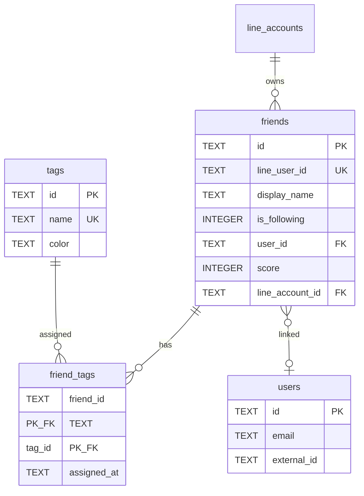
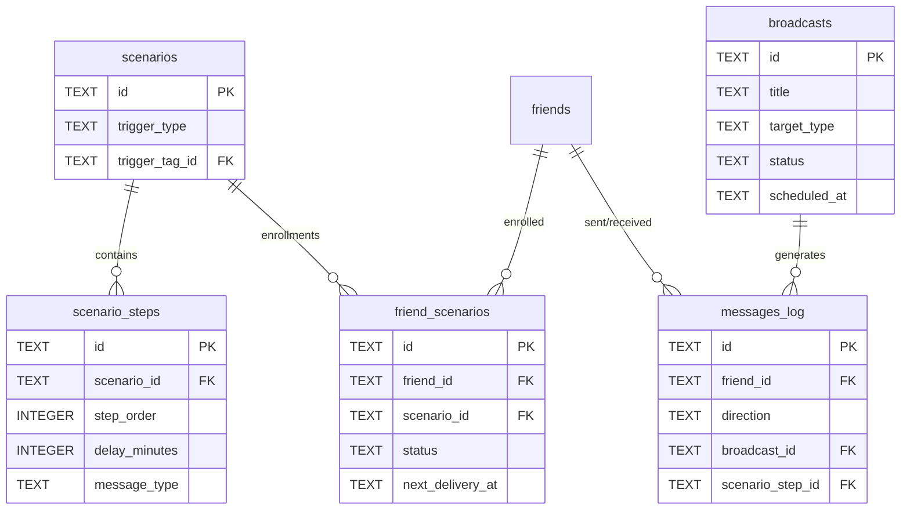
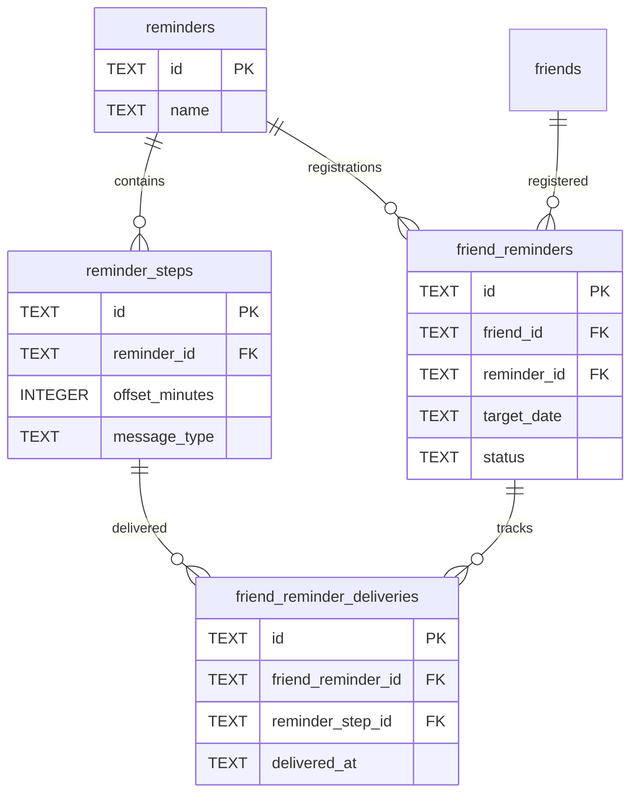
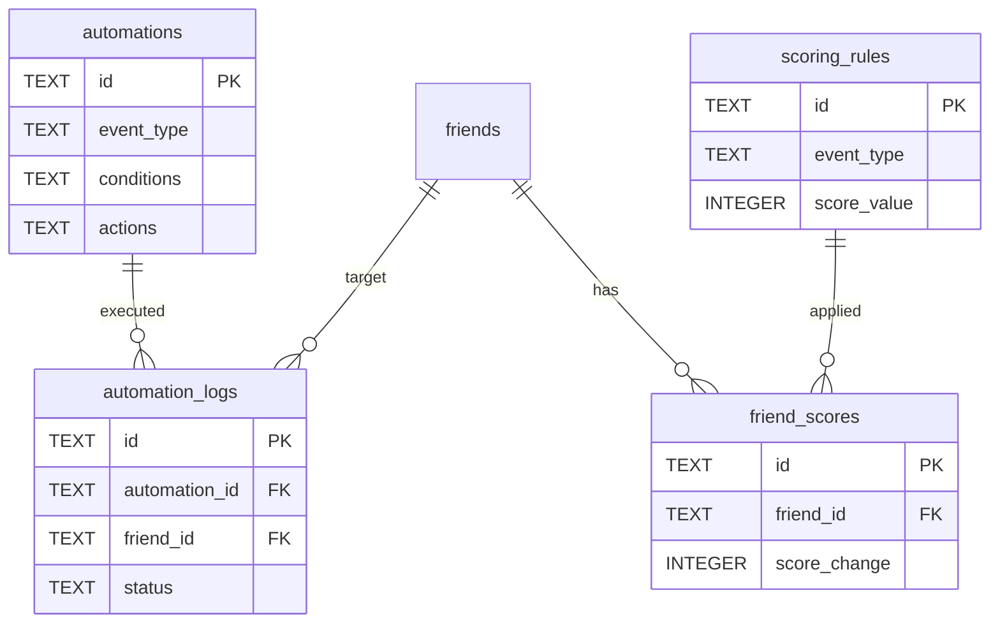

# ER 図

## 表記法

- `PK` = Primary Key
- `FK` = Foreign Key
- `||--o{` = 1 対 多
- `}o--o{` = 多 対 多（中間テーブル経由）

---

## 全体 ER 図 (Mermaid)

```mermaid
erDiagram
    %% ============================================================
    %% CRM コア
    %% ============================================================

    friends {
        TEXT id PK
        TEXT line_user_id UK
        TEXT display_name
        TEXT picture_url
        TEXT status_message
        INTEGER is_following
        TEXT user_id FK
        INTEGER score
        TEXT line_account_id FK
        TEXT metadata
        TEXT ref_code
        TEXT created_at
        TEXT updated_at
    }

    tags {
        TEXT id PK
        TEXT name UK
        TEXT color
        TEXT created_at
    }

    friend_tags {
        TEXT friend_id PK_FK
        TEXT tag_id PK_FK
        TEXT assigned_at
    }

    friends ||--o{ friend_tags : "has"
    tags ||--o{ friend_tags : "assigned to"

    %% ============================================================
    %% シナリオ（ステップ配信）
    %% ============================================================

    scenarios {
        TEXT id PK
        TEXT name
        TEXT description
        TEXT trigger_type
        TEXT trigger_tag_id FK
        INTEGER is_active
        TEXT line_account_id FK
        TEXT created_at
        TEXT updated_at
    }

    scenario_steps {
        TEXT id PK
        TEXT scenario_id FK
        INTEGER step_order
        INTEGER delay_minutes
        TEXT message_type
        TEXT message_content
        TEXT condition_type
        TEXT condition_value
        INTEGER next_step_on_false
        TEXT created_at
    }

    friend_scenarios {
        TEXT id PK
        TEXT friend_id FK
        TEXT scenario_id FK
        INTEGER current_step_order
        TEXT status
        TEXT next_delivery_at
        TEXT started_at
        TEXT updated_at
    }

    tags ||--o| scenarios : "triggers (tag_added)"
    scenarios ||--o{ scenario_steps : "contains"
    friends ||--o{ friend_scenarios : "enrolled in"
    scenarios ||--o{ friend_scenarios : "has enrollments"

    %% ============================================================
    %% 配信
    %% ============================================================

    broadcasts {
        TEXT id PK
        TEXT title
        TEXT message_type
        TEXT message_content
        TEXT target_type
        TEXT target_tag_id FK
        TEXT status
        TEXT scheduled_at
        TEXT sent_at
        INTEGER total_count
        INTEGER success_count
        TEXT created_at
    }

    tags ||--o{ broadcasts : "targets"

    messages_log {
        TEXT id PK
        TEXT friend_id FK
        TEXT direction
        TEXT message_type
        TEXT content
        TEXT broadcast_id FK
        TEXT scenario_step_id FK
        TEXT created_at
    }

    friends ||--o{ messages_log : "has"
    broadcasts ||--o{ messages_log : "generates"
    scenario_steps ||--o{ messages_log : "generates"

    auto_replies {
        TEXT id PK
        TEXT keyword
        TEXT match_type
        TEXT response_type
        TEXT response_content
        INTEGER is_active
        TEXT line_account_id FK
        TEXT created_at
    }

    templates {
        TEXT id PK
        TEXT name
        TEXT category
        TEXT message_type
        TEXT message_content
        TEXT created_at
        TEXT updated_at
    }

    %% ============================================================
    %% リマインダ
    %% ============================================================

    reminders {
        TEXT id PK
        TEXT name
        TEXT description
        INTEGER is_active
        TEXT created_at
        TEXT updated_at
    }

    reminder_steps {
        TEXT id PK
        TEXT reminder_id FK
        INTEGER offset_minutes
        TEXT message_type
        TEXT message_content
        TEXT created_at
    }

    friend_reminders {
        TEXT id PK
        TEXT friend_id FK
        TEXT reminder_id FK
        TEXT target_date
        TEXT status
        TEXT created_at
        TEXT updated_at
    }

    friend_reminder_deliveries {
        TEXT id PK
        TEXT friend_reminder_id FK
        TEXT reminder_step_id FK
        TEXT delivered_at
    }

    reminders ||--o{ reminder_steps : "contains"
    friends ||--o{ friend_reminders : "registered"
    reminders ||--o{ friend_reminders : "has registrations"
    friend_reminders ||--o{ friend_reminder_deliveries : "tracks"
    reminder_steps ||--o{ friend_reminder_deliveries : "delivered"

    %% ============================================================
    %% スコアリング
    %% ============================================================

    scoring_rules {
        TEXT id PK
        TEXT name
        TEXT event_type
        INTEGER score_value
        INTEGER is_active
        TEXT created_at
        TEXT updated_at
    }

    friend_scores {
        TEXT id PK
        TEXT friend_id FK
        TEXT scoring_rule_id FK
        INTEGER score_change
        TEXT reason
        TEXT created_at
    }

    friends ||--o{ friend_scores : "has"
    scoring_rules ||--o{ friend_scores : "applied"

    %% ============================================================
    %% 自動化
    %% ============================================================

    automations {
        TEXT id PK
        TEXT name
        TEXT description
        TEXT event_type
        TEXT conditions
        TEXT actions
        INTEGER is_active
        INTEGER priority
        TEXT line_account_id FK
        TEXT created_at
        TEXT updated_at
    }

    automation_logs {
        TEXT id PK
        TEXT automation_id FK
        TEXT friend_id FK
        TEXT event_data
        TEXT actions_result
        TEXT status
        TEXT created_at
    }

    automations ||--o{ automation_logs : "executed"
    friends ||--o{ automation_logs : "target of"

    %% ============================================================
    %% チャット
    %% ============================================================

    operators {
        TEXT id PK
        TEXT name
        TEXT email UK
        TEXT role
        INTEGER is_active
        TEXT created_at
        TEXT updated_at
    }

    chats {
        TEXT id PK
        TEXT friend_id FK
        TEXT operator_id FK
        TEXT status
        TEXT notes
        TEXT last_message_at
        TEXT created_at
        TEXT updated_at
    }

    friends ||--o{ chats : "has"
    operators ||--o{ chats : "assigned"

    %% ============================================================
    %% 通知
    %% ============================================================

    notification_rules {
        TEXT id PK
        TEXT name
        TEXT event_type
        TEXT conditions
        TEXT channels
        INTEGER is_active
        TEXT line_account_id FK
        TEXT created_at
        TEXT updated_at
    }

    notifications {
        TEXT id PK
        TEXT rule_id FK
        TEXT event_type
        TEXT title
        TEXT body
        TEXT channel
        TEXT status
        TEXT metadata
        TEXT created_at
    }

    notification_rules ||--o{ notifications : "generates"

    %% ============================================================
    %% Webhook IN/OUT
    %% ============================================================

    incoming_webhooks {
        TEXT id PK
        TEXT name
        TEXT source_type
        TEXT secret
        INTEGER is_active
        TEXT created_at
        TEXT updated_at
    }

    outgoing_webhooks {
        TEXT id PK
        TEXT name
        TEXT url
        TEXT event_types
        TEXT secret
        INTEGER is_active
        TEXT created_at
        TEXT updated_at
    }

    %% ============================================================
    %% 外部連携
    %% ============================================================

    google_calendar_connections {
        TEXT id PK
        TEXT calendar_id
        TEXT access_token
        TEXT refresh_token
        TEXT api_key
        TEXT auth_type
        INTEGER is_active
        TEXT created_at
        TEXT updated_at
    }

    calendar_bookings {
        TEXT id PK
        TEXT connection_id FK
        TEXT friend_id FK
        TEXT event_id
        TEXT title
        TEXT start_at
        TEXT end_at
        TEXT status
        TEXT metadata
        TEXT created_at
        TEXT updated_at
    }

    google_calendar_connections ||--o{ calendar_bookings : "has"
    friends ||--o{ calendar_bookings : "booked"

    stripe_events {
        TEXT id PK
        TEXT stripe_event_id UK
        TEXT event_type
        TEXT friend_id FK
        REAL amount
        TEXT currency
        TEXT metadata
        TEXT processed_at
    }

    friends ||--o{ stripe_events : "linked"

    %% ============================================================
    %% CV・アフィリエイト
    %% ============================================================

    conversion_points {
        TEXT id PK
        TEXT name
        TEXT event_type
        REAL value
        TEXT created_at
    }

    conversion_events {
        TEXT id PK
        TEXT conversion_point_id FK
        TEXT friend_id FK
        TEXT user_id
        TEXT affiliate_code
        TEXT metadata
        TEXT created_at
    }

    conversion_points ||--o{ conversion_events : "records"
    friends ||--o{ conversion_events : "converted"

    affiliates {
        TEXT id PK
        TEXT name
        TEXT code UK
        REAL commission_rate
        INTEGER is_active
        TEXT created_at
    }

    affiliate_clicks {
        TEXT id PK
        TEXT affiliate_id FK
        TEXT url
        TEXT ip_address
        TEXT created_at
    }

    affiliates ||--o{ affiliate_clicks : "tracked"

    %% ============================================================
    %% アカウント管理
    %% ============================================================

    users {
        TEXT id PK
        TEXT email
        TEXT phone
        TEXT external_id
        TEXT display_name
        TEXT created_at
        TEXT updated_at
    }

    friends }o--o| users : "linked via user_id"

    line_accounts {
        TEXT id PK
        TEXT channel_id UK
        TEXT name
        TEXT channel_access_token
        TEXT channel_secret
        INTEGER is_active
        TEXT created_at
        TEXT updated_at
    }

    line_accounts ||--o{ friends : "belongs to"
    line_accounts ||--o{ scenarios : "owns"
    line_accounts ||--o{ automations : "owns"
    line_accounts ||--o{ auto_replies : "owns"
    line_accounts ||--o{ notification_rules : "owns"

    admin_users {
        TEXT id PK
        TEXT email UK
        TEXT password_hash
        TEXT created_at
    }

    account_health_logs {
        TEXT id PK
        TEXT line_account_id
        INTEGER error_code
        INTEGER error_count
        TEXT check_period
        TEXT risk_level
        TEXT created_at
    }

    line_accounts ||--o{ account_health_logs : "monitored"

    account_migrations {
        TEXT id PK
        TEXT from_account_id
        TEXT to_account_id
        TEXT status
        INTEGER migrated_count
        INTEGER total_count
        TEXT created_at
        TEXT completed_at
    }
```

---

## ドメイン別グループ

### CRM コア

### 配信システム

### リマインダシステム

### 自動化・スコアリング

