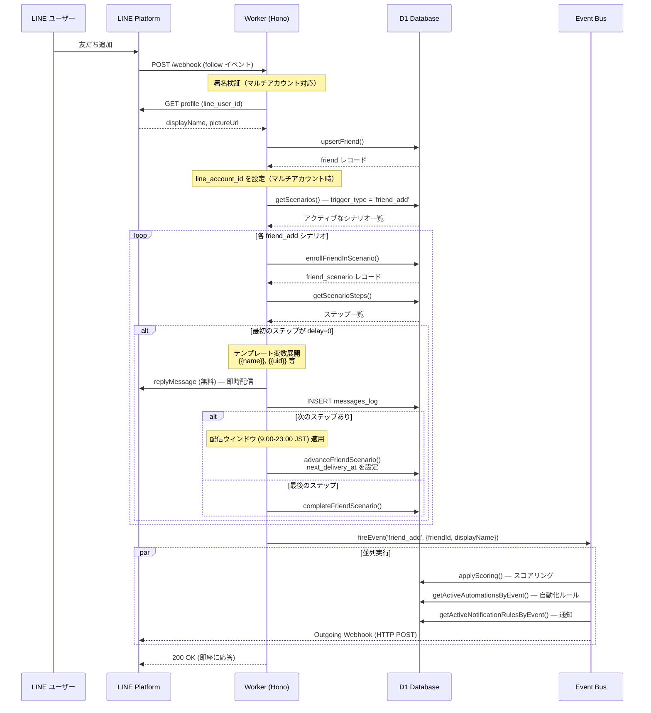
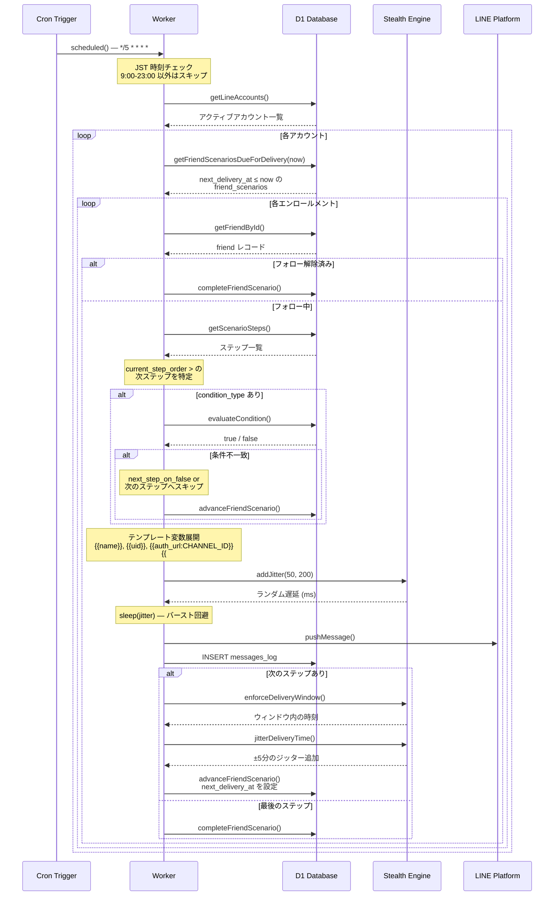
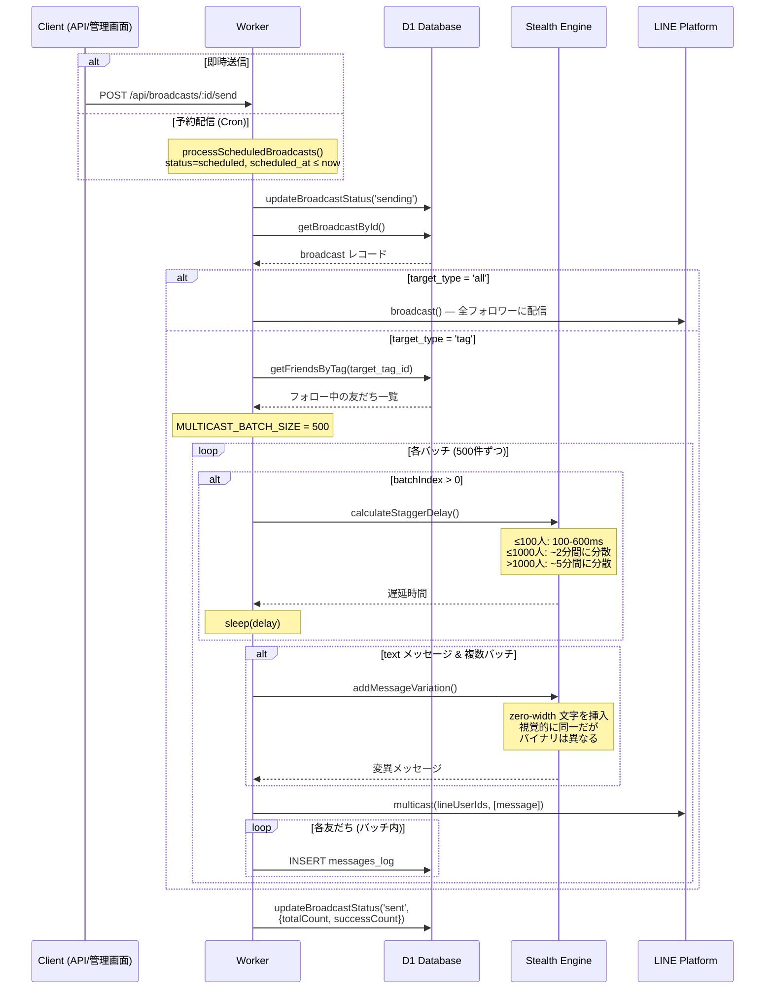
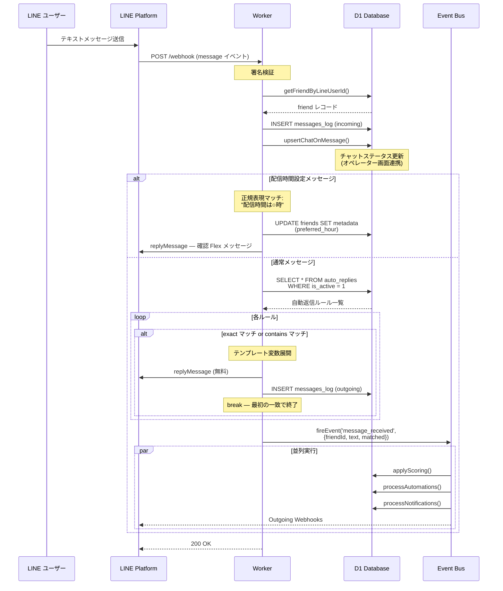
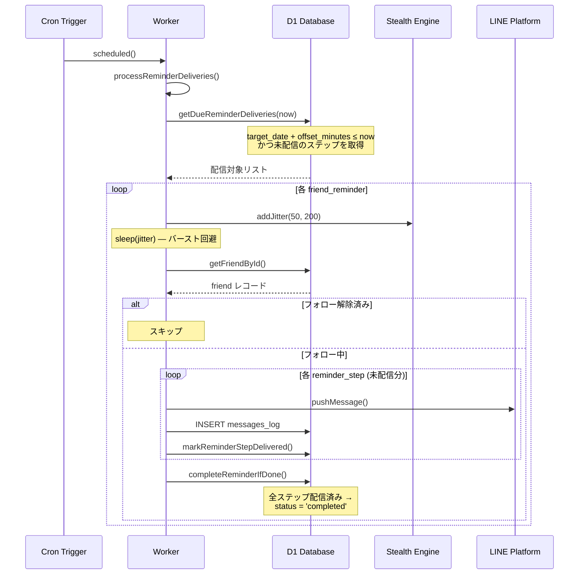
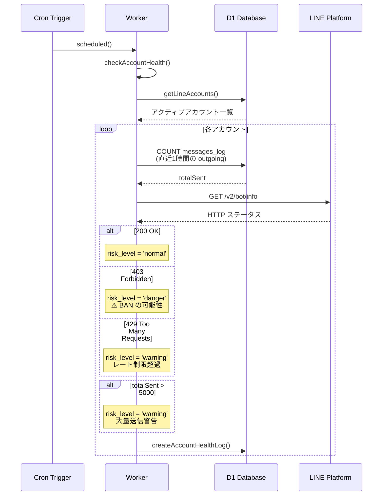
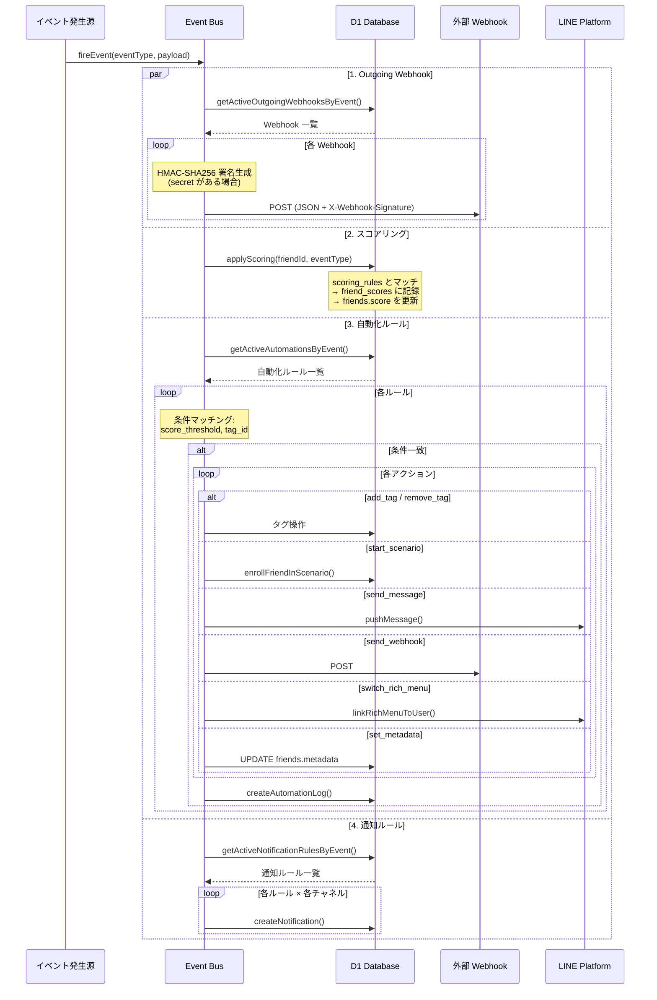
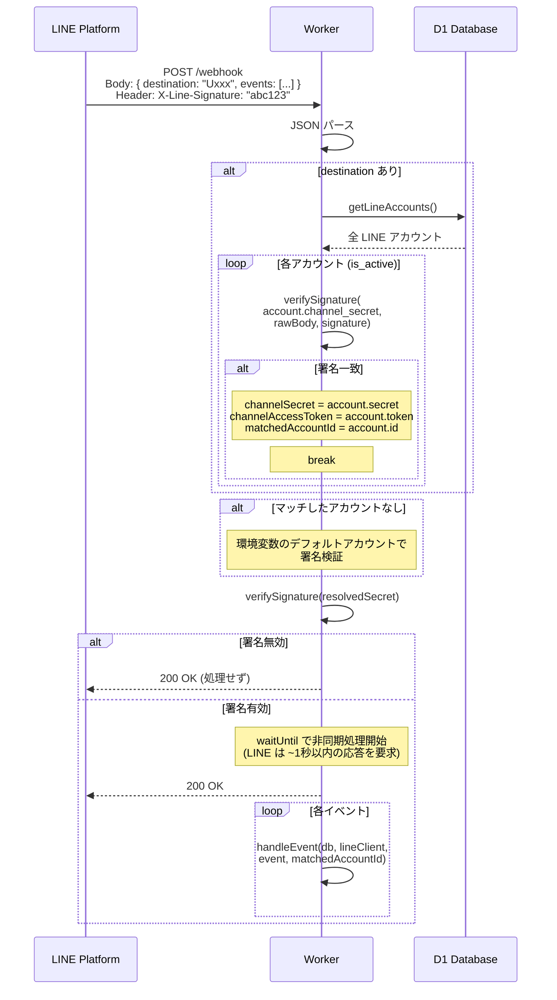
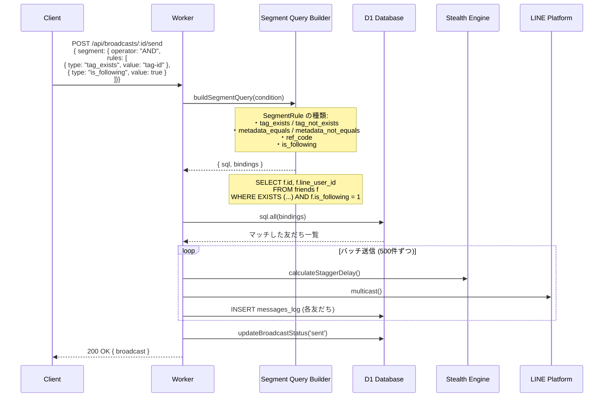

# シーケンス図

## 1. 友だち追加 → シナリオ開始

ユーザーが LINE 公式アカウントを友だち追加した際のフロー。

## 2. ステップ配信 (Cron)

5 分間隔の Cron トリガーによるステップ配信処理。

## 3. ブロードキャスト送信

即時送信またはスケジュール配信のフロー。

## 4. メッセージ受信 → 自動返信

ユーザーからのテキストメッセージ受信と自動返信のフロー。

## 5. リマインダ配信 (Cron)

基準日からのオフセットに基づくカウントダウン配信。

## 6. BAN 検知 (Cron)

LINE アカウントのヘルスチェックと BAN 検知。

## 7. イベントバス処理

システムイベント発火時の並列処理フロー。

## 8. マルチアカウント Webhook ルーティング

複数 LINE アカウントを 1 つの Worker で処理する際のルーティング。

## 9. セグメント配信

タグ・メタデータ条件によるセグメント配信。

