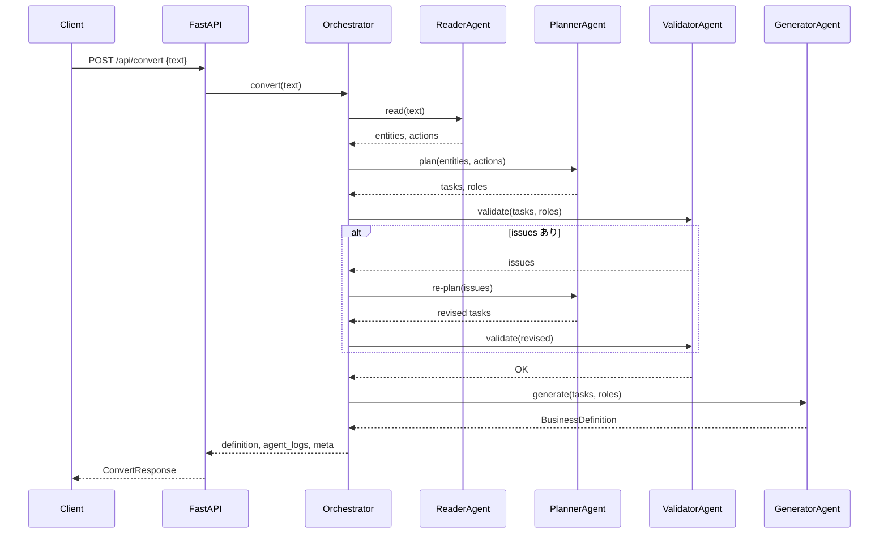
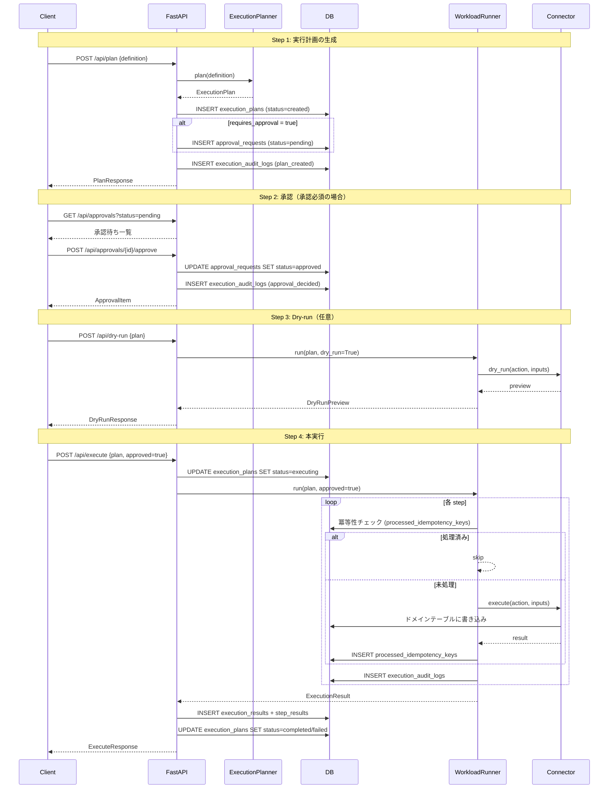
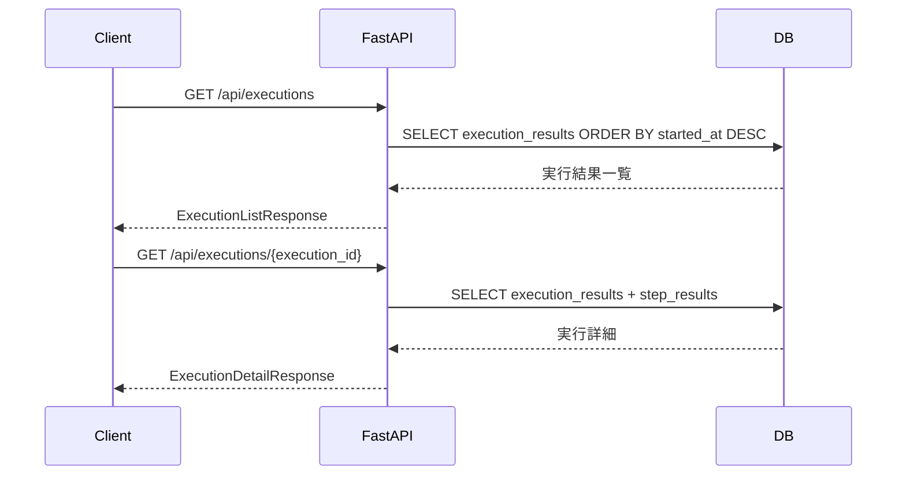
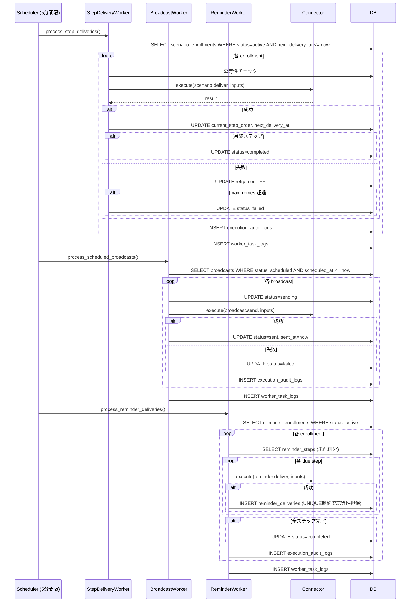
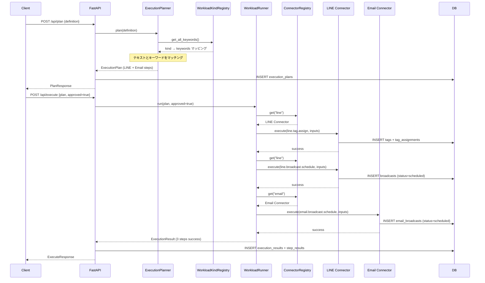
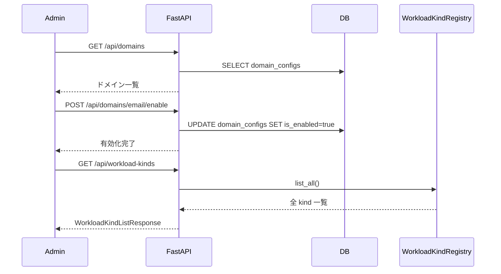

# Agentic BizFlow — シーケンス図

> 本ドキュメントは主要フローのシーケンス図（Mermaid 形式）です。

---

## 1. 業務文章変換フロー（Phase 1）

---

## 2. 実行計画 → 承認 → 実行フロー（Phase 2.5〜4）

---

## 3. 実行履歴照会フロー（Phase 3）

---

## 4. Scheduler 定期処理フロー（Phase 4）

---

## 5. Cross-domain 実行フロー（Phase 5）

---

## 6. ドメイン管理フロー（Phase 5）

